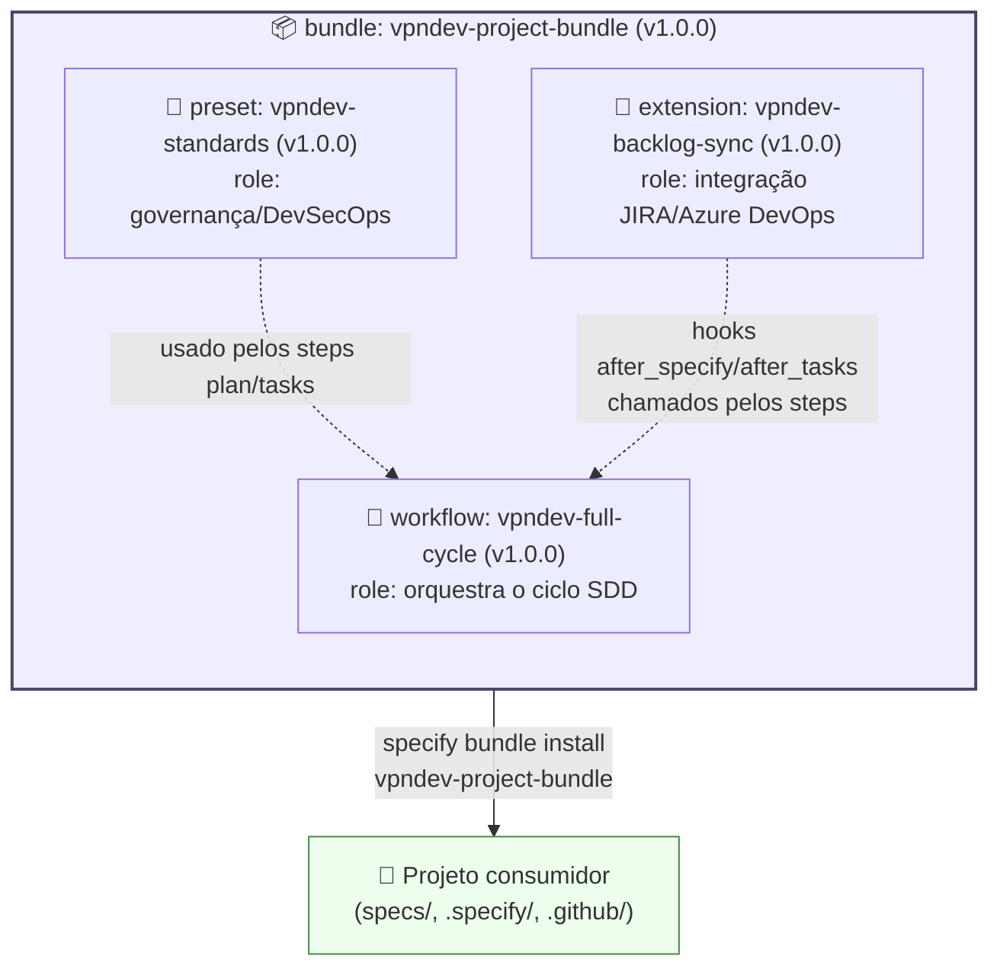

# speckit-vpndev-standards

> ⚠️ **Propriedade Intelectual — Uso Interno Exclusivo**
> Este repositório e todo o seu conteúdo (templates, presets, extensões, workflows,
> padrões de governança e documentação) são propriedade exclusiva da **Venha Pra Nuvem**.
> Cópia, redistribuição ou uso fora da organização são expressamente proibidos — ver
> [`LICENSE`](LICENSE). Qualquer alteração em arquivos de padrão exige aprovação do
> `@vpndev-arch-board` via Pull Request (ver [`.github/CODEOWNERS`](.github/CODEOWNERS)).

Padrões corporativos de **Spec-Driven Development** (GitHub Spec Kit) da
**VPN Dev**, distribuídos como um **bundle** único para que todo projeto novo já
nasça com governança, gate de segurança/DevSecOps e integração de backlog
consistentes — sem que cada time precise reescrever essas regras.

## O que este repositório contém

| Componente | Pasta | O que faz |
|---|---|---|
| **Preset** `vpndev-standards` | [`presets/vpndev-standards/`](presets/vpndev-standards/) | Injeta os princípios não-negociáveis da empresa na constituição (`wrap`) e acrescenta o Security/DevSecOps Gate + Architecture Decision Log ao `plan.md` e o checklist de qualidade ao `tasks.md` (`append`) — sem remover nada do Spec Kit nativo. |
| **Extensão** `vpndev-backlog-sync` | [`extensions/vpndev-backlog-sync/`](extensions/vpndev-backlog-sync/) | Sincroniza specs/tasks com JIRA ou Azure DevOps via MCP, como hook opcional após `/speckit-specify` e `/speckit-tasks`. |
| **Workflow** `vpndev-full-cycle` | [`workflows/vpndev-full-cycle/`](workflows/vpndev-full-cycle/) | Ciclo SDD completo com um gate explícito de DevSecOps entre `plan` e `tasks`. |
| **Bundle** `vpndev-project-bundle` | [`bundles/vpndev-project-bundle/`](bundles/vpndev-project-bundle/) | Amarra as três peças acima numa "receita" instalável de uma vez, com versões pinadas. |

Cada peça é independentemente versionada (SemVer) e pode ser instalada isolada —
ver o README de cada pasta.

## 📘 Manual do Dev — comece por aqui

Se você é dev e vai usar o Spec Kit no dia a dia (repo novo, repo existente
sem Spec Kit, ou importar um card do Azure DevOps/JIRA para começar uma
feature), o documento central é
[`docs/developer-guide.md`](docs/developer-guide.md) — cobre os três cenários
passo a passo, com os prompts exatos a usar.

### 🔶 Brownfield: boas práticas, DOs e DONTs

Se você está rodando Spec Kit em um **repositório já existente** (brownfield),
leia **obrigatoriamente** [`docs/brownfield-best-practices.md`](docs/brownfield-best-practices.md)
— é referência profunda sobre:

- Por que a constituição é o passo crítico (e como iterá-la).
- Múltiplos passes de `implement` → `converge` (esperado, não erro).
- Artefatos SDD como documentos vivos (quando editar vs. regenerar).
- Integração com backlog externo (Azure DevOps/JIRA).
- Troubleshooting comum e estratégias de migração incremental.

**TL;DR do brownfield**: sempre rode `/speckit.constitution` **antes** de qualquer
feature (análise profunda do código existente é essencial); use
`/speckit.converge` **sempre** após `implement`; aceite múltiplos passes e
documentar exceções no Architecture Decision Log.

## Modelo visual do bundle



O bundle só amarra os três componentes acima em versões pinadas — nenhum tem
lógica própria fora do que já é descrito na tabela acima. Diagramas completos
(estratégias `wrap`/`append` do preset, fluxo do workflow com os gates,
instalação/atualização e o ecossistema de servidores MCP candidatos por
plataforma — GitHub, Microsoft 365, Azure, Google Workspace, GCP) estão em
[`docs/bundle-architecture.md`](docs/bundle-architecture.md).

## Como um projeto novo já nasce com isso

```bash
curl -fsSL https://raw.venha-pra-nuvem.ghe.com/venha-pra-nuvem/speckit-vpndev-standards/main/bootstrap.sh | bash
```

Isso executa `specify init` (se ainda não inicializado) e instala preset +
extensão + workflow na versão publicada mais recente da branch `main`.

### Bônus: GitHub Project criado automaticamente (garantido em todo repo)

Se o `gh` CLI estiver instalado e autenticado, o `bootstrap.sh` **cria
automaticamente um GitHub Project V2** com 3 views padrão (copiadas do
IOX-CROWDFUNDINGPAAS) e 2 campos customizados:

- **Board por Epic** — organize issues por épicas
- **Board por Prioridade** — organize por níveis de prioridade
- **Tabela — P0 Blocker** — filtro pré-configurado para P0-blocker críticos
- **Campo "Horas Humanas"** (número) — para lançar tempo humano em tarefas de
  modelo híbrido (agente + humano) e compor o custo real da tarefa (tokens do
  agente + horas humanas × taxa do perfil) — ver
  [`docs/ai-code-quality-and-observability.md`](docs/ai-code-quality-and-observability.md#8-modelo-híbrido-agentes-de-ia--humanos-codando-juntos)
  e [`docs/cost-profiles-and-rates.md`](presets/vpndev-standards/templates/cost-profiles-and-rates.md)
- **Campo "Oportunidade D365"** (texto) — cole a URL completa da Oportunidade
  no Dynamics 365 para vincular a issue/PR à venda/negócio de origem

O project é criado com o nome `{repo-name} — Spec Kit Roadmap` e fica
imediatamente acessível para customize (adicionar/remover filtros, agrupar
por campos, etc.).

**Garantia contínua:** o `bootstrap.sh` também instala
[`.github/workflows/ensure-github-project.yml`](.github/workflows/ensure-github-project.yml),
que roda semanalmente e recria o Project automaticamente se ele não existir
mais (ex.: `gh` CLI indisponível no bootstrap original, ou Project apagado por
engano) — garantindo que **todo repositório com este bundle sempre tenha o
Project**, mesmo sem intervenção manual. Requer os secrets
`VPNDEV_PROJECT_TOKEN` (PAT com escopos `repo`+`project`) e
`VPNDEV_STANDARDS_READ_TOKEN`.

Se preferir criar o project **manualmente** ou em **um repositório existente**:

```bash
bash ./scripts/setup-github-project.sh --repo-owner venha-pra-nuvem --repo-name meu-projeto
```

### Bônus: Portfólio PMO (visão consolidada de todos os repositórios)

Além do Project por repositório acima, o bundle também cobre a visão
**cross-repositório** que o PMO precisa (backlog/prioridade e custo real
consolidados):

1. **Uma vez por organização**, crie o Project de portfólio:
   ```bash
   bash ./scripts/setup-pmo-org-project.sh --org venha-pra-nuvem
   ```
   Cria um GitHub Project V2 de organização com 4 views (Board por
   Repositório, Board por Prioridade, Tabela — Backlog Consolidado, Tabela —
   P0 Blocker).
2. **Em cada repositório** que deve alimentar esse board, instale
   [`templates/workflows/add-to-pmo-project.yml`](templates/workflows/add-to-pmo-project.yml)
   apontando para a URL do project criado acima — toda issue/PR nova é
   adicionada automaticamente (via [`actions/add-to-project`](https://github.com/actions/add-to-project)).
3. Para **custo real (Horas Humanas) e Oportunidades D365 consolidados**
   entre repositórios — que não somam sozinhos no board de portfólio, pois
   são campos por-projeto no GitHub Projects V2 — rode:
   ```bash
   bash ./scripts/pmo-cost-rollup.sh --repo venha-pra-nuvem/repo1 --repo venha-pra-nuvem/repo2
   ```

Detalhes completos em
[`docs/ai-code-quality-and-observability.md` — "Como o PMO acompanha o status"](docs/ai-code-quality-and-observability.md#como-o-pmo-acompanha-o-status-visão-por-projeto-e-visão-global).

### Bônus: Labels de priorização e desenvolvimento autônomo

O `bootstrap.sh` também **cria/atualiza automaticamente a taxonomia de
labels** do bundle (via `scripts/setup-github-labels.sh`): `priority:P0-blocker`
a `P3-low`, `complexity:S0`–`S4`, `type:bug/feature/chore/docs`,
`agent:autonomous-ok`/`agent:needs-human`, `status:needs-triage`/`blocked` e
`dora:deployment-frequency`/`dora:lead-time`/`dora:change-failure-rate`/`dora:mttr`
(para correlacionar issues com os 4 indicadores DORA).

O label `agent:autonomous-ok` dispara automaticamente a atribuição da issue
ao GitHub Copilot coding agent (via
[`.github/workflows/agent-auto-assign.yml`](.github/workflows/agent-auto-assign.yml)),
com guardrails que impedem atribuição autônoma em issues `agent:needs-human`,
`complexity:S4`, `status:blocked` ou já atribuídas. Requer o secret
`COPILOT_AGENT_ASSIGN_TOKEN` configurado no repositório consumidor — ver guia
completo, incluindo como evitar gatilhos duplicados com a feature nativa
"Copilot Automations" do GitHub, em
[`docs/label-taxonomy-and-autonomous-dev.md`](docs/label-taxonomy-and-autonomous-dev.md).

Para criar/atualizar os labels manualmente em qualquer repositório:

```bash
bash ./scripts/setup-github-labels.sh --repo-owner venha-pra-nuvem --repo-name meu-projeto
```

### Bônus: verificação automática de atualização do Spec Kit/bundle

O `bootstrap.sh` também copia
[`templates/workflows/update-speckit-and-bundle.yml`](templates/workflows/update-speckit-and-bundle.yml)
para `.github/workflows/` do projeto consumidor. Esse workflow roda
semanalmente + sob demanda e abre/atualiza uma issue avisando quando há uma
versão mais nova do Spec Kit CLI ou do bundle — nunca aplica a atualização
sozinho (ver [Versão do Bundle em uso — Política de Atualização](#versão-do-bundle-em-uso--política-de-atualização)).
Requer o secret `VPNDEV_STANDARDS_READ_TOKEN` configurado no projeto
consumidor.

> **Nota sobre `specify bundle install`**: o CLI do Spec Kit resolve os
> componentes de um bundle (`provides.presets/extensions/workflows`) **somente
> através de um catálogo registrado** — o campo `source` do `bundle.yml` é só
> metadado de proveniência, não um mecanismo de download. Por isso este repo
> publica tanto os artefatos via GitHub Releases quanto os `catalog.json` de
> cada tipo (`presets/catalog.json`, `extensions/catalog.json`,
> `workflows/catalog.json`, `bundles/catalog.json`). Depois de registrar os
> catálogos uma vez (ver [Publicação e Catálogo](#publicação-e-catálogo)),
> `specify bundle install vpndev-project-bundle` funciona como um comando único.

## Versão do Bundle em uso — Política de Atualização

**A versão do bundle instalada em um projeto só muda mediante aprovação
formal** — da mesma forma que a versão do próprio Spec Kit CLI. Isso existe
para que nenhum projeto tenha seu `plan.md`/`constitution.md`/workflow
alterados silenciosamente por uma atualização de política organizacional no
meio de uma feature em andamento.

Fluxo de atualização:

1. Uma mudança neste repositório (preset/extensão/workflow) é revisada e
   aprovada via PR normal.
2. Uma nova versão do bundle é publicada (ver [Versionamento](#versionamento))
   **somente** depois da aprovação — nunca antes.
3. Cada projeto consumidor recebe, semanalmente, uma **issue automática**
   (workflow `update-speckit-and-bundle.yml`, instalado automaticamente em
   `.github/workflows/` pelo `bootstrap.sh` — ver
   [`templates/workflows/`](templates/workflows/)) comparando sua versão
   instalada com a mais recente publicada aqui — **essa issue nunca aplica a
   atualização sozinha**, apenas avisa e traz os comandos exatos a rodar; a
   atualização em si sempre vira um PR normal, revisado como qualquer outra
   mudança de dependência. Requer o secret `VPNDEV_STANDARDS_READ_TOKEN`
   (PAT de qualquer membro da organização) configurado no projeto consumidor.

Todo projeto que consome este bundle deve documentar, no seu próprio README, a
versão instalada — ver o modelo em
[`templates/README-bundle-section.md`](templates/README-bundle-section.md).

## Templates Reutilizáveis para Projetos Consumidores

Este repositório fornece arquivos prontos para copiar em projetos que usam o Spec Kit:

| Template | Propósito | Onde copiar |
|---|---|---|
| [`templates/README-bundle-section.md`](templates/README-bundle-section.md) | Seção do README do projeto documentando versão do bundle | `README.md` do projeto (adapte para seu contexto) |
| [`templates/BROWNFIELD-SETUP-CHECKLIST.md`](templates/BROWNFIELD-SETUP-CHECKLIST.md) | Checklist interativo para setup de Spec Kit em repo existente | `.specify/BROWNFIELD-SETUP-CHECKLIST.md` (brownfield) |
| [`templates/workflows/update-speckit-and-bundle.yml`](templates/workflows/update-speckit-and-bundle.yml) | GitHub Action automática para notificar atualizações do bundle | `.github/workflows/update-speckit-and-bundle.yml` (todos os projetos) |

**Para brownfield especificamente**: depois de rodar `specify init` e o
`bootstrap.sh`, copie o checklist para o seu `.specify/`:

```bash
curl -fsSL https://raw.venha-pra-nuvem.ghe.com/venha-pra-nuvem/speckit-vpndev-standards/main/templates/BROWNFIELD-SETUP-CHECKLIST.md \
  > .specify/BROWNFIELD-SETUP-CHECKLIST.md
git add .specify/BROWNFIELD-SETUP-CHECKLIST.md
```

Depois, siga as fases do checklist como um roadmap de setup — lê-o enquanto trabalha
com o Spec Kit. Após completado, o arquivo fica versionado como parte do histórico
de decisões do projeto.

## Versionamento

Cada componente (preset, extensão, workflow, bundle) segue
[SemVer](https://semver.org/) de forma independente, mas o **bundle sempre pina
versões exatas** dos componentes que referencia (nunca ranges) — para que
`vpndev-project-bundle vX.Y.Z` seja sempre reproduzível.

Mudar qualquer arquivo em `presets/`, `extensions/` ou `workflows/` é uma
**mudança de política organizacional**: requer PR revisado pelo time responsável
pelos padrões da VPN Dev antes de publicar uma nova versão de bundle. Não é
uma decisão de projeto individual.

## Publicação e Catálogo

Releases são publicadas via tag `vX.Y.Z` — o workflow
[`.github/workflows/release.yml`](.github/workflows/release.yml) empacota cada
componente em `.zip` e anexa como assets da GitHub Release correspondente. Os
arquivos `catalog.json` em `presets/`, `extensions/`, `workflows/` e `bundles/`
apontam para esses assets e são atualizados no mesmo PR que muda a versão.

Para registrar os catálogos uma vez por projeto (ou uma vez por máquina, em
`~/.specify/*-catalogs.yml`):

```bash
specify preset catalog add \
  https://raw.venha-pra-nuvem.ghe.com/venha-pra-nuvem/speckit-vpndev-standards/main/presets/catalog.json \
  --name vpndev --priority 5 --install-allowed

specify extension catalog add \
  https://raw.venha-pra-nuvem.ghe.com/venha-pra-nuvem/speckit-vpndev-standards/main/extensions/catalog.json \
  --name vpndev --install-allowed

specify workflow catalog add \
  https://raw.venha-pra-nuvem.ghe.com/venha-pra-nuvem/speckit-vpndev-standards/main/workflows/catalog.json \
  --name vpndev

specify bundle catalog add \
  https://raw.venha-pra-nuvem.ghe.com/venha-pra-nuvem/speckit-vpndev-standards/main/bundles/catalog.json \
  --id vpndev --priority 5 --policy install-allowed
```

Depois disso, `specify bundle install vpndev-project-bundle --integration copilot`
funciona como um comando único, em qualquer diretório (novo ou existente).

> ℹ️ **Este repositório é interno** (visível a todos os membros da organização
> `venha-pra-nuvem`, fora do público). Isso simplifica bastante o acesso em
> relação a um repositório privado: qualquer membro autenticado da
> organização — incluindo um token de máquina/CI que seja membro da org —
> já enxerga `raw.venha-pra-nuvem.ghe.com/...` sem precisar ser adicionado
> como colaborador deste repositório especificamente. Ainda assim, requisições
> HTTP simples (`curl`, e o fetcher interno do `specify` CLI) **exigem um
> token de autenticação** (não é o mesmo mecanismo usado por `git clone`/`gh`,
> que já funciona com as credenciais configuradas na máquina/CI). Por isso,
> **o caminho recomendado e já validado ponta a ponta hoje é o
> [`bootstrap.sh`](bootstrap.sh)** (que usa `git clone` autenticado, não HTTP
> cru) — o fluxo por catálogo acima é o alvo de longo prazo e só precisa de
> um token de leitura de escopo mínimo (qualquer membro da org já serve, não
> precisa de acesso concedido especificamente a este repo).

## Extensões candidatas a repositório próprio

Ver análise completa em [`docs/extension-candidates.md`](docs/extension-candidates.md).

## MCP Servers no bundle?

O Spec Kit **não instala nem gerencia** servidores MCP — o bundle/extensão só
pode **declarar** uma dependência informativa (`requires.mcp` em `extension.yml`),
que aparece como aviso na instalação, mas não provisiona nada. Ver detalhes em
[`docs/mcp-and-bundles.md`](docs/mcp-and-bundles.md), incluindo uma tabela de
referência com os servidores MCP mais relevantes por plataforma (GitHub,
Microsoft 365, Azure, Google Workspace, GCP) como candidatos avaliados — nenhum
deles instalado pelo bundle hoje.

## Estrutura

```text
speckit-vpndev-standards/
├── presets/vpndev-standards/           # preset.yml + templates/
├── extensions/vpndev-backlog-sync/     # extension.yml + commands/
├── workflows/vpndev-full-cycle/        # workflow.yml
├── bundles/vpndev-project-bundle/      # bundle.yml
├── scripts/
│   ├── setup-github-project.sh         # cria GitHub Project V2 com views padrão
│   └── setup-github-labels.sh          # cria/atualiza taxonomia de labels (priority/complexity/type/agent/status)
├── templates/                         # arquivos para copiar em projetos consumidores
│   ├── README-bundle-section.md
│   ├── BROWNFIELD-SETUP-CHECKLIST.md
│   └── workflows/update-speckit-and-bundle.yml
├── docs/
│   ├── bundle-architecture.md
│   ├── brownfield-best-practices.md
│   ├── developer-guide.md
│   ├── extension-candidates.md
│   ├── ai-code-quality-and-observability.md
│   ├── label-taxonomy-and-autonomous-dev.md
│   └── mcp-and-bundles.md
├── bootstrap.sh
└── .github/workflows/
    ├── release.yml
    ├── agent-auto-assign.yml           # auto-assign do Copilot coding agent via label agent:autonomous-ok
    ├── graph-guard.yml
    └── dependency-review.yml
```
