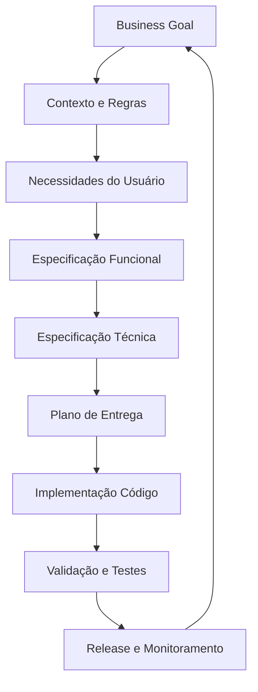
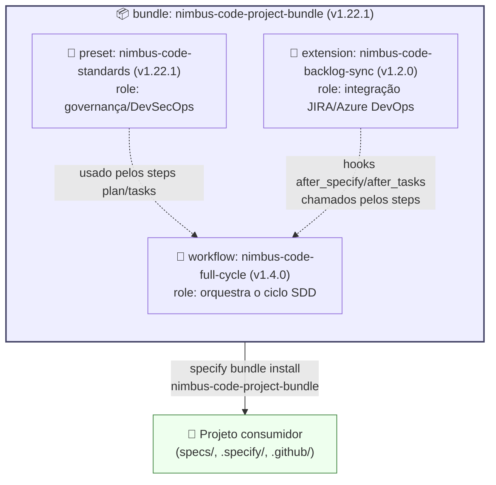

# Nimbus Code (Core Framework & Platform)

> ⚠️ **Propriedade Intelectual & Licenciamento — Venha Pra Nuvem (VPN)**
> Este repositório central (`nimbus-code`) é a fonte canônica do **Nimbus Code Framework**.
> Ele contém o core proprietário da VPN (presets institucionais, 15 agentes especialistas `nc-*`, harness de engenharia e catálogo de reuso).
> Os adaptadores de cliente (`clients/vscode`, `clients/mcp-server`) são distribuídos publicamente sob licença **BSL 1.1** (Source-Available / Avaliação Livre e Produção via Licença VPN).
> Qualquer alteração exige aprovação do `@nimbus-code-arch-board` via Pull Request (ver [`.github/CODEOWNERS`](.github/CODEOWNERS)).

Repositório central do **NIMBUS CODE™ AI Delivery System** para engine do framework,
presets corporativos, orquestração multi-IDE (`@nimbus`), adaptadores de clientes e infraestrutura de governança.
O framework oferece suporte a VS Code e a outras IDEs agênticas, incluindo
Antigravity, Claude Code, Cursor AI e Kiro.

## Arquitetura de Camadas do NIMBUS CODE

| Camada | Diretório / Módulo | Visibilidade & Licença | Descrição |
|---|---|---|---|
| **Core Framework** | `presets/`, `scripts/`, `specs/`, `templates/`, `bootstrap.sh` | **Privado VPN** (Proprietário) | Presets corporativos, personas `nc-*`, regras S0–S4, SHA-256 e harness. |
| **Clients / Multi-IDE** | `extensions/vscode/`, `servers/mcp-nimbus/` | **Público / BSL 1.1** | Extensão VS Code/Cursor e Servidor MCP universal (Claude Code, Cursor, AGY). |
| **Cloud & Entitlement** | `infrastructure/nimbus-code-extension-iac/` | **Privado VPN** (Azure) | IaC Terraform (Container Apps, Storage WORM 5y, Key Vault, PostgreSQL). |
| **Documentação** | `docs/` | **Público / Governança** | Manuais de onboarding, guias do desenvolvedor e FAQ da BSL 1.1. |

## Modelo Operacional: "Sanfona de Dev" e BYO-LLM

1. **Zero Custo de Tokens para a VPN (BYO-LLM):** Toda inferência de código é realizada com a infraestrutura de IA do próprio cliente (GitHub Copilot corporativo, chaves de API do cliente). A VPN nunca paga a inferência dos desenvolvedores.
2. **Community / Self-Service:** Desenvolvedores utilizam a extensão pública com `specify-cli` upstream para testes locais irrestritos.
3. **Enterprise & Sanfona de Dev:** Clientes que contratam a VPN contam com os squads de aceleração e o esquadrão completo de agentes `nc-*` para entregas de alta complexidade.

## Governança corporativa de IA

Esta organização usa uma única constituição corporativa para toda IA. A
implementação documental desta política vive em
[`docs/ai-governance/README.md`](docs/ai-governance/README.md) e define:

- **Ferramentas oficiais de IA**: Microsoft Copilot para produtividade/negócio
  e GitHub Enterprise Copilot para engenharia.
- **Governança M365**: qualquer agente criado no Microsoft 365 segue a mesma
  constituição, com regras próprias de publicação, compartilhamento e uso de
  dados.
- **Ferramentas legadas**: Claude Enterprise e ChatGPT só devem ser usadas sob
  a mesma constituição corporativa, sem política paralela.
- **Nomenclatura Nimbus**: os nomes Nimbus são uma camada de aliases sobre o
  Spec Kit; os comandos originais continuam válidos e suportados.

## Framework NIMBUS em passos (Business → Código)

1. **Business Goal**
   Definir problema, objetivo, KPI e valor de negócio.

2. **Contexto e Regras**
   Mapear stakeholders, restrições, riscos e critérios de sucesso.

3. **Necessidades do Usuário**
   Transformar objetivos em jornadas, dores e resultados esperados.

4. **Especificação Funcional**
   Converter necessidades em requisitos claros (escopo, regras, fluxos).

5. **Especificação Técnica**
   Traduzir requisitos para arquitetura, contratos, dados e integrações.

6. **Plano de Entrega**
   Quebrar em épicos, histórias e tarefas priorizadas.

7. **Implementação (Código)**
   Desenvolver incrementalmente, com padrões e qualidade.

8. **Validação**
   Testar (funcional, integração, aceitação) e verificar KPI de negócio.

9. **Release e Aprendizado**
   Publicar, monitorar métricas e retroalimentar o ciclo.



O bootstrap agora exige a seleção explícita do tipo de repositório (`platform`
ou `dev_standards`) antes de instalar qualquer preset. Em CI/automação, use
`--repo-type` para evitar falha explícita em modo não interativo.
Use `--ref <tag-ou-branch>` (ou `--version`) para fixar a versão do template;
quando essa opção não é informada, o bootstrap usa `main`. A versão instalada,
o preset e a referência de origem ficam registrados em
`.nimbus/bootstrap.json` para auditoria e upgrades reproduzíveis.

Os perfis são estritos: `dev_standards` instala a extensão de backlog, a
extensão de custo, o workflow `nimbus-code-full-cycle`, as automações de
GitHub Project, o catálogo de reuso, o manual de sessões e os artefatos de
custo; `platform` instala somente o preset, o template de issue e as
instruções específicas de plataforma. Assim, um repositório de plataforma
não recebe automações de backlog, custo, GitHub Project ou hooks de
versionamento de workload por acidente. O bootstrap falha quando uma
instalação crítica ou o diretório de templates do preset selecionado não pode
ser aplicado — erros reais não são tratados como "já instalado".

No fluxo greenfield, o bootstrap também registra a decisão estrutural
`monorepo` vs `multirepo` com justificativa e owner (`--delivery-model`,
`--decision-reason`, `--decision-owner`). Quando a escolha for `multirepo`,
a baseline recomendada FRONT/BACK/DESIGN/DATA/JOBS é usada como ponto de
partida adaptável (com justificativa + ownership explícitos).

## O que este repositório contém

| Componente | Pasta | O que faz |
|---|---|---|
| **Preset** `nimbus-code-standards` | [`presets/nimbus-code-standards/`](presets/nimbus-code-standards/) | Injeta os princípios não-negociáveis da empresa na constituição (`wrap`) e acrescenta o Security/DevSecOps Gate + Architecture Decision Log ao `plan.md`, o checklist de qualidade ao `tasks.md` (`append`) e o fluxo de entrevista `speckit-interview` com validação determinística. |
| **Extensão** `nimbus-code-backlog-sync` | [`extensions/nimbus-code-backlog-sync/`](extensions/nimbus-code-backlog-sync/) | Sincroniza specs/tasks com JIRA ou Azure DevOps via MCP, como hook opcional após `/nimbus-code-specify` e `/nimbus-code-tasks`. |
| **Workflow** `nimbus-code-full-cycle` | [`workflows/nimbus-code-full-cycle/`](workflows/nimbus-code-full-cycle/) | Ciclo SDD completo com um gate explícito de DevSecOps entre `plan` e `tasks`. |
| **Bundle** `nimbus-code-project-bundle` | [`bundles/nimbus-code-project-bundle/`](bundles/nimbus-code-project-bundle/) | Amarra as três peças acima numa "receita" instalável de uma vez, com versões pinadas. |
| **Skill** `speckit-interview` | [`.github/skills/speckit-interview/`](.github/skills/speckit-interview/) | Conduz a entrevista de descoberta e preenche `specs/<feature>/interview.md` antes do `/speckit-specify`. |

Cada peça é independentemente versionada (SemVer) e pode ser instalada isolada —
ver o README de cada pasta.

## 📘 Manual do Dev — comece por aqui

Se você está conduzindo a migração do nome do repositório ou atualizando
projetos consumidores, veja também
[`docs/repository-rename-migration.md`](docs/repository-rename-migration.md).

Se você é dev e vai usar o Nimbus Code no dia a dia (repo novo, repo existente
sem Nimbus Code, ou importar um card do Azure DevOps/JIRA para começar uma
feature), o documento central é
[`docs/developer-guide.md`](docs/developer-guide.md) — cobre os três cenários
passo a passo, com os prompts exatos a usar.

### 🔶 Brownfield: boas práticas, DOs e DONTs

Se você está rodando Nimbus Code em um **repositório já existente** (brownfield),
leia **obrigatoriamente** [`docs/brownfield-best-practices.md`](docs/brownfield-best-practices.md)
— é referência profunda sobre:

- Por que a constituição é o passo crítico (e como iterá-la).
- Múltiplos passes de `implement` → `converge` (esperado, não erro).
- Artefatos SDD como documentos vivos (quando editar vs. regenerar).
- Integração com backlog externo (Azure DevOps/JIRA).
- Estratégia para múltiplas homologações com Feature Toggle.
- Troubleshooting comum e estratégias de migração incremental.

**TL;DR do brownfield**: sempre rode `/speckit.constitution` **antes** de qualquer
feature (análise profunda do código existente é essencial); use
`/speckit.converge` **sempre** após `implement`; aceite múltiplos passes e
documentar exceções no Architecture Decision Log.

Para o cenário de branches concorrentes (3+ homologações ativas), veja também
[`docs/feature-toggle-multi-homologacoes.md`](docs/feature-toggle-multi-homologacoes.md).
Para adoção de LaunchDarkly no processo atual, veja
[`docs/launchdarkly-no-processo-nimbus.md`](docs/launchdarkly-no-processo-nimbus.md).

## Modelo visual do bundle



O bundle só amarra os três componentes acima em versões pinadas — nenhum tem
lógica própria fora do que já é descrito na tabela acima. Diagramas completos
(estratégias `wrap`/`append` do preset, fluxo do workflow com os gates,
instalação/atualização e o ecossistema de servidores MCP candidatos por
plataforma — GitHub, Microsoft 365, Azure, Google Workspace, GCP) estão em
[`docs/bundle-architecture.md`](docs/bundle-architecture.md).

## Como um projeto novo já nasce com isso

```bash
curl -fsSL https://venha-pra-nuvem.ghe.com/venha-pra-nuvem/nimbus-code/raw/main/bootstrap.sh | bash
```

Isso executa `specify init` (se ainda nao inicializado), exige a selecao explicita do tipo de repositorio (`platform` ou `dev_standards`) e instala preset + extensao + workflow na versao publicada mais recente da branch `main`.

### Bootstrap intake: greenfield vs brownfield

Antes de seguir para qualquer outra etapa, o `bootstrap.sh` classifica o
repositório como **greenfield** ou **brownfield** com base em `relevant
application code`.

- **Greenfield**: repositórios com apenas `README`, `LICENSE`, workflows,
  templates, scripts de setup ou esqueleto mínimo sem implementação real.
- **Brownfield**: repositórios que já contêm código de aplicação relevante em
  diretórios como `src/`, `app/`, `packages/`, `services/`, `frontend/` e
  `backend`, ou manifests/testes já conectados a esse código.

O resultado aparece no console com a interpretação operacional da escolha para
facilitar validação humana e alinhamento com a [quickstart](specs/020-satellite-repo-governance/quickstart.md).

**Alternativa mais robusta para troubleshooting, VPN/proxy ou shell com pipe restrito:**

```bash
curl -fsSL https://venha-pra-nuvem.ghe.com/venha-pra-nuvem/nimbus-code/raw/main/bootstrap.sh \
  -o /tmp/nimbus-bootstrap.sh
bash /tmp/nimbus-bootstrap.sh
```


### Bônus: GitHub Project criado automaticamente (garantido em todo repo)

Se o `gh` CLI estiver instalado e autenticado, o `bootstrap.sh` **cria
automaticamente um GitHub Project V2** com 5 views padrão (copiadas do
IOX-CROWDFUNDINGPAAS) e 2 campos customizados:

- **Board por Epic** — visão da camada EPIC (`type:epic`)
- **Board por Feature** — visão da camada FEATURE (`type:feature`)
- **Board por User Story** — visão da camada US (`type:user-story`)
- **Board por Prioridade** — organize por níveis de prioridade
- **Tabela — P0 Blocker** — filtro pré-configurado para P0-blocker críticos
- **Campo "Horas Humanas"** (número) — para lançar tempo humano em tarefas de
  modelo híbrido (agente + humano) e compor o custo real da tarefa (tokens do
  agente + horas humanas × taxa do perfil) — ver
  [`docs/ai-code-quality-and-observability.md`](docs/ai-code-quality-and-observability.md#8-modelo-híbrido-agentes-de-ia--humanos-codando-juntos)
  e [`docs/cost-profiles-and-rates.md`](presets/nimbus-code-standards/templates/cost-profiles-and-rates.md)
- **Campo "Oportunidade D365"** (texto) — cole a URL completa da Oportunidade
  no Dynamics 365 para vincular a issue/PR à venda/negócio de origem
- **Campo "Ocorrência CRM (N1)"** (texto) — cole a URL/ID do atendimento N1 no
  CRM para incidentes e reconciliação operacional

O project é criado com o nome `{repo-name} — Nimbus Code Roadmap` e fica
imediatamente acessível para customize (adicionar/remover filtros, agrupar
por campos, etc.).

**Garantia continua:** o `bootstrap.sh` tambem instala
[`.github/workflows/ensure-github-project.yml`](.github/workflows/ensure-github-project.yml),
que roda semanalmente e recria o Project automaticamente se ele nao existir
mais (ex.: `gh` CLI indisponivel no bootstrap original, ou Project apagado por
engano) - garantindo que **todo repositorio com este bundle sempre tenha o
Project**, mesmo sem intervencao manual. Prefere `NIMBUS_APP_ID` e
`NIMBUS_APP_PRIVATE_KEY`; `VPNDEV_PROJECT_TOKEN` permanece apenas como fallback
temporario durante o rollout do GitHub App.

Se preferir criar o project **manualmente** ou em **um repositório existente**:

```bash
bash ./scripts/setup-github-project.sh --repo-owner venha-pra-nuvem --repo-name meu-projeto
```

### Bônus: Portfólio PMO (visão consolidada de todos os repositórios)

Além do Project por repositório acima, o bundle também cobre a visão
**cross-repositório** que o PMO precisa (backlog/prioridade e custo real
consolidados):

1. **Uma vez por organização**, crie o Project de portfólio:
   ```bash
   bash ./scripts/setup-pmo-org-project.sh --org venha-pra-nuvem
   ```
   Cria um GitHub Project V2 de organização com 4 views (Board por
   Repositório, Board por Prioridade, Tabela — Backlog Consolidado, Tabela —
   P0 Blocker).
2. **Em cada repositório** que deve alimentar esse board, instale
   [`templates/workflows/add-to-pmo-project.yml`](templates/workflows/add-to-pmo-project.yml)
   apontando para a URL do project criado acima — toda issue/PR nova é
   adicionada automaticamente (via [`actions/add-to-project`](https://github.com/actions/add-to-project)).
3. Para **custo real (Horas Humanas), Oportunidades D365 e Ocorrências CRM (N1)
   consolidados**
   entre repositórios — que não somam sozinhos no board de portfólio, pois
   são campos por-projeto no GitHub Projects V2 — rode:
   ```bash
   bash ./scripts/pmo-cost-rollup.sh --repo venha-pra-nuvem/repo1 --repo venha-pra-nuvem/repo2
   ```

Detalhes completos em
[`docs/ai-code-quality-and-observability.md` — "Como o PMO acompanha o status"](docs/ai-code-quality-and-observability.md#como-o-pmo-acompanha-o-status-visão-por-projeto-e-visão-global).

### Bônus: Labels de priorização e desenvolvimento autônomo

O `bootstrap.sh` também **cria/atualiza automaticamente a taxonomia de
labels** do bundle (via `scripts/setup-github-labels.sh`): `priority:P0-blocker`
a `P3-low`, `complexity:S0`–`S4`, `type:bug/feature/chore/docs`,
`agent:autonomous-ok`/`agent:needs-human`, `status:needs-triage`/`blocked` e
`dora:deployment-frequency`/`dora:lead-time`/`dora:change-failure-rate`/`dora:mttr`
(para correlacionar issues com os 4 indicadores DORA).

O label `agent:autonomous-ok` dispara automaticamente a atribuicao da issue
ao GitHub Copilot coding agent (via
[`.github/workflows/agent-auto-assign.yml`](.github/workflows/agent-auto-assign.yml)),
com guardrails que impedem atribuicao autonoma em issues `agent:needs-human`,
`complexity:S4`, `status:blocked` ou ja atribuidas. Prefere
`NIMBUS_APP_ID`/`NIMBUS_APP_PRIVATE_KEY`; `COPILOT_AGENT_ASSIGN_TOKEN` segue
como fallback temporario durante o rollout - ver guia
completo, incluindo como evitar gatilhos duplicados com a feature nativa
"Copilot Automations" do GitHub, em
[`docs/label-taxonomy-and-autonomous-dev.md`](docs/label-taxonomy-and-autonomous-dev.md).

Para criar/atualizar os labels manualmente em qualquer repositório:

```bash
bash ./scripts/setup-github-labels.sh --repo-owner venha-pra-nuvem --repo-name meu-projeto
```

### Bônus: verificação automática de atualização do Nimbus Code/bundle

O `bootstrap.sh` também copia
[`templates/workflows/update-speckit-and-bundle.yml`](templates/workflows/update-speckit-and-bundle.yml)
para `.github/workflows/` do projeto consumidor. Esse workflow roda
semanalmente + sob demanda e abre/atualiza uma issue avisando quando há uma
versão mais nova do Nimbus Code CLI ou do bundle — nunca aplica a atualização
sozinho (ver [Versão do Bundle em uso — Política de Atualização](#versão-do-bundle-em-uso--política-de-atualização)).
Com o secret `VPNDEV_STANDARDS_READ_TOKEN` configurado no projeto consumidor,
também compara a versão mais recente do bundle; sem esse secret, o workflow
continua e compara apenas a versão do Nimbus Code CLI.

> **Nota sobre `specify bundle install`**: o CLI do Nimbus Code resolve os
> componentes de um bundle (`provides.presets/extensions/workflows`) **somente
> através de um catálogo registrado** — o campo `source` do `bundle.yml` é só
> metadado de proveniência, não um mecanismo de download. Por isso este repo
> publica tanto os artefatos via GitHub Releases quanto os `catalog.json` de
> cada tipo (`presets/catalog.json`, `extensions/catalog.json`,
> `workflows/catalog.json`, `bundles/catalog.json`). Depois de registrar os
> catálogos uma vez (ver [Publicação e Catálogo](#publicação-e-catálogo)),
> `specify bundle install nimbus-code-project-bundle` funciona como um comando único.

## Versão do Bundle em uso — Política de Atualização

**A versão do bundle instalada em um projeto só muda mediante aprovação
formal** — da mesma forma que a versão do próprio Nimbus Code CLI. Isso existe
para que nenhum projeto tenha seu `plan.md`/`constitution.md`/workflow
alterados silenciosamente por uma atualização de política organizacional no
meio de uma feature em andamento.

Fluxo de atualização:

1. Uma mudança neste repositório (preset/extensão/workflow) é revisada e
   aprovada via PR normal.
2. Uma nova versão do bundle é publicada (ver [Versionamento](#versionamento))
   **somente** depois da aprovação — nunca antes.
3. Cada projeto consumidor recebe, semanalmente, uma **issue automática**
   (workflow `update-speckit-and-bundle.yml`, instalado automaticamente em
   `.github/workflows/` pelo `bootstrap.sh` — ver
   [`templates/workflows/`](templates/workflows/)) comparando sua versão
   instalada com a mais recente publicada aqui — **essa issue nunca aplica a
   atualização sozinha**, apenas avisa e traz os comandos exatos a rodar; a
   atualização em si sempre vira um PR normal, revisado como qualquer outra
   mudança de dependência. Se algum arquivo local copiado pelo bootstrap tiver
   sido apagado, rerode o bootstrap/sync antes do PR para reidratar os artefatos
   faltantes. Com o secret `VPNDEV_STANDARDS_READ_TOKEN` (PAT de qualquer membro
   da organização), também compara a versão publicada do bundle; sem esse
   secret, a execução continua e valida apenas o Nimbus Code CLI.

Todo projeto que consome este bundle deve documentar, no seu próprio README, a
versão instalada — ver o modelo em
[`templates/README-bundle-section.md`](templates/README-bundle-section.md).

## Templates Reutilizáveis para Projetos Consumidores

Este repositório fornece arquivos prontos para copiar em projetos que usam o Nimbus Code:

| Template | Propósito | Onde copiar |
|---|---|---|
| [`templates/README-bundle-section.md`](templates/README-bundle-section.md) | Seção do README do projeto documentando versão do bundle | `README.md` do projeto (adapte para seu contexto) |
| [`templates/BROWNFIELD-SETUP-CHECKLIST.md`](templates/BROWNFIELD-SETUP-CHECKLIST.md) | Checklist interativo para setup de Nimbus Code em repo existente | `.specify/BROWNFIELD-SETUP-CHECKLIST.md` (brownfield) |
| [`templates/workflows/update-speckit-and-bundle.yml`](templates/workflows/update-speckit-and-bundle.yml) | GitHub Action automática para notificar atualizações do bundle | `.github/workflows/update-speckit-and-bundle.yml` (todos os projetos) |

Além destes, o preset `nimbus-code-standards` já instala automaticamente (sem
cópia manual) os seguintes workflows de governança em `.github/workflows/` de
todo projeto consumidor: `graph-guard.yml` (bloqueia PR que altera código sem
atualizar `graph.yaml`/`graph.md`), `agent-auto-assign.yml` (atribui o Copilot
coding agent quando `agent:autonomous-ok` é aplicado), `promote-develop-to-main.yml`
(abre o PR de promoção `develop` -> `main`), `normalize-issue-bodies.yml` e
`close-referenced-issues-fallback.yml`.

**Para brownfield especificamente**: depois de rodar `specify init` e o
`bootstrap.sh`, copie o checklist para o seu `.specify/`:

```bash
curl -fsSL https://venha-pra-nuvem.ghe.com/venha-pra-nuvem/nimbus-code/raw/main/templates/BROWNFIELD-SETUP-CHECKLIST.md \
  > .specify/BROWNFIELD-SETUP-CHECKLIST.md
git add .specify/BROWNFIELD-SETUP-CHECKLIST.md
```

Depois, siga as fases do checklist como um roadmap de setup — lê-o enquanto trabalha
com o Nimbus Code. Após completado, o arquivo fica versionado como parte do histórico
de decisões do projeto.

## Versionamento

Cada componente (preset, extensão, workflow, bundle) segue
[SemVer](https://semver.org/) de forma independente, mas o **bundle sempre pina
versões exatas** dos componentes que referencia (nunca ranges) — para que
`nimbus-code-project-bundle vX.Y.Z` seja sempre reproduzível.

Mudar qualquer arquivo em `presets/`, `extensions/` ou `workflows/` é uma
**mudança de política organizacional**: requer PR revisado pelo time responsável
pelos padrões da Nimbus-Code antes de publicar uma nova versão de bundle. Não é
uma decisão de projeto individual.

## Publicação e Catálogo

Releases são publicadas via tag `vX.Y.Z` — o workflow
[`.github/workflows/release.yml`](.github/workflows/release.yml) empacota cada
componente em `.zip` e anexa como assets da GitHub Release correspondente. Os
arquivos `catalog.json` em `presets/`, `extensions/`, `workflows/` e `bundles/`
apontam para esses assets e são atualizados no mesmo PR que muda a versão.

### Fluxo semi-automático de versão (develop -> main -> tag)

1. **Durante PRs para `develop`**
   - Classifique a PR com um label `release:*`:
     - `release:major`, `release:minor`, `release:patch` ou `release:skip`.
   - O gate
     [`.github/workflows/release-readiness-gate.yml`](.github/workflows/release-readiness-gate.yml)
     auto-rotula `release:skip` para mudanças só de documentação de release e
     `release:patch` quando a PR já altera arquivos versionados + `catalog.json`;
     fora desses casos, ele falha se a PR não tiver exatamente um label
     `release:*`.
2. **Ao merge em `develop`**
   - O workflow
     [`.github/workflows/release-impact-advisor.yml`](.github/workflows/release-impact-advisor.yml)
     registra recomendação de bump na issue operacional `Release Candidate: develop`.
3. **Promoção para `main`**
   - O workflow
     [`.github/workflows/promote-develop-to-main.yml`](.github/workflows/promote-develop-to-main.yml)
     abre/atualiza PR `develop` -> `main` e solicita aprovadores configurados.
4. **Publicação da versão**
   - Depois do PR `develop` -> `main` aprovado e mergeado, o workflow
     [`.github/workflows/tag-release-on-main.yml`](.github/workflows/tag-release-on-main.yml)
     cria/pusha a tag `vX.Y.Z` com base em `bundles/nimbus-code-project-bundle/bundle.yml`.
   - O workflow de release valida que a tag está em commit da `main` e então publica.

Para registrar os catálogos uma vez por projeto (ou uma vez por máquina, em
`~/.specify/*-catalogs.yml`):

```bash
specify preset catalog add \
  https://venha-pra-nuvem.ghe.com/venha-pra-nuvem/nimbus-code/raw/main/presets/catalog.json \
  --name nimbus-code --priority 5 --install-allowed

specify extension catalog add \
  https://venha-pra-nuvem.ghe.com/venha-pra-nuvem/nimbus-code/raw/main/extensions/catalog.json \
  --name nimbus-code --install-allowed

specify workflow catalog add \
  https://venha-pra-nuvem.ghe.com/venha-pra-nuvem/nimbus-code/raw/main/workflows/catalog.json \
  --name nimbus-code

specify bundle catalog add \
  https://venha-pra-nuvem.ghe.com/venha-pra-nuvem/nimbus-code/raw/main/bundles/catalog.json \
  --id nimbus-code --priority 5 --policy install-allowed
```

Depois disso, `specify bundle install nimbus-code-project-bundle --integration copilot`
funciona como um comando único, em qualquer diretório (novo ou existente).

> ℹ️ **Este repositório é interno** (visível a todos os membros da organização
> `venha-pra-nuvem`, fora do público). Isso simplifica bastante o acesso em
> relação a um repositório privado: qualquer membro autenticado da
> organização — incluindo um token de máquina/CI que seja membro da org —
> já enxerga `venha-pra-nuvem.ghe.com/.../raw/main/...` sem precisar ser adicionado
> como colaborador deste repositório especificamente. Ainda assim, requisições
> HTTP simples (`curl`, e o fetcher interno do `specify` CLI) **exigem um
> token de autenticação** (não é o mesmo mecanismo usado por `git clone`/`gh`,
> que já funciona com as credenciais configuradas na máquina/CI). Por isso,
> **o caminho recomendado e já validado ponta a ponta hoje é o
> [`bootstrap.sh`](bootstrap.sh)** (que usa `git clone` autenticado, não HTTP
> cru) — o fluxo por catálogo acima é o alvo de longo prazo e só precisa de
> um token de leitura de escopo mínimo (qualquer membro da org já serve, não
> precisa de acesso concedido especificamente a este repo).

## Extensões candidatas a repositório próprio

Ver análise completa em [`docs/extension-candidates.md`](docs/extension-candidates.md).

## MCP Servers no bundle?

O Nimbus Code **não instala nem gerencia** servidores MCP — o bundle/extensão só
pode **declarar** uma dependência informativa (`requires.mcp` em `extension.yml`),
que aparece como aviso na instalação, mas não provisiona nada. Ver detalhes em
[`docs/mcp-and-bundles.md`](docs/mcp-and-bundles.md), incluindo uma tabela de
referência com os servidores MCP mais relevantes por plataforma (GitHub,
Microsoft 365, Azure, Google Workspace, GCP) como candidatos avaliados — nenhum
deles instalado pelo bundle hoje.

## Estrutura

```text
nimbus-code/
├── presets/nimbus-code-standards/           # preset.yml + templates/
├── extensions/nimbus-code-backlog-sync/     # extension.yml + commands/
├── workflows/nimbus-code-full-cycle/        # workflow.yml
├── bundles/nimbus-code-project-bundle/      # bundle.yml
├── scripts/
│   ├── setup-github-project.sh         # cria GitHub Project V2 com views padrão
│   └── setup-github-labels.sh          # cria/atualiza taxonomia de labels (priority/complexity/type/agent/status)
├── templates/                         # arquivos para copiar em projetos consumidores
│   ├── README-bundle-section.md
│   ├── BROWNFIELD-SETUP-CHECKLIST.md
│   └── workflows/update-speckit-and-bundle.yml
├── docs/
│   ├── bundle-architecture.md
│   ├── brownfield-best-practices.md
│   ├── developer-guide.md
│   ├── extension-candidates.md
│   ├── feature-toggle-multi-homologacoes.md
│   ├── launchdarkly-no-processo-nimbus.md
│   ├── ai-code-quality-and-observability.md
│   ├── label-taxonomy-and-autonomous-dev.md
│   └── mcp-and-bundles.md
├── bootstrap.sh
└── .github/workflows/
    ├── release.yml
    ├── agent-auto-assign.yml           # auto-assign do Copilot coding agent via label agent:autonomous-ok
    ├── graph-guard.yml
    └── dependency-review.yml
```
