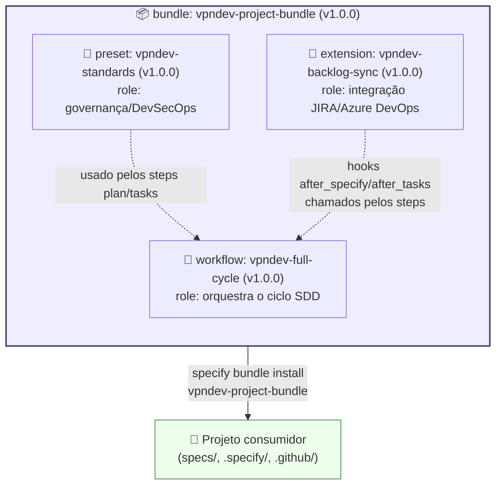
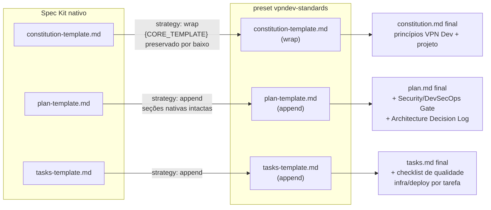
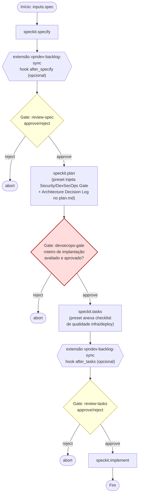
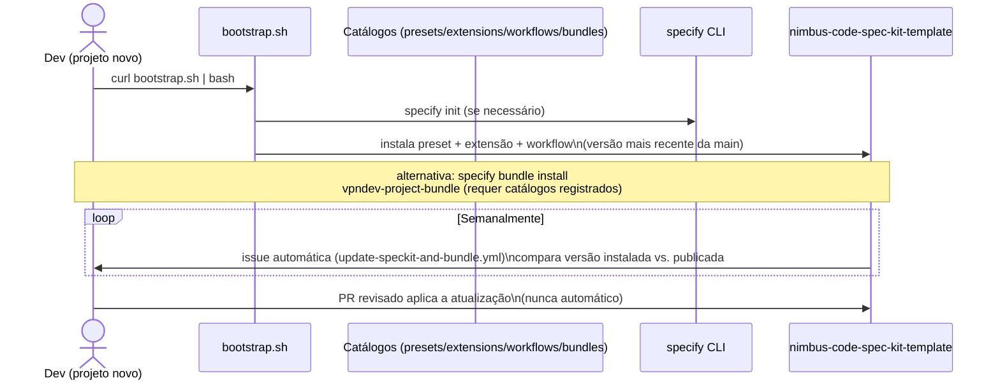
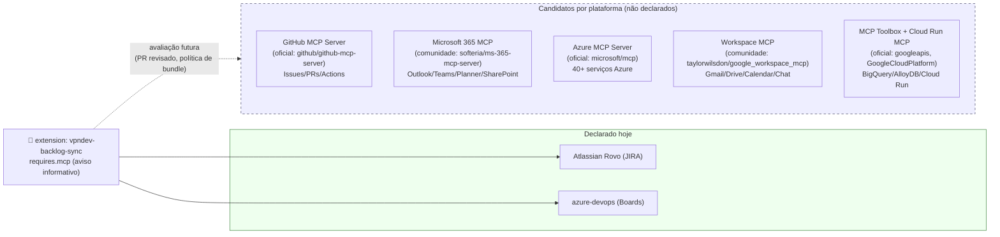

# Modelo Visual do Bundle (diagramas Mermaid)

Este documento traduz em diagramas o que já está descrito em texto no
[README.md](../README.md) e nos manifestos `*.yml` de cada componente — para
consulta rápida por devs que preferem um modelo visual.

Se a renderização Mermaid mudar de comportamento (novo componente, nova
estratégia, novo step de workflow), **atualize este arquivo junto** com o PR
que muda o `.yml` correspondente — ele não é gerado automaticamente.

## 1. Composição do bundle

O `vpndev-project-bundle` não contém lógica própria: ele só **amarra três
componentes independentes**, cada um publicado e versionado separadamente
(ver [`bundle.yml`](../bundles/vpndev-project-bundle/bundle.yml)).

**Leitura**: instalar o bundle é equivalente a instalar preset + extensão +
workflow nas versões exatas pinadas no `bundle.yml` (nunca ranges — ver
[Versionamento](../README.md#versionamento)). O workflow **consome** o preset
(templates alterados) e a extensão (hooks) em tempo de execução, mas os três
são artefatos versionados de forma independente.

## 2. Como o preset altera os templates nativos do Spec Kit

O preset `vpndev-standards` nunca substitui os templates do Spec Kit por
inteiro — ele aplica duas estratégias diferentes, item por item (ver
[`preset.yml`](../presets/vpndev-standards/preset.yml)):

**Leitura**: `wrap` envolve o conteúdo nativo (que continua existindo, só que
"por dentro"); `append` só acrescenta seções novas ao final. Em nenhum caso o
preset remove algo que o Spec Kit já oferece nativamente.

## 3. Fluxo do workflow `vpndev-full-cycle`

Ciclo SDD completo com dois gates humanos explícitos, um deles específico de
DevSecOps (ver [`workflow.yml`](../workflows/vpndev-full-cycle/workflow.yml)):

**Leitura**: os hooks da extensão (`after_specify`/`after_tasks`) são
**opcionais** — se o projeto não usa JIRA/Azure DevOps, o dev simplesmente
recusa o prompt e o ciclo segue normalmente usando só `specs/` como fonte da
verdade. O `devsecops-gate` (em vermelho) é o ponto que distingue este
workflow do ciclo padrão do Spec Kit.

## 4. Instalação e política de atualização

**Leitura**: a issue semanal **nunca aplica** a atualização sozinha — toda
mudança de versão do bundle vira um PR revisado, seguindo a mesma política de
aprovação formal usada para mudar a versão do próprio Spec Kit CLI (ver
[Versão do Bundle em uso — Política de Atualização](../README.md#versão-do-bundle-em-uso--política-de-atualização)).

## 5. Ecossistema de MCP servers candidatos

O Spec Kit **nunca instala** servidores MCP — `requires.mcp` é só um aviso em
texto na hora da instalação (ver
[`docs/mcp-and-bundles.md`](mcp-and-bundles.md)). O diagrama abaixo situa a
declaração atual da extensão (`atlassian-rovo`/`azure-devops`) ao lado de outros
servidores MCP relevantes por plataforma, pesquisados como candidatos para
futuras extensões da VPN Dev — nenhum deles provisionado pelo bundle:

**Leitura**: mudar `requires.mcp` da extensão para incluir qualquer um destes é
uma **mudança de política organizacional** — segue o mesmo fluxo de PR revisado
descrito em [Versionamento](../README.md#versionamento), igual a qualquer
alteração em `presets/`, `extensions/` ou `workflows/`. A tabela completa com
links, status oficial/comunidade e escopo de cada servidor está em
[`docs/mcp-and-bundles.md`](mcp-and-bundles.md#servidores-mcp-relevantes-por-plataforma-referência-para-requiresmcp).
