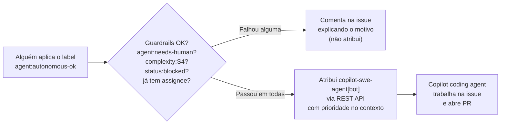

# Labels — Priorização, Ordenamento e Desenvolvimento Autônomo

Este documento descreve a taxonomia padrão de labels do bundle VPN Dev, criada
via [`scripts/setup-github-labels.sh`](../scripts/setup-github-labels.sh), e
como ela é usada para (1) **priorizar e ordenar** issues/PRs no backlog e (2)
decidir quais issues são candidatas a **desenvolvimento autônomo** por agente
(ex.: GitHub Copilot coding agent) via o workflow
[`.github/workflows/agent-auto-assign.yml`](../.github/workflows/agent-auto-assign.yml).

Nasce junto com todo projeto novo que roda `bootstrap.sh` (ver
[README — Bônus: GitHub Project criado automaticamente](../README.md#bônus-github-project-criado-automaticamente))
— não é algo que cada time precisa inventar depois.

## 1. Por que um processo de labels formal?

Sem uma taxonomia compartilhada, cada projeto da VPN Dev acaba reinventando (ou
não tendo) uma forma consistente de responder a duas perguntas recorrentes:

1. **Em que ordem o time (humano ou agente) deve puxar o próximo item do
   backlog?** → resolvido pelos labels `priority:*`.
2. **Esta issue pode ser implementada por um agente de IA sem um humano
   precisar acompanhar cada passo, ou exige revisão humana desde o início?**
   → resolvido pelos labels `agent:*` (e pela guardrail automática de
   `complexity:S4`, que nunca é autônoma).

## 2. Taxonomia completa

| Categoria | Label | Cor | Uso |
|---|---|---|---|
| Prioridade | `priority:P0-blocker` | `#b60205` | Bloqueador — trata antes de qualquer outro item |
| Prioridade | `priority:P1-high` | `#d93f0b` | Próximo item a puxar após todo P0 |
| Prioridade | `priority:P2-medium` | `#fbca04` | Planejado, sem urgência imediata |
| Prioridade | `priority:P3-low` | `#0e8a16` | Nice-to-have |
| Complexidade | `complexity:S0`–`S4` | gradiente verde→vermelho | Mesma escala S0–S4 do `copilot-instructions.md` (ver [`ai-code-quality-and-observability.md`](ai-code-quality-and-observability.md#6-seleção-de-modelo-por-complexidade-s0s4)) |
| Tipo | `type:bug` / `type:feature` / `type:chore` / `type:docs` | padrão GitHub | Classificação padrão de issue/PR |
| Agente | `agent:autonomous-ok` | `#0e8a16` | Dispara o auto-assign ao Copilot coding agent |
| Agente | `agent:needs-human` | `#e99695` | Bloqueia qualquer auto-assign, mesmo que `agent:autonomous-ok` também esteja presente |
| Status | `status:needs-triage` | `#ededed` | Issue nova, ainda sem `priority:*`/`complexity:*` — não deve ser puxada por agente autônomo |
| Status | `status:blocked` | `#5319e7` | Pular na fila, mesmo com `priority:P0-blocker` |
| DORA | `dora:deployment-frequency` | `#0052cc` | Issue impacta a frequência de deploy |
| DORA | `dora:lead-time` | `#1d76db` | Issue impacta o lead time for changes |
| DORA | `dora:change-failure-rate` | `#d93f0b` | Issue impacta a taxa de falha de mudança |
| DORA | `dora:mttr` | `#b60205` | Issue impacta o tempo de restauração de serviço (MTTR) |

A lista de labels (nome, cor, descrição) vive como fonte única da verdade em
[`scripts/setup-github-labels.sh`](../scripts/setup-github-labels.sh) — este
documento explica o *porquê*, o script é o *o quê* executável.

## 3. Ordenamento do backlog

A ordem de leitura recomendada para qualquer pessoa (ou agente) decidir "qual é
o próximo item a puxar" é:

1. Excluir tudo com `status:blocked` ou `status:needs-triage`.
2. Ordenar o restante por `priority:*`: `P0-blocker` > `P1-high` >
   `P2-medium` > `P3-low`. Itens sem label de prioridade são tratados como
   `P2-medium` por padrão (ver comentários do workflow
   `.github/workflows/agent-auto-assign.yml`).
3. Dentro do mesmo nível de prioridade, usar `complexity:*` apenas para
   decidir alocação de agente/modelo (ver escala S0–S4) — não para desempatar
   ordem, a menos que o time decida isso explicitamente.

Essa ordenação é visualizável diretamente na view **"Board por Prioridade"**
do GitHub Project criado por
[`scripts/setup-github-project.sh`](../scripts/setup-github-project.sh) —
agrupe/ordene essa view pelos labels `priority:*` para obter a fila real.

## 4. Desenvolvimento autônomo: quando é seguro?

Uma issue é candidata a desenvolvimento 100% autônomo (sem humano precisar
acompanhar cada etapa) quando:

- Tem o label `agent:autonomous-ok` **e**
- **Não** tem `agent:needs-human` **e**
- **Não** tem `complexity:S4` (regra da constituição VPN Dev: S4 sempre exige
  revisão humana, nunca é autônomo — ver
  [`constitution-template.md`](../presets/vpndev-standards/templates/constitution-template.md)) **e**
- **Não** tem `status:blocked` **e**
- Ainda não tem nenhum assignee (evita reatribuir trabalho em andamento).

Todas essas condições são verificadas automaticamente pelo workflow antes de
atribuir — se qualquer uma falhar, o workflow **comenta na issue explicando o
motivo** em vez de falhar silenciosamente ou assumir o pior.

### Como funciona o gatilho



### Pré-requisitos para habilitar o auto-assign

1. Rodar `scripts/setup-github-labels.sh` no repositório (cria a taxonomia).
2. Copiar `.github/workflows/agent-auto-assign.yml` para o repositório do
   projeto (feito automaticamente pelo `bootstrap.sh`; ver seção 6).
3. GitHub Copilot coding agent habilitado no repositório/organização.
4. Configurar o secret `COPILOT_AGENT_ASSIGN_TOKEN`: um **Personal Access
   Token** (classic com escopo `repo`, ou fine-grained com leitura/escrita em
   `actions`, `contents`, `issues` e `pull requests`) de um usuário com acesso
   de escrita ao repositório.

   **Por que não dá para usar o `GITHUB_TOKEN` padrão?** A API de atribuição
   de issues ao Copilot só aceita autenticação **user-to-server** (PAT, OAuth
   app token, ou GitHub App user-to-server token). O `GITHUB_TOKEN` que o
   GitHub Actions injeta automaticamente é um token **server-to-server**
   (installation token), explicitamente **não suportado** por essa API — ver
   [documentação oficial da API de agentes do Copilot](https://docs.github.com/en/copilot/how-tos/use-copilot-agents/cloud-agent/use-cloud-agent-via-the-api).
   Sem o secret configurado, o workflow falha explicitamente com uma mensagem
   clara, em vez de tentar e falhar de forma confusa.

Sem o secret configurado, o workflow **falha explicitamente** (ver step
"Atribuir Copilot coding agent à issue") em vez de tentar e falhar de forma
confusa — assim quem instalar o bundle percebe rapidamente que falta esse
passo de configuração.

### Guardrail: por que `complexity:S4` bloqueia sempre

Isso não é uma decisão do workflow — é a aplicação técnica de uma regra que já
existe na constituição do preset (`Features S4 exigem label complexity:S4 no
PR e revisão humana`, ver
[`constitution-template.md`](../presets/vpndev-standards/templates/constitution-template.md)).
O workflow apenas garante que essa regra não pode ser contornada
acidentalmente aplicando `agent:autonomous-ok` numa issue S4.

## 5. Labels DORA — correlação com métricas DevOps

Os labels `dora:*` não afetam nenhum workflow automático (não são gatilho de
nada) — são puramente um **domínio de classificação** para permitir consultas
e dashboards que correlacionem issues fechadas com os **4 indicadores DORA**
("Four Keys", DevOps Research and Assessment):

| Label | Métrica DORA correspondente | Quando aplicar |
|---|---|---|
| `dora:deployment-frequency` | Deployment Frequency | Issues sobre pipeline de release, automação de deploy, cadência de entrega (ex.: "automatizar deploy canário", "reduzir passos manuais do release") |
| `dora:lead-time` | Lead Time for Changes | Issues sobre reduzir o tempo entre commit e produção (ex.: "paralelizar suite de testes no CI", "remover aprovação manual redundante") |
| `dora:change-failure-rate` | Change Failure Rate | Bugs introduzidos por um deploy/mudança recente, ou trabalho preventivo para reduzir a taxa de falha (ex.: "adicionar smoke test pós-deploy") |
| `dora:mttr` | Time to Restore Service (MTTR) | Incidentes, hotfixes emergenciais, ou trabalho para acelerar detecção/recuperação (ex.: "melhorar alerta de rollback automático") |

**Como usar na prática:**

1. Aplique o label `dora:*` relevante ao **triar** a issue — pode coexistir
   com `priority:*`, `complexity:*` e `type:*` normalmente (não são mutuamente
   exclusivos; uma issue pode até ter mais de um `dora:*` se impactar mais de
   uma métrica, embora isso deva ser raro).
2. Nem toda issue precisa de um label `dora:*` — só aplique quando a issue tem
   relação direta e mensurável com um dos 4 indicadores. Trabalho de feature
   comum (sem relação com pipeline/incidente/qualidade de release) não precisa
   desse label.
3. Para reportar as métricas de fato, consulte/filtre issues fechadas por
   `dora:*` e cruze com dados reais de deploy do seu pipeline de CI/CD — os
   labels **não substituem** a medição automatizada (deploy timestamps,
   incident timestamps), apenas dão contexto de **quais itens de trabalho**
   contribuíram para mover cada indicador, o que é útil para retrospectivas e
   priorização (ex.: "quantas issues P1/P2 deste trimestre foram sobre
   `dora:change-failure-rate`? Vale investir mais aqui?").
4. Times que já têm uma ferramenta dedicada de métricas DORA (ex.: DORA
   Metrics do GitHub, um dashboard próprio) podem usar esses labels como
   **complemento qualitativo** (visão de "issue → intenção"), não como
   substituto da fonte de verdade quantitativa.

## 6. Instalação em um projeto novo ou existente

O `bootstrap.sh` já chama `setup-github-labels.sh` automaticamente (mesmo
padrão do GitHub Project — ver
[README](../README.md#bônus-github-project-criado-automaticamente)). Para
instalar manualmente (ou num repositório que já existe e não vai rodar o
bootstrap de novo):

```bash
# 1. Criar/atualizar a taxonomia de labels no repositório
bash ./scripts/setup-github-labels.sh --repo-owner venha-pra-nuvem --repo-name meu-projeto

# 2. Copiar o workflow de auto-assign
mkdir -p .github/workflows
curl -fsSL https://raw.venha-pra-nuvem.ghe.com/venha-pra-nuvem/speckit-vpndev-standards/main/.github/workflows/agent-auto-assign.yml \
  > .github/workflows/agent-auto-assign.yml
git add .github/workflows/agent-auto-assign.yml

# 3. Configurar o secret no GitHub (Settings → Secrets and variables → Actions)
gh secret set COPILOT_AGENT_ASSIGN_TOKEN --repo venha-pra-nuvem/meu-projeto
```

## 7. Evitando disparo duplicado (importante antes de habilitar)

Este workflow é **o único gatilho versionado** deste bundle para atribuição
automática ao Copilot — não existe (e nunca existiu neste repositório) nenhum
outro label, script ou workflow que dispare a mesma ação. O botão manual
**"Assign to Copilot"** em Assignees continua existindo e não conflita, pois é
uma ação humana explícita, não um gatilho automático.

**Atenção a uma fonte de duplicidade que fica FORA do controle deste bundle**:
o GitHub tem uma feature nativa chamada **Copilot cloud agent Automations**
(aba **Agents → Automations** de cada repositório), configurada diretamente
na UI por qualquer pessoa com acesso de escrita — ela **não é versionada em
git**, não aparece em nenhum arquivo do repositório e é **privada de quem a
criou** (nem outros admins do repo a veem). Se alguém já tiver configurado ali
uma automação com trigger "when an issue is created" ou similar, ela rodaria
**em paralelo** a este workflow e poderia atribuir/comentar duas vezes.

Antes de habilitar `agent-auto-assign.yml` num repositório:

1. Confira a aba **Agents → Automations** do repositório (cada colaborador
   precisa checar a própria lista — automações são privadas por criador) e
   desative/ajuste qualquer automação existente com trigger em issues que
   também assigne o Copilot, para não duplicar com este workflow.
2. Se o projeto já usa Automations nativas para esse fim e prefere continuar
   assim, **não instale** `agent-auto-assign.yml` — os dois mecanismos não
   devem coexistir no mesmo repositório para a mesma finalidade.

## 8. Relação com outros documentos

- [`ai-code-quality-and-observability.md`](ai-code-quality-and-observability.md#5-bugs-abertos-e-atribuídos-automaticamente-ao-copilot) —
  gestão de bugs e atribuição ao Copilot (contexto mais amplo).
- [`module-graphs.md`](module-graphs.md) — por que `complexity:S4` exige
  `impact-map.md` e revisão humana.
- [`constitution-template.md`](../presets/vpndev-standards/templates/constitution-template.md) —
  a regra organizacional da qual a guardrail de S4 deste workflow deriva.
- [`developer-guide.md`](developer-guide.md) — manual do dev, cenários de uso
  ponta a ponta.
