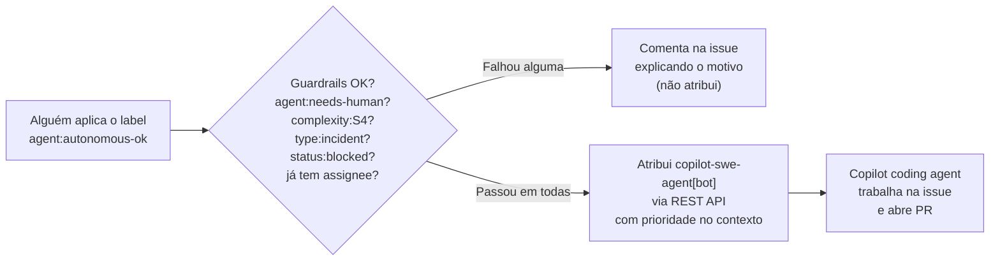

# Labels — Priorização, Ordenamento e Desenvolvimento Autônomo

> **TL;DR** (S0/S1 — leitura completa reservada para S2+ ou dúvida
> específica): ordene o backlog por `priority:P0-blocker` > `P1-high` >
> `P2-medium` > `P3-low`; desenvolvimento autônomo só com
> `agent:autonomous-ok` **e sem** `agent:needs-human`/`complexity:S4`/
> `type:incident`/`status:blocked`; `type:incident` e `complexity:S4` sempre
> exigem revisão humana; `dora:*` só correlaciona métrica, não dispara
> automação. Ver seções abaixo para o detalhamento e os guardrails do
> workflow de auto-assign.

Este documento descreve a taxonomia padrão de labels do bundle Nimbus-Code, criada
via [`scripts/setup-github-labels.sh`](../scripts/setup-github-labels.sh), e
como ela é usada para (1) **priorizar e ordenar** issues/PRs no backlog e (2)
decidir quais issues são candidatas a **desenvolvimento autônomo** por agente
(ex.: GitHub Copilot coding agent) via o workflow
[`.github/workflows/agent-auto-assign.yml`](../.github/workflows/agent-auto-assign.yml).

Nasce junto com todo projeto novo que roda `bootstrap.sh` (ver
[README — Bônus: GitHub Project criado automaticamente](../README.md#bônus-github-project-criado-automaticamente))
— não é algo que cada time precisa inventar depois.

## 1. Por que um processo de labels formal?

Sem uma taxonomia compartilhada, cada projeto da Nimbus-Code acaba reinventando (ou
não tendo) uma forma consistente de responder a duas perguntas recorrentes:

1. **Em que ordem o time (humano ou agente) deve puxar o próximo item do
   backlog?** → resolvido pelos labels `priority:*`.
2. **Esta issue pode ser implementada por um agente de IA sem um humano
   precisar acompanhar cada passo, ou exige revisão humana desde o início?**
   → resolvido pelos labels `agent:*` (e pela guardrail automática de
   `complexity:S4`, que nunca é autônoma).

## 2. Taxonomia completa

| Categoria | Label | Cor | Uso |
|---|---|---|---|
| Prioridade | `priority:P0-blocker` | `#b60205` | Bloqueador — trata antes de qualquer outro item |
| Prioridade | `priority:P1-high` | `#d93f0b` | Próximo item a puxar após todo P0 |
| Prioridade | `priority:P2-medium` | `#fbca04` | Planejado, sem urgência imediata |
| Prioridade | `priority:P3-low` | `#0e8a16` | Nice-to-have |
| Complexidade | `complexity:S0`–`S4` | gradiente verde→vermelho | Mesma escala S0–S4 do `copilot-instructions.md` (ver [`ai-code-quality-and-observability.md`](ai-code-quality-and-observability.md#6-seleção-de-modelo-por-complexidade-s0s4)) |
| Tipo | `type:epic` / `type:feature` / `type:user-story` / `type:bug` / `type:chore` / `type:docs` / `type:incident` | padrão GitHub | Classificação padrão de issue/PR e hierarquia de backlog EPIC/FEATURE/US — `type:incident` é originada de ocorrência em produção/ambiente de cliente e **sempre** exige revisão humana (ver seção 4.1) |
| Agente | `agent:autonomous-ok` | `#0e8a16` | Dispara o auto-assign ao Copilot coding agent |
| Agente | `agent:needs-human` | `#e99695` | Bloqueia qualquer auto-assign, mesmo que `agent:autonomous-ok` também esteja presente |
| Status | `status:needs-triage` | `#ededed` | Issue nova, ainda sem `priority:*`/`complexity:*` — não deve ser puxada por agente autônomo |
| Status | `status:blocked` | `#5319e7` | Pular na fila, mesmo com `priority:P0-blocker` |
| Sincronização | `sync:preset-version` | `#1d76db` | PR criado pela auditoria semanal para alinhar um satélite à versão central do preset |
| DORA | `dora:deployment-frequency` | `#0052cc` | Issue impacta a frequência de deploy |
| DORA | `dora:lead-time` | `#1d76db` | Issue impacta o lead time for changes |
| DORA | `dora:change-failure-rate` | `#d93f0b` | Issue impacta a taxa de falha de mudança |
| DORA | `dora:mttr` | `#b60205` | Issue impacta o tempo de restauração de serviço (MTTR) |

A lista de labels (nome, cor, descrição) vive como fonte única da verdade em
[`scripts/setup-github-labels.sh`](../scripts/setup-github-labels.sh) — este
documento explica o *porquê*, o script é o *o quê* executável.

## 3. Ordenamento do backlog

A ordem de leitura recomendada para qualquer pessoa (ou agente) decidir "qual é
o próximo item a puxar" é:

1. Excluir tudo com `status:blocked` ou `status:needs-triage`.
2. Ordenar o restante por `priority:*`: `P0-blocker` > `P1-high` >
   `P2-medium` > `P3-low`. Itens sem label de prioridade são tratados como
   `P2-medium` por padrão (ver comentários do workflow
   `.github/workflows/agent-auto-assign.yml`).
3. Dentro do mesmo nível de prioridade, usar `complexity:*` apenas para
   decidir alocação de agente/modelo (ver escala S0–S4) — não para desempatar
   ordem, a menos que o time decida isso explicitamente.

Essa ordenação é visualizável diretamente na view **"Board por Prioridade"**
do GitHub Project criado por
[`scripts/setup-github-project.sh`](../scripts/setup-github-project.sh) —
agrupe/ordene essa view pelos labels `priority:*` para obter a fila real.

## 4. Desenvolvimento autônomo: quando é seguro?

Uma issue é candidata a desenvolvimento 100% autônomo (sem humano precisar
acompanhar cada etapa) quando:

- Tem o label `agent:autonomous-ok` **e**
- **Não** tem `agent:needs-human` **e**
- **Não** tem `complexity:S4` (regra da constituição Nimbus-Code: S4 sempre exige
  revisão humana, nunca é autônomo — ver
  [`constitution-template.md`](../presets/nimbus-code-standards/templates/constitution-template.md)) **e**
- **Não** tem `type:incident` (regra da constituição Nimbus-Code: issues originadas
  de ocorrência em produção/ambiente de cliente sempre exigem revisão humana,
  independente da complexidade S0–S4 — ver seção 6) **e**
- **Não** tem `status:blocked` **e**
- Ainda não tem nenhum assignee (evita reatribuir trabalho em andamento).

Todas essas condições são verificadas automaticamente pelo workflow antes de
atribuir — se qualquer uma falhar, o workflow **comenta na issue explicando o
motivo** em vez de falhar silenciosamente ou assumir o pior.

### Como funciona o gatilho



### Pré-requisitos para habilitar o auto-assign

1. Rodar `scripts/setup-github-labels.sh` no repositório (cria a taxonomia).
2. Copiar `.github/workflows/agent-auto-assign.yml` para o repositório do
   projeto (feito automaticamente pelo `bootstrap.sh`; ver seção 6).
3. GitHub Copilot coding agent habilitado no repositório/organização.
4. Configurar `NIMBUS_APP_ID` e `NIMBUS_APP_PRIVATE_KEY` para o caminho
   preferencial do workflow. Durante o rollout,
   `COPILOT_AGENT_ASSIGN_TOKEN` pode permanecer configurado como fallback
   legado.

   **Por que nao da para usar apenas o `GITHUB_TOKEN` padrao?** Esta automacao
   precisa de uma credencial dedicada para a atribuicao do agente; por isso o
   workflow tenta primeiro o GitHub App e falha explicitamente se nenhuma
   credencial dedicada estiver disponivel.

Sem nenhuma credencial dedicada configurada, o workflow **falha
explicitamente** (ver step "Atribuir Copilot coding agent a issue") em vez de
tentar e falhar de forma confusa; assim quem instalar o bundle percebe
rapidamente que falta esse passo de configuracao.

### Issues manuais sem labels de governança: `scripts/apply-governance-labels.sh`

O gatilho do auto-assign (`issues: labeled`) só dispara quando o label
`agent:autonomous-ok` é efetivamente aplicado numa issue — e nenhum workflow
deste bundle aplica esse label (ou `priority:*`/`complexity:*`/`type:*`)
sozinho em issues criadas manualmente (pela UI do GHE, `gh issue create`
avulso, importação, etc.). Só o `/speckit-taskstoissues` aplica esses labels
automaticamente, e apenas nas issues de Feature/User Story/Task que ele
mesmo cria/rastreia.

Para corrigir issues manuais que ficaram sem esses labels, use
[`scripts/apply-governance-labels.sh`](../scripts/apply-governance-labels.sh):
ele varre as issues abertas do repositório e aplica defaults sensatos
(`priority:P2-medium`, `complexity:S2`, `agent:autonomous-ok`/
`agent:needs-human`, `type:task`) só nos labels ausentes, sem sobrescrever o
que já existe e sem pedir valor por issue (modo "bulk fix"). Ele honra os
dois guardrails acima: nunca aplica `agent:autonomous-ok` numa issue
`complexity:S4` nem `type:incident`, mesmo quando esse label é o único que
falta. Rode com `--dry-run` primeiro para revisar o que seria alterado. Ver
`--help` do script e a seção "De onde vêm os labels nas issues" em
[`docs/developer-guide.md`](./developer-guide.md) para o detalhamento
completo.

### Guardrail: por que `complexity:S4` bloqueia sempre

Isso não é uma decisão do workflow — é a aplicação técnica de uma regra que já
existe na constituição do preset (`Features S4 exigem label complexity:S4 no
PR e revisão humana`, ver
[`constitution-template.md`](../presets/nimbus-code-standards/templates/constitution-template.md)).
O workflow apenas garante que essa regra não pode ser contornada
acidentalmente aplicando `agent:autonomous-ok` numa issue S4.

### Guardrail: por que `type:incident` bloqueia sempre

Mesma lógica do guardrail de `complexity:S4`, mas para uma dimensão diferente:
uma issue pode ser tecnicamente simples (S0/S1) e ainda assim ser
**arriscada de automatizar** porque se origina de uma ocorrência real em
produção/ambiente de cliente — o contexto de "algo já quebrou uma vez" pesa
mais que a complexidade técnica isolada da correção. Por isso `type:incident`
bloqueia autonomia **independente** do label `complexity:*` presente na
mesma issue. Ver seção 6 para o fluxo completo de ocorrência → issue.

## 5. Labels DORA — correlação com métricas DevOps

Os labels `dora:*` não afetam nenhum workflow automático (não são gatilho de
nada) — são puramente um **domínio de classificação** para permitir consultas
e dashboards que correlacionem issues fechadas com os **4 indicadores DORA**
("Four Keys", DevOps Research and Assessment):

| Label | Métrica DORA correspondente | Quando aplicar |
|---|---|---|
| `dora:deployment-frequency` | Deployment Frequency | Issues sobre pipeline de release, automação de deploy, cadência de entrega (ex.: "automatizar deploy canário", "reduzir passos manuais do release") |
| `dora:lead-time` | Lead Time for Changes | Issues sobre reduzir o tempo entre commit e produção (ex.: "paralelizar suite de testes no CI", "remover aprovação manual redundante") |
| `dora:change-failure-rate` | Change Failure Rate | Bugs introduzidos por um deploy/mudança recente, ou trabalho preventivo para reduzir a taxa de falha (ex.: "adicionar smoke test pós-deploy") |
| `dora:mttr` | Time to Restore Service (MTTR) | Incidentes, hotfixes emergenciais, ou trabalho para acelerar detecção/recuperação (ex.: "melhorar alerta de rollback automático") |

**Como usar na prática:**

1. Aplique o label `dora:*` relevante ao **triar** a issue — pode coexistir
   com `priority:*`, `complexity:*` e `type:*` normalmente (não são mutuamente
   exclusivos; uma issue pode até ter mais de um `dora:*` se impactar mais de
   uma métrica, embora isso deva ser raro).
2. Nem toda issue precisa de um label `dora:*` — só aplique quando a issue tem
   relação direta e mensurável com um dos 4 indicadores. Trabalho de feature
   comum (sem relação com pipeline/incidente/qualidade de release) não precisa
   desse label.
3. Para reportar as métricas de fato, consulte/filtre issues fechadas por
   `dora:*` e cruze com dados reais de deploy do seu pipeline de CI/CD — os
   labels **não substituem** a medição automatizada (deploy timestamps,
   incident timestamps), apenas dão contexto de **quais itens de trabalho**
   contribuíram para mover cada indicador, o que é útil para retrospectivas e
   priorização (ex.: "quantas issues P1/P2 deste trimestre foram sobre
   `dora:change-failure-rate`? Vale investir mais aqui?").
4. Times que já têm uma ferramenta dedicada de métricas DORA (ex.: DORA
   Metrics do GitHub, um dashboard próprio) podem usar esses labels como
   **complemento qualitativo** (visão de "issue → intenção"), não como
   substituto da fonte de verdade quantitativa.

### 5.1 PRs de sincronização automática de preset

O label `sync:preset-version` é aplicado automaticamente aos PRs gerados pelo
workflow de auditoria semanal de presets satélite. Ele existe para sinalizar um
tipo de mudança operacional muito específico:

- o PR foi aberto pelo fluxo automático, não por uma feature do produto;
- o objetivo é alinhar o repositório satélite à versão central do preset;
- o merge idealmente acontece **antes** de continuar a próxima rodada de
  desenvolvimento funcional naquele satélite.

**Como coordenar com trabalho de feature em andamento**

1. Se o repositório satélite já tiver qualquer PR aberto, o auto-sync **não**
   cria um novo PR — o workflow considera que o repositório está em
   desenvolvimento ativo e pula esse satélite para evitar conflito de branch.
2. Se o PR `sync:preset-version` já existir, prefira revisar/mergear esse PR
   primeiro e só depois rebasear a branch funcional. Assim o time evita drift
   duplo (preset + feature) no mesmo review.
3. Se for necessário continuar a feature antes do merge do auto-sync, rode
   `bootstrap.sh --refresh-preset` manualmente na branch da feature e deixe
   explícito no PR que a sincronização foi absorvida manualmente.

**Como fazer override / desabilitar**

- **Globalmente no repo central**: defina a variável de repositório
  `NIMBUS_DISABLE_PRESET_AUTO_SYNC=true`. A auditoria semanal continuará
  gerando o relatório e a issue, mas não despachará o workflow de auto-PR.
- **Pontualmente por satélite**: mantenha um PR aberto no satélite enquanto a
  feature estiver em andamento. O guardrail de “repositório em desenvolvimento
  ativo” já impede a abertura do PR automático naquela janela.
- **Manual**: mesmo com o auto-sync desabilitado, o time pode disparar o
  workflow `auto-sync-preset.yml` manualmente ou executar
  `bootstrap.sh --refresh-preset` no próprio satélite.

## 6. Ocorrências (CRM) e Issues de Infraestrutura

Times que hoje gerenciam atendimento inicial (N1) de ocorrências num CRM (ex.:
Dynamics 365) e querem trazer o trabalho de infraestrutura resultante para o
Nimbus Code seguem este fluxo:

```mermaid
flowchart LR
    A["Ocorrência aberta\nno CRM (N1)"] --> B{"N1 resolve com\nprocedimento padrão?"}
    B -- "Sim" --> C["Fecha no CRM\n(não vira issue)"]
    B -- "Não — exige mudança\nreal no ambiente" --> D["Cria issue no repo\nde INFRA"]
    D --> E["Label type:incident\n+ dora:mttr"]
    D --> F["Campo \"Ocorrência CRM (N1)\"\n= URL/ID do atendimento"]
    E --> G["complexity:S0-S4\nnormal (a maioria S0/S1)"]
    G --> H["Revisão humana OBRIGATÓRIA\n(type:incident bloqueia\nauto-assign sempre)"]
```

**Critério de "quando vira issue"**: se o N1 resolveu com um procedimento
padrão já documentado (reinício, ajuste de configuração pontual), **não**
precisa virar issue — foi só um atendimento. Se exigir uma mudança real e
potencialmente recorrente no ambiente (script, correção de infraestrutura,
algo que provavelmente vai se repetir se não for corrigido na causa raiz),
**aí sim** vira issue no repositório de INFRA correspondente.

**Na issue de INFRA:**

- Label `type:incident` (ver seção 2 e o guardrail na seção 4) — **sempre**
  bloqueia atribuição autônoma ao Copilot coding agent, independente da
  complexidade S0–S4 daquela issue específica.
- Label `dora:mttr` na maioria dos casos — o tempo entre abertura da issue e
  fechamento é literalmente a métrica de tempo de restauração de serviço.
- Campo **"Ocorrência CRM (N1)"** do GitHub Project (criado por
  `scripts/setup-github-project.sh`) preenchido com a URL/ID do atendimento
  original no CRM — rastreabilidade e cálculo de MTTR consistente entre as
  duas ferramentas.
- Classificação S0–S4 normal — a maioria das correções de ocorrência é S0/S1,
  mas se a causa raiz exigir redesenho de infraestrutura, pode chegar a S2+
  (e então também exige `graph.yaml`/`graph.md`, e S3/S4 exige `impact-map.md`).

**Infraestrutura sem Terraform (ou sem IaC formal):** isso não é bloqueio
para usar o Nimbus Code. A classificação S0–S4, o Module Dependency Graph e o
`impact-map.md` (S3/S4) não presumem nenhuma ferramenta específica de IaC —
o `impact-map.md` fica, na verdade, **mais crítico** quando não há
`terraform plan` como rede de segurança, pois passa a ser o único artefato
documentando blast radius e plano de rollback antes de uma mudança manual no
ambiente do cliente. Documente no `plan.md` da feature qual é a ferramenta
real usada (script, runbook, ClickOps documentado, Ansible, etc.) — o Spec
Kit governa o *o quê* e o *porquê* (spec, critérios de aceitação, risco),
não exige uma ferramenta específica para o *como*.

## 7. Instalação em um projeto novo ou existente

O `bootstrap.sh` já chama `setup-github-labels.sh` automaticamente (mesmo
padrão do GitHub Project — ver
[README](../README.md#bônus-github-project-criado-automaticamente)). Para
instalar manualmente (ou num repositório que já existe e não vai rodar o
bootstrap de novo):

```bash
# 1. Criar/atualizar a taxonomia de labels no repositório
bash ./scripts/setup-github-labels.sh --repo-owner venha-pra-nuvem --repo-name meu-projeto

# 2. Copiar o workflow de auto-assign
mkdir -p .github/workflows
curl -fsSL https://venha-pra-nuvem.ghe.com/venha-pra-nuvem/nimbus-code-spec-kit-template/raw/main/.github/workflows/agent-auto-assign.yml \
  > .github/workflows/agent-auto-assign.yml
git add .github/workflows/agent-auto-assign.yml

# 3. Configurar o secret no GitHub (Settings → Secrets and variables → Actions)
gh secret set NIMBUS_APP_ID --repo venha-pra-nuvem/meu-projeto
gh secret set NIMBUS_APP_PRIVATE_KEY --repo venha-pra-nuvem/meu-projeto < caminho/para/chave.pem
# Opcional durante o rollout:
gh secret set COPILOT_AGENT_ASSIGN_TOKEN --repo venha-pra-nuvem/meu-projeto
```

## 8. Evitando disparo duplicado (importante antes de habilitar)

Este workflow é **o único gatilho versionado** deste bundle para atribuição
automática ao Copilot — não existe (e nunca existiu neste repositório) nenhum
outro label, script ou workflow que dispare a mesma ação. O botão manual
**"Assign to Copilot"** em Assignees continua existindo e não conflita, pois é
uma ação humana explícita, não um gatilho automático.

**Atenção a uma fonte de duplicidade que fica FORA do controle deste bundle**:
o GitHub tem uma feature nativa chamada **Copilot cloud agent Automations**
(aba **Agents → Automations** de cada repositório), configurada diretamente
na UI por qualquer pessoa com acesso de escrita — ela **não é versionada em
git**, não aparece em nenhum arquivo do repositório e é **privada de quem a
criou** (nem outros admins do repo a veem). Se alguém já tiver configurado ali
uma automação com trigger "when an issue is created" ou similar, ela rodaria
**em paralelo** a este workflow e poderia atribuir/comentar duas vezes.

Antes de habilitar `agent-auto-assign.yml` num repositório:

1. Confira a aba **Agents → Automations** do repositório (cada colaborador
   precisa checar a própria lista — automações são privadas por criador) e
   desative/ajuste qualquer automação existente com trigger em issues que
   também assigne o Copilot, para não duplicar com este workflow.
2. Se o projeto já usa Automations nativas para esse fim e prefere continuar
   assim, **não instale** `agent-auto-assign.yml` — os dois mecanismos não
   devem coexistir no mesmo repositório para a mesma finalidade.

## 9. Relação com outros documentos

- [`ai-code-quality-and-observability.md`](ai-code-quality-and-observability.md#5-bugs-abertos-e-atribuídos-automaticamente-ao-copilot) —
  gestão de bugs e atribuição ao Copilot (contexto mais amplo).
- [`module-graphs.md`](module-graphs.md) — por que `complexity:S4` exige
  `impact-map.md` e revisão humana.
- [`constitution-template.md`](../presets/nimbus-code-standards/templates/constitution-template.md) —
  a regra organizacional da qual a guardrail de S4 deste workflow deriva.
- [`developer-guide.md`](developer-guide.md) — manual do dev, cenários de uso
  ponta a ponta.

### Preset Synchronization Labels (SPEC 020 Phase 2)

#### `sync:preset-version`

**Applied by**: Auto-sync workflow when creating preset sync PRs

**Meaning**: PR contains preset version updates from automated satellite audit

**Usage**:
- Automatically added to PRs created by `.github/workflows/auto-sync-preset.yml`
- Used to filter and track preset sync PRs across all satellite repos
- Helps distinguish preset maintenance PRs from feature work

**Coordination with Feature Work**:
- If you have a feature PR open in a satellite repo, the auto-sync workflow will skip that repo (no active development override)
- If auto-sync PR conflicts with your feature work, one of these options:
  - Label your feature PR with `no:auto-sync` before audit runs
  - Merge feature first, then auto-sync PR will process on next audit
  - Manually merge both PRs with `git merge --theirs` if conflicts are only in `.specify/` files

#### `no:auto-sync`

**Applied by**: Developer (manual override)

**Meaning**: Prevent automatic preset sync for this repository during current cycle

**Usage**:
- Add to your PR if you want to prevent auto-sync from running
- Useful when you're actively refactoring `.specify/` or have parallel feature work
- Remove label after your work completes to re-enable auto-sync
