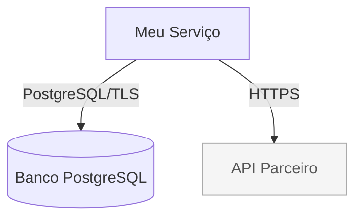
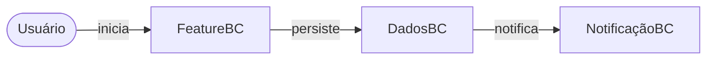

# Grafos de Módulos — Guia Nimbus-Code

> **TL;DR** (S0/S1 — leitura completa reservada para S2+): todo `plan.md`
> precisa de `specs/<feature>/graph.yaml` (fonte de verdade estruturada) +
> `graph.md` (Mermaid, leitura humana); S3/S4 exigem também `impact-map.md`;
> qualquer PR que altere `src/`/`services/`/`infrastructure/`/`modules/` sem
> atualizar o grafo é bloqueado pelo Graph Guard. Ver seções abaixo para como
> criar/manter e para os templates prontos.

Este documento explica o sistema de grafos de módulos obrigatórios do preset
`nimbus-code-standards`: o que são, por que existem, como criar e como manter.

## O que são os grafos de módulos?

Todo projeto de software tem dependências entre seus componentes. O grafo de
módulos torna essas dependências **explícitas, versionadas e rastreáveis** — em
vez de viver apenas na cabeça do time ou espalhadas no código.

O sistema usa dois ângulos complementares:

| Grafo | O que modela | Quem lê |
|---|---|---|
| **Por Código** | Dependências técnicas entre módulos/serviços (imports, HTTP, eventos, banco) | Devs, agentes de IA, Code Review |
| **Por Business** | Fluxo de domínios, bounded contexts, jornadas de usuário | PMs, Tech Leads, Arquitetos |

## Arquivos por feature

Toda feature em `specs/<feature-slug>/` deve conter:

| Arquivo | Obrigatório para | Descrição |
|---|---|---|
| `graph.yaml` | S2, S3, S4 | Fonte de verdade estruturada (lida pelo Graph Guard) |
| `graph.md` | S2, S3, S4 | Diagramas Mermaid para leitura humana |
| `impact-map.md` | S3, S4 | Análise de risco, dependências indiretas, rollback |

Templates disponíveis em:
`presets/nimbus-code-standards/templates/feature-artifacts/`

## Como criar os arquivos

### 1. Copiar os templates

```bash
FEATURE="minha-feature"
mkdir -p specs/$FEATURE
cp presets/nimbus-code-standards/templates/feature-artifacts/graph.yaml  specs/$FEATURE/
cp presets/nimbus-code-standards/templates/feature-artifacts/graph.md    specs/$FEATURE/
# Para S3/S4:
cp presets/nimbus-code-standards/templates/feature-artifacts/impact-map.md specs/$FEATURE/
```

### 2. Preencher `graph.yaml`

Campos obrigatórios:

```yaml
feature: "minha-feature"
complexity: "S2"          # S0 | S1 | S2 | S3 | S4
version: 1
updated_at: "2026-08-09"
spec_ref: "specs/minha-feature/spec.md"

nodes:
  - id: "meu-servico"
    type: "service"         # service | module | library | database | queue | external
    path: "services/meu-servico"
    description: "Responsabilidade em uma linha"

edges:
  - src: "meu-servico"
    dst: "meu-banco"
    type: "sync"            # sync | async | event
    protocol: "PostgreSQL/TLS"
    description: "Leitura e escrita de dados"

externals:
  - id: "api-parceiro"
    provider: "AcmeCorp"
    called_by: ["meu-servico"]
    criticality: "high"
    fallback: "cache local + retry"
```

### 3. Preencher `graph.md`

Dois diagramas Mermaid obrigatórios:

**Grafo por Código** (dependências técnicas):


**Grafo por Business** (fluxo de domínio):


## Como manter o grafo atualizado

### Regra fundamental

**O grafo deve refletir o estado ATUAL do sistema, não o estado futuro planejado.**
Atualizar durante a implementação, não só no plan.

### Quando atualizar

Atualizar `graph.yaml` e `graph.md` **na mesma PR** sempre que:

- Adicionar um módulo/serviço novo
- Remover um módulo/serviço
- Renomear um módulo/serviço
- Adicionar uma dependência entre módulos
- Remover uma dependência entre módulos
- Mudar o protocolo de comunicação entre módulos
- Adicionar ou remover um sistema externo
- Mudar a criticidade de um sistema externo

### Incrementar a versão

Toda atualização estrutural deve incrementar `version` no `graph.yaml`:

```yaml
version: 2   # era 1 — adicionado serviço de notificação
updated_at: "2026-08-09"
```

## GitHub Action Graph Guard

O workflow `.github/workflows/graph-guard.yml` verifica automaticamente em
toda PR:

1. Se arquivos em `src/`, `services/`, `infrastructure/` ou `modules/` foram
   alterados **sem** atualizar `graph.yaml` ou `graph.md` → **falha o check**.
2. Se `graph.yaml` declara complexidade S3/S4 mas `impact-map.md` está ausente
   → **falha o check**.
3. Se apenas um dos arquivos (yaml ou md) foi atualizado → **aviso** (warning).

**Para instalar o Graph Guard em um repositório de projeto:**

```bash
cp .github/workflows/graph-guard.yml <repo>/.github/workflows/graph-guard.yml
```

O workflow usa apenas `actions/checkout` e `actions/github-script` — sem
dependências externas.

## Exemplos práticos

### Feature S2 — módulo de notificação

```yaml
# specs/notificacao-email/graph.yaml
feature: "notificacao-email"
complexity: "S2"
version: 1
updated_at: "2026-08-09"

nodes:
  - id: "notification-service"
    type: "service"
    path: "services/notification-service"
    description: "Envia emails transacionais"

  - id: "notification-db"
    type: "database"
    path: "infrastructure/rds/notification"
    description: "Histórico de notificações enviadas"

edges:
  - src: "notification-service"
    dst: "notification-db"
    type: "sync"
    protocol: "PostgreSQL/TLS"
    description: "Registra histórico"

externals:
  - id: "sendgrid"
    provider: "SendGrid"
    called_by: ["notification-service"]
    criticality: "medium"
    fallback: "fila de retry + DLQ"
```

### Feature S4 — autenticação

Features S4 exigem:
- `graph.yaml` com todos os nós de auth
- `graph.md` com diagrama do fluxo de autenticação
- `impact-map.md` com análise de riscos de segurança
- Label `complexity:S4` na PR
- Revisão humana obrigatória (não apenas Copilot)
- Modelo mais forte (GPT-5.5 / Claude Opus) no agente

## Grafos Multi-Repo e campo `cross_repo`

> Introduzido por
> [`specs/014-brownfield-multirepo-context-awareness`](/specs/014-brownfield-multirepo-context-awareness/spec.md).

Em projetos brownfield multirepo, o "grafo de módulos" de uma feature
individual (seção acima) coexiste com um **grafo de bounded context** —
gerado automaticamente por `scripts/generate-context-graph.sh` a partir de
`docs/bounded-contexts.yaml` — que mostra como os *repositórios* de um mesmo
bounded context dependem uns dos outros, e não apenas como os *módulos* de
uma única feature se relacionam.

### Quando cada grafo se aplica

| Grafo | Escopo | Gerado por | Arquivo |
|---|---|---|---|
| Grafo de módulos (feature) | Módulos dentro do repo desta feature | Agente, manualmente, ao escrever `plan.md` (seção acima) | `specs/<feature>/graph.yaml` |
| Grafo de contexto (multi-repo) | Repositórios de um bounded context inteiro | `scripts/generate-context-graph.sh`, automaticamente via `/speckit-specify` | `specs/<feature>/graph.yaml` (schema estendido, ver abaixo) — sobrescrito/mesclado quando o contexto tem repos mapeados |

### Campo `cross_repo`

Todo node de um grafo de contexto multi-repo pode declarar `cross_repo:
true|false` (ADL-001 de `specs/014-brownfield-multirepo-context-awareness/plan.md`):

```yaml
nodes:
  - id: "org-svc-billing"
    type: "repo"
    repository: "org/svc-billing"
    cross_repo: true   # repo diferente do repo onde esta feature está sendo implementada
    manifest_source: "gh-api"   # ou "local:<caminho>", ou "unavailable"
```

- `cross_repo: false` — o node representa o próprio repositório onde a
  feature está sendo desenvolvida (módulo "local").
- `cross_repo: true` — o node representa um repositório **externo** ao repo
  atual, mas parte do mesmo bounded context.

**Por que isso importa para o Graph Guard**: sem este campo, o Graph Guard
não tem como diferenciar "módulo local não encontrado" (possível erro real —
a feature deveria ter criado o módulo mas não criou) de "repo externo,
naturalmente fora do checkout atual" (esperado, não é um erro). O campo
`cross_repo` permite ao Graph Guard aplicar regras diferentes para cada caso,
evitando falsos positivos em contextos multirepo.

### Fluxo de geração automática

1. `/speckit-specify` verifica se o "Bounded Context" da nova feature está
   registrado em `docs/bounded-contexts.yaml` com repos mapeados.
2. Se sim, invoca `scripts/generate-context-graph.sh <slug> --feature <feature-slug>`
   automaticamente, **antes** de o `spec.md` ser finalizado — o grafo já
   existe quando o agente começa o `/speckit-plan`.
3. Se o contexto não tiver repos mapeados (ou `docs/bounded-contexts.yaml`
   não existir), o fluxo emite um aviso e prossegue sem bloquear — mapear o
   contexto é uma decisão do time, não um pré-requisito da spec.
4. O agente deve consultar esse grafo (seção "Grafo do Contexto" do
   `plan.md`) antes de propor qualquer decisão arquitetural que atravesse
   mais de um repositório do contexto — ver `.github/copilot-instructions.md`,
   seção "Grafo de Contexto Multi-Repo (Brownfield)".

### Harvest de padrões (`harvest-patterns.sh`) — complementar, não parte do grafo

`scripts/harvest-patterns.sh` (mesma feature 014) é um mecanismo
**complementar** ao grafo de contexto: em vez de mapear repositórios e suas
dependências, ele varre metadados estruturais de um repo específico e
propõe entradas para `docs/reuse-catalog.yaml`. É **exclusivamente
on-demand** — nunca invocado automaticamente por `/speckit-specify` nem por
nenhum workflow de CI (diferente de `generate-context-graph.sh`, que roda
automaticamente). Ver `docs/reuse-catalog.yaml` para o schema das entradas
resultantes (campo `example` opcional).

## Referências

- Templates: `presets/nimbus-code-standards/templates/feature-artifacts/`
- Copilot Instructions template: `presets/nimbus-code-standards/templates/project-root/copilot-instructions.md`
- Graph Guard: `.github/workflows/graph-guard.yml`
- Seleção de modelos S0–S4: [`docs/ai-code-quality-and-observability.md`](./ai-code-quality-and-observability.md#6-seleção-de-modelo-por-complexidade-s0s4)
- Constituição Nimbus-Code: `presets/nimbus-code-standards/templates/constitution-template.md`
