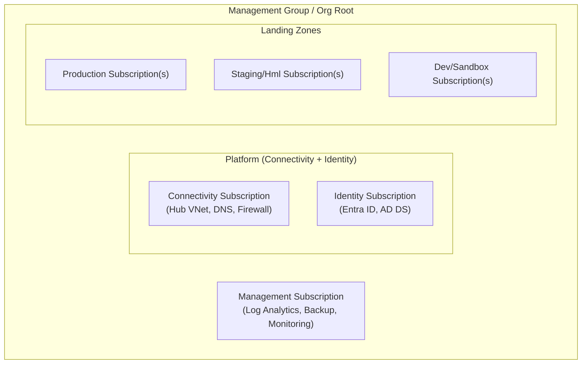

# Landing Zone — Design — `<Cliente/Tenant>` / `<platform-id>`

<!--
  Artefato formal da FASE `landing_zone_generated` do pipeline de plataforma.
  Produzido (ou atualizado) toda vez que o `iac_lifecycle_stage` da plataforma
  avança de `plan_diff_zero` para `landing_zone_generated`, e reavaliado a
  cada mudança estrutural posterior.

  Salvar em: landing-zone/<platform-id>/design.md
  Referenciar em `platform-graph.yaml` no campo `landing_zone_ref` da plataforma.

  Este documento é derivado do estado real confirmado com diff-zero —
  não é uma proposta de futuro, é o registro de como a Landing Zone está
  estruturada hoje, aderente ao CAF da nuvem correspondente.
  Não aplicar nenhuma mudança a partir daqui — mudanças nascem em repositórios
  de projeto (workload).
-->

## Identificação

| Campo | Valor |
|---|---|
| **Cliente/Tenant** | [ex.: Venha Pra Nuvem (piloto interno)] |
| **Platform ID** | [ex.: azure-prod] |
| **Nuvem** | Azure · AWS · GCP · GWS · M365 · D365 |
| **Ambiente** | prod · hml · dev |
| **CAF de referência** | Azure CAF · AWS Control Tower / Well-Architected · GCP Cloud Foundation · *(selecionar)* |
| **Versão deste documento** | 1.0 |
| **Gerado/atualizado em** | YYYY-MM-DD |
| **`iac_lifecycle_stage` da plataforma na geração** | `landing_zone_generated` |

## Topologia da Landing Zone

*Descreva a topologia atual da Landing Zone para esta plataforma, seguindo
a estrutura do CAF correspondente. Preencher com base no estado real
confirmado (diff-zero), não em intenção futura.*

### Diagrama de Topologia

*Substituir pelo diagrama real da plataforma. O diagrama deve refletir
exatamente o que foi confirmado com diff-zero no `platform-graph.yaml`.*

### Estrutura de Contas/Assinaturas/Projetos

| Unidade | ID | Finalidade | IaC Status | Ferramenta |
|---|---|---|---|---|
| [ex.: Subscription Hub] | `<id>` | Conectividade central (VNet hub, DNS, FW) | parcial | Terraform `azurerm` |
| [ex.: Subscription Prod App] | `<id>` | Workloads de produção | não iniciado | Terraform `azurerm` |

### Serviços de Plataforma Compartilhados

| Serviço | Escopo | IaC Status | Observações |
|---|---|---|---|
| [ex.: Azure Firewall Premium] | Todas as subs | parcial | Regras ainda não em Terraform |
| [ex.: Azure DNS Private Zones] | Hub | não iniciado | — |

## Aderência ao CAF

*Ver `checklist-caf.md` nesta mesma pasta para o checklist detalhado.
Resumo dos itens críticos com status atual:*

| Pilar CAF | Status | Observação |
|---|---|---|
| Hierarquia de Management Groups | ✅ / ⚠️ / ❌ | |
| Políticas de governança (Azure Policy / SCPs / Org Policy) | ✅ / ⚠️ / ❌ | |
| Modelo de identidade e acesso (RBAC / IAM) | ✅ / ⚠️ / ❌ | |
| Conectividade (Hub-Spoke / Transit / Direct Connect) | ✅ / ⚠️ / ❌ | |
| Segurança e conformidade (Defender, SIEM, logging) | ✅ / ⚠️ / ❌ | |
| Gestão de custos (orçamentos, alertas, tags obrigatórias) | ✅ / ⚠️ / ❌ | |
| Automação e IaC (drift-check, pipeline CI/CD) | ✅ / ⚠️ / ❌ | |

## Lacunas em Relação ao CAF Ideal

*Documentar os gaps entre o estado atual (diff-zero confirmado) e o estado
ideal do CAF. Cada gap deve ter um responsável e uma estimativa de quando
será endereçado via repositório de projeto.*

| Gap | Impacto | Repositório de projeto responsável | Data alvo |
|---|---|---|---|
| [ex.: Sem Defender for Cloud no nível de Management Group] | Alto | [link ou "não criado ainda"] | YYYY-MM-DD |

## Histórico de Atualizações

| Data | Mudança | Quem atualizou |
|---|---|---|
| YYYY-MM-DD | Geração inicial (fase `landing_zone_generated`) | [nome] |
