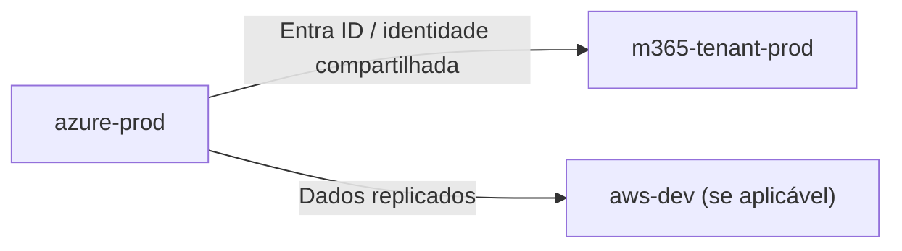

# Nimbus Discovery Report — `<Cliente/Tenant>` / `<platform-id>`

<!--
  Artefato formal da FASE DE DISCOVERY do pipeline de plataforma.
  Produzido antes de qualquer importação/Terraform. É pré-requisito para
  avançar de `iac_lifecycle_stage: discovery` para `imported`.

  Preencher um arquivo deste por plataforma descoberta. Salvar em:
    specs/<feature-slug>/nimbus-discovery-report-<platform-id>.md
  e referenciar o caminho em `platform-graph.yaml` no campo
  `discovery_report_ref` da plataforma correspondente.

  Este arquivo é somente-observação — não autoriza nenhuma mudança no ambiente.
-->

## Identificação

| Campo | Valor |
|---|---|
| **Cliente/Tenant** | [ex.: Venha Pra Nuvem (piloto interno)] |
| **Platform ID** | [ex.: azure-prod — mesmo valor do `platform_id` no `platform-graph.yaml`] |
| **Nuvem/domínio** | Azure · AWS · GCP · GWS · M365 · D365 |
| **Ambiente** | prod · hml · dev |
| **Executado por** | [nome do analista/arquiteto] |
| **Data do discovery** | YYYY-MM-DD |
| **Ferramentas usadas** | [ex.: aztfexport, Azure Resource Graph, M365DSC Export, GAM, terraformer] |

## Objetivo do Discovery

*Descreva o escopo: o que estava sendo mapeado e por que este discovery foi iniciado
(onboarding de cliente novo, legado sem documentação, auditoria periódica, etc.).*

## Grafo de Recursos Descobertos

*Liste os recursos/superfícies encontrados por domínio. Não precisa ser Terraform
ainda — é um inventário de "o que existe hoje". Refinar depois na fase `imported`.*

### Infraestrutura (Terraform-gerenciável)

| Recurso | Tipo | Ambiente | Criticidade estimada | IaC hoje? | Observações |
|---|---|---|---|---|---|
| [ex.: rg-prod-network] | Resource Group | prod | Alta | Não | VNet hub e firewall dentro |
| | | | | | |

### Configuração de Tenant / Plataforma (não-Terraform)

| Recurso / Política | Domínio | IaC/config-as-code hoje? | Ferramenta candidata | Observações |
|---|---|---|---|---|
| [ex.: Conditional Access – MFA Baseline] | M365 | Não | Microsoft365DSC | Aplicado manualmente |
| | | | | |

### Sistemas Legados Identificados

| Sistema | Tecnologia | Banco de Dados | Ambiente | Criticidade | Proprietário conhecido? |
|---|---|---|---|---|---|
| [ex.: ERP v1] | .NET 4.7 / IIS | SQL Server 2016 | prod | Alta | [nome/time] |
| | | | | | |

## Relacionamentos entre Plataformas do Mesmo Cliente

*Quando o cliente tem múltiplas plataformas (ex.: Azure prod + M365 + AWS dev),
documentar as dependências encontradas entre elas.*

*Substituir pelo diagrama real do cliente. Remover se não houver dependências.*

## Lacunas Identificadas (recursos sem IaC)

*Recursos descobertos que ainda não têm nenhuma cobertura IaC — esta lista vira
a fila de trabalho da fase `imported`.*

| Recurso | Domínio | Ferramenta recomendada | Complexidade estimada | Prioridade |
|---|---|---|---|---|
| [ex.: azure-hub-network] | Azure (infra) | `aztfexport` + módulo AVM | S3 | P1 |
| [ex.: Conditional Access baseline] | M365 | Microsoft365DSC export | S2 | P1 |
| | | | | |

## Riscos e Observações

*Registrar qualquer risco identificado durante o discovery: credenciais desconhecidas,
recursos sem dono claro, dependências circulares, ambientes "esquecidos", etc.*

- [ ] [ex.: Subscription X não tem dono técnico definido — escalar antes de iniciar importação]
- [ ] [ex.: Firewall gerenciado via portal sem nenhum histórico de mudanças — risco de drift silencioso]

## Critério de Saída desta Fase

*Antes de avançar o `iac_lifecycle_stage` de `discovery` para `imported`:*

- [ ] Todos os recursos de criticidade **alta** listados acima e conferidos com o cliente/responsável
- [ ] Relacionamentos entre plataformas documentados no grafo acima
- [ ] Lacunas priorizadas na tabela acima (pelo menos as de criticidade alta têm ferramenta e responsável)
- [ ] `platform-graph.yaml` atualizado com `discovery_report_ref` apontando para este arquivo
- [ ] Este arquivo revisado por arquiteto ou analista sênior (não apenas pelo agente que executou o discovery)
