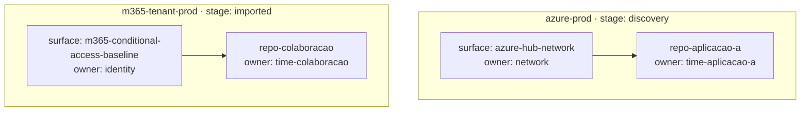

# Grafo de Plataforma — `<Cliente/Tenant>`

> Gerado/mantido a partir de `platform-graph.yaml`. O YAML é a fonte de
> verdade; este documento é a visão legível por humanos.
>
> **Hierarquia oficial:** `platform -> surface -> workload`.
>
> **Lifecycle oficial:** `discovery -> imported -> plan_diff_zero ->
> landing_zone_generated -> managed`.

## Visão por Hierarquia

## Tabela-resumo de Plataformas

| Plataforma | Provider | Ambiente | Lifecycle stage | Owner | Evidência mais recente | Dependências |
|---|---|---|---|---|---|---|
| azure-prod | Azure | prod | `discovery` | plataforma | `platform/evidence-registry.yaml#ev-azure-prod-plan-2026-09-20` | — |
| m365-tenant-prod | M365 | prod | `imported` | workplace | `platform/evidence-registry.yaml#ev-m365-baseline-2026-09-20` | — |

## Tabela de Superfícies Compartilhadas

| Plataforma | Superfície | Tipo | Owner | Baseline | Evidência |
|---|---|---|---|---|---|
| azure-prod | azure-hub-network | network | network | `platform/baseline-registry.yaml#bl-azure-hub-network` | `platform/evidence-registry.yaml#ev-azure-prod-plan-2026-09-20` |
| m365-tenant-prod | m365-conditional-access-baseline | policy | identity | `platform/baseline-registry.yaml#bl-m365-ca` | `platform/evidence-registry.yaml#ev-m365-baseline-2026-09-20` |

## Tabela de Workloads Dependentes

| Workload | Plataforma | Superfície | Owner | Dependência declarada |
|---|---|---|---|---|
| repo-aplicacao-a | azure-prod | azure-hub-network | time-aplicacao-a | egress e DNS privado |
| repo-colaboracao | m365-tenant-prod | m365-conditional-access-baseline | time-colaboracao | políticas de acesso e identidade |

## Regras de manutenção

1. Toda plataforma precisa declarar `owner`, `evidence` e `lifecycle_stage`.
2. Toda superfície compartilhada precisa referenciar uma baseline e uma evidência.
3. Todo workload dependente precisa aparecer aqui e no `impact-map.md` do
   repositório de workload correspondente.
4. `managed` só é permitido com evidência fresh, baseline válida e política de
   drift ativa.
