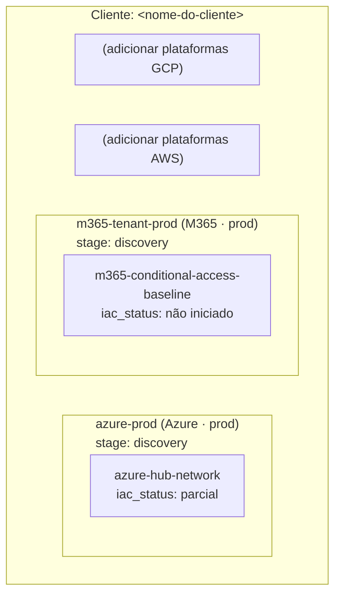
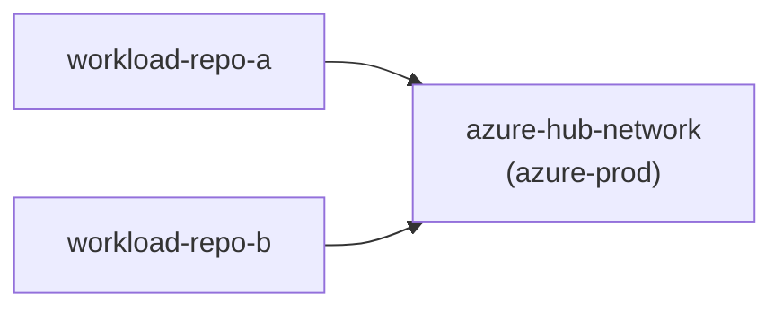

# Grafo de Plataforma — `<Cliente/Tenant>`

> Gerado/mantido a partir de `platform-graph.yaml`. Não editar os diagramas
> aqui sem atualizar o `.yaml` correspondente — este arquivo é a versão legível
> por humanos, o `.yaml` é a fonte de verdade estrutural.
>
> **Estrutura:** cada plataforma (conta/assinatura/tenant) é um nó de primeiro
> nível. As superfícies (recursos compartilhados) vivem dentro de cada
> plataforma. O `iac_lifecycle_stage` da plataforma indica em qual fase do
> pipeline ela se encontra: `discovery → imported → plan_diff_zero →
> landing_zone_generated → managed`.

## Visão por Plataforma e Fase de Ciclo de Vida

## Visão por Dependência (Workload → Superfície de Plataforma)

> Toda seta aqui deve corresponder a um item declarado no `impact-map.md` do
> repositório de workload correspondente ("Impacto em superfície de
> plataforma compartilhada"). Se um workload depende de uma superfície e essa
> dependência não está sinalizada nos dois lados, o grafo está desatualizado.

## Status de Plataformas (resumo de fase)

| Plataforma | Nuvem | Ambiente | Fase (`iac_lifecycle_stage`) | Discovery Report | Landing Zone |
|---|---|---|---|---|---|
| azure-prod | Azure | prod | `discovery` | — | — |
| m365-tenant-prod | M365 | prod | `discovery` | — | — |

## Status de Superfícies por Plataforma

### azure-prod

| Superfície | Tipo | `iac_status` | Ferramenta de reconciliação | Última verificação diff-zero |
|---|---|---|---|---|
| azure-hub-network | network | parcial | `terraform plan` | YYYY-MM-DD (diff pendente) |

### m365-tenant-prod

| Superfície | Tipo | `iac_status` | Ferramenta de reconciliação | Última verificação diff-zero |
|---|---|---|---|---|
| m365-conditional-access-baseline | policy | não iniciado | `Test-M365DSCConfiguration` | — |

## Sistemas Legados (referenciados, ainda sem projeto próprio)

| Sistema | Plataforma | Ambiente | Tem Terraform? | Schema registrado? | Projeto responsável |
|---|---|---|---|---|---|
| `<sistema-legado-exemplo>` | azure-prod | prod | Não | Ver `db-schema-registry.md` | Nenhum ainda |

> Quando um sistema legado desta lista precisar de mudança real, **nasce um
> repositório de projeto novo** para ele — a coluna "Projeto responsável" é
> atualizada aqui assim que isso acontecer.
