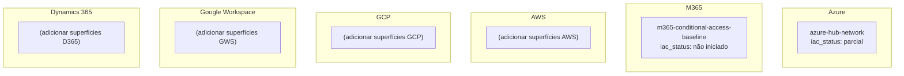
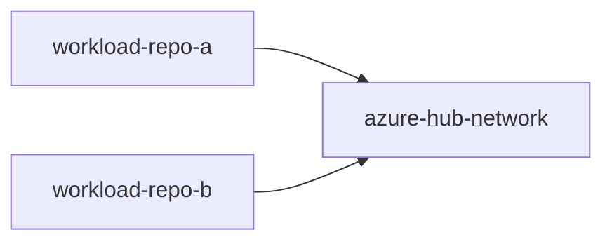

# Grafo de Plataforma — `<Cliente/Tenant>`

> Gerado/mantido a partir de `platform-graph.yaml`. Não editar os diagramas
> aqui sem atualizar o `.yaml` correspondente — este arquivo é a versão legível
> por humanos, o `.yaml` é a fonte de verdade estrutural.

## Visão por Nuvem/Domínio

## Visão por Dependência (Workload → Superfície de Plataforma)

> Toda seta aqui deve corresponder a um item declarado no `impact-map.md` do
> repositório de workload correspondente ("Impacto em superfície de
> plataforma compartilhada"). Se um workload depende de uma superfície e essa
> dependência não está sinalizada nos dois lados, o grafo está desatualizado.

## Status de Cobertura IaC (resumo)

| Superfície | Nuvem | Status | Ferramenta de reconciliação | Última verificação diff-zero |
|---|---|---|---|---|
| azure-hub-network | Azure | parcial | `terraform plan` | YYYY-MM-DD (diff pendente) |
| m365-conditional-access-baseline | M365 | não iniciado | `Test-M365DSCConfiguration` | — |

## Sistemas Legados (referenciados, ainda sem projeto próprio)

| Sistema | Ambiente | Tem Terraform? | Schema registrado? | Projeto responsável |
|---|---|---|---|---|
| `<sistema-legado-exemplo>` | prod | Não | Ver `db-schema-registry.md` | Nenhum ainda |

> Quando um sistema legado desta lista precisar de mudança real, **nasce um
> repositório de projeto novo** para ele — a coluna "Projeto responsável" é
> atualizada aqui assim que isso acontecer.
