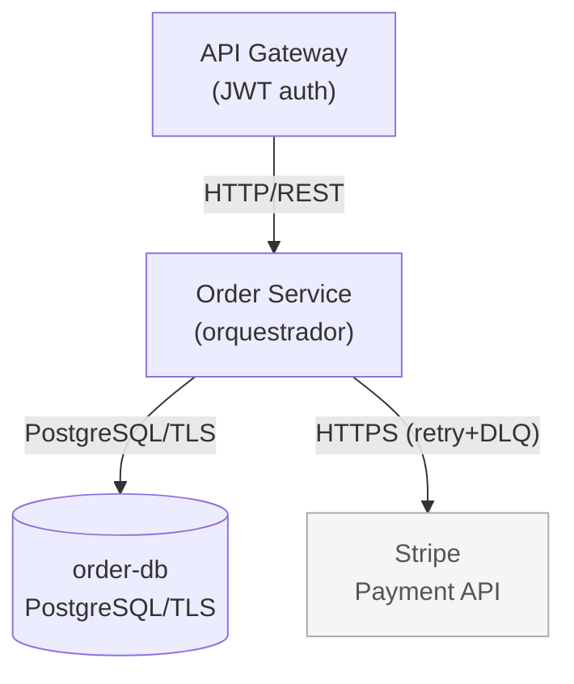
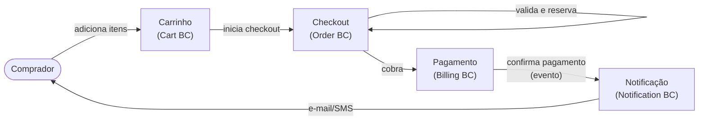

<!--
  graph.md — Grafo de módulos para leitura humana
  Gerado/atualizado junto com graph.yaml.
  OBRIGATÓRIO: deve estar presente e atualizado antes de /speckit-tasks.
  Para qualquer PR que altere código em src/, services/, infrastructure/ ou
  modules/, este arquivo deve ser atualizado na mesma PR.
-->

# Grafo de Módulos — `<feature-slug>`

> **Complexidade:** S2 — Módulo  
> **Última atualização:** YYYY-MM-DD  
> **Spec:** [spec.md](./spec.md) · **Grafo estruturado:** [graph.yaml](./graph.yaml)

---

## Grafo por Código (dependências técnicas)

> **Legenda:** retângulos = internos · contornos duplos = banco de dados · cinza = externos.  
> Setas sólidas = **síncronas** · setas tracejadas = **assíncronas/eventos**.

---

## Grafo por Business (fluxo de domínio / jornada)

---

## Tabela de Nós

| ID | Tipo | Path | Responsabilidade |
|---|---|---|---|
| `api-gateway` | service | `services/api-gateway` | Ponto de entrada, autenticação JWT |
| `order-service` | service | `services/order-service` | Orquestra criação de pedidos |
| `order-db` | database | `infrastructure/rds/order` | Dados de pedidos (PostgreSQL) |
| `payment-api` | external | — | Gateway de cobrança (Stripe) |

---

## Tabela de Dependências

| De | Para | Tipo | Protocolo | Fallback |
|---|---|---|---|---|
| `api-gateway` | `order-service` | sync | HTTP/REST | Circuit breaker 5xx |
| `order-service` | `order-db` | sync | PostgreSQL/TLS | — |
| `order-service` | `payment-api` | sync | HTTPS | Fila retry + DLQ |

---

## Notas de Risco / Pontos de Atenção

- `payment-api` (Stripe) é **SPoF** para confirmação de pedido — fallback via fila de retry obrigatório.
- `order-db` é acessado diretamente pelo `order-service`; qualquer acesso externo deve ser proibido por policy de rede.

> _Substitua todos os exemplos acima pelos módulos reais desta feature._
