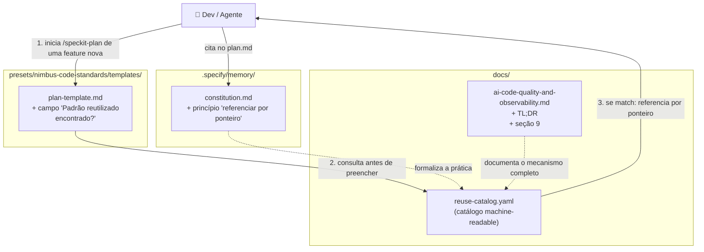
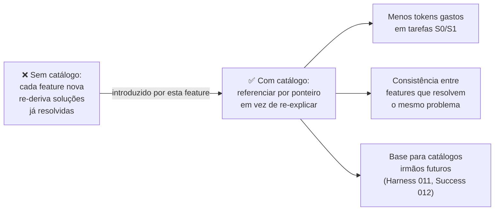

# graph.md — Feature 001: Catálogo de Conteúdo Reutilizável

> Gerado a partir de `graph.yaml` — manter os dois em sincronia após cada mudança de módulo.

---

## Diagrama por Código (fluxo de execução)

---

## Diagrama por Business (redução de custo de tokens)

---

## Notas de Manutenção

- Esta feature (001) é a **origem** dos catálogos de conteúdo reutilizável
  deste bundle — features posteriores (011 Harness Engineering, 012 Loop de
  Melhoria Contínua) seguem o mesmo padrão estrutural para domínios distintos
  (erros, sucessos) em vez de estender este catálogo diretamente.
- Documento gerado retroativamente em 2026-08-20 — a implementação real
  ocorreu antes desta data, entregue via release `v1.5.0` do preset.
