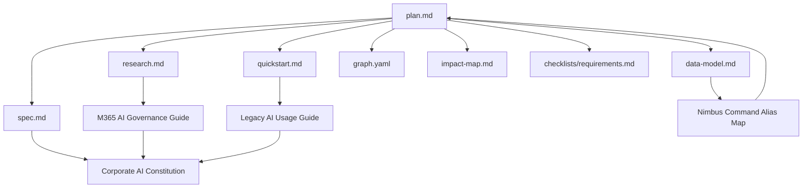
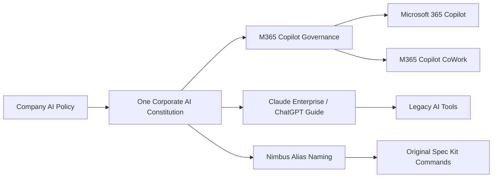

# Feature Graph: Camada de Governanca IA Corporativa M365

## Artifact view

## Business view

## Notes

- This feature is documentation-only in v1.
- The graph is intentionally centered on artifact coherence instead of runtime services.
- The external AI platforms are represented only as governance references.
