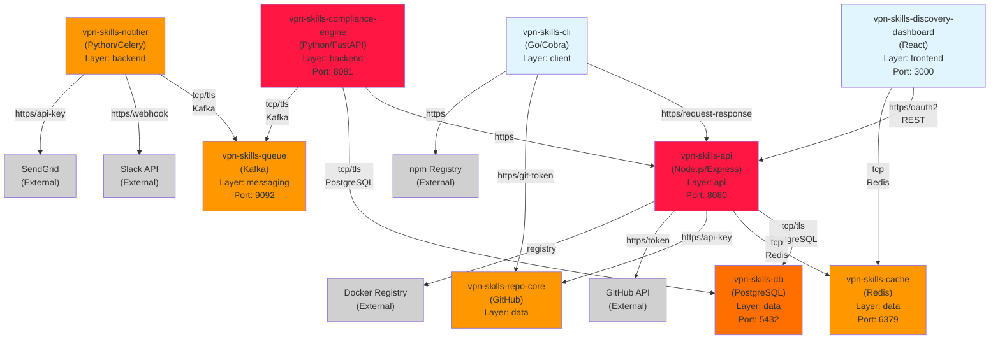
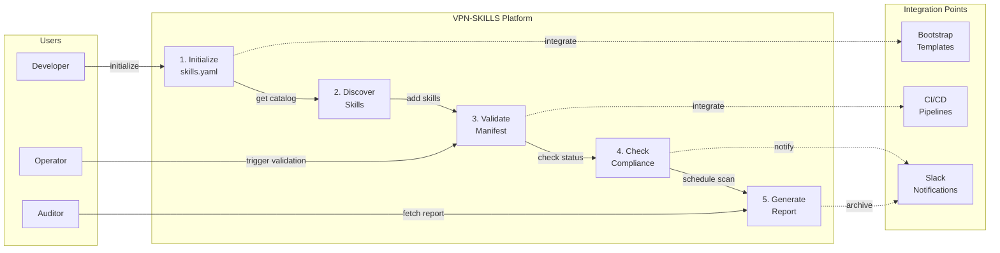
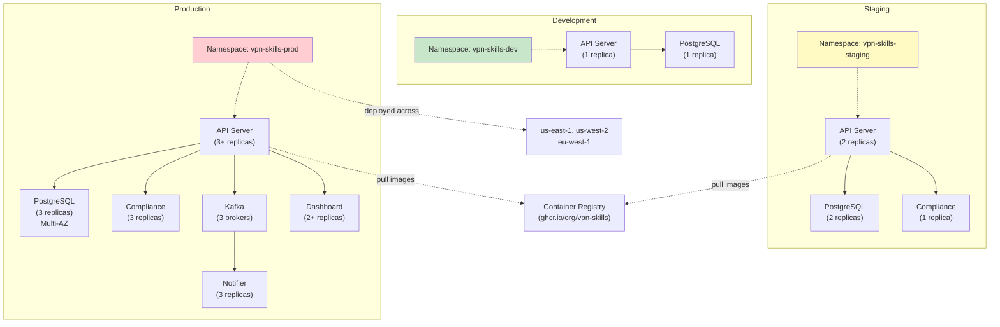
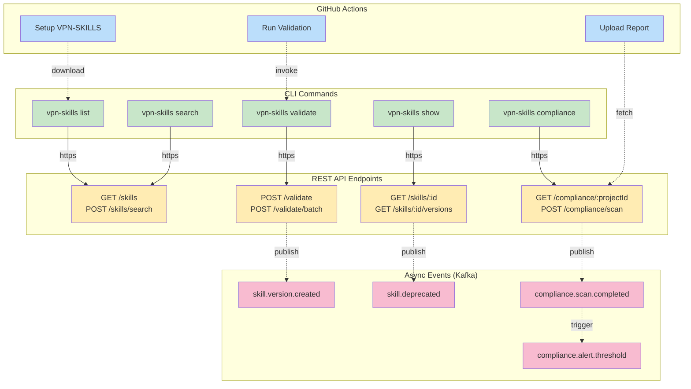
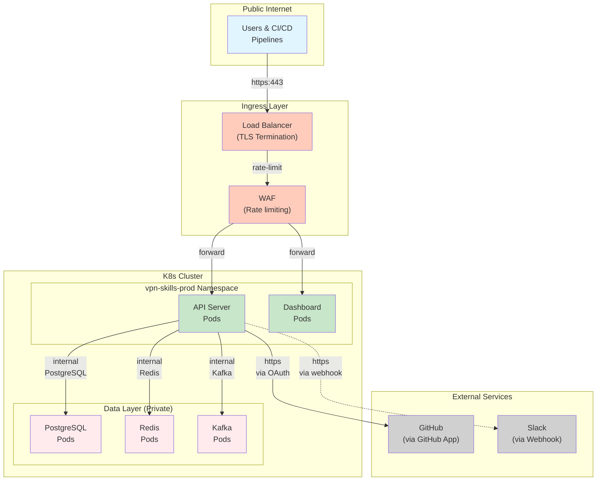

# VPN-SKILLS Module Dependency Graph

**Version**: 1.0  
**Created**: 2026-08-12

This document provides visual representations of the VPN-SKILLS architecture and module dependencies.

---

## 1. Code-Level Module Dependency Graph

### Diagram: Module Connections and Data Flow

**Legend**:
- 🔴 **Red**: Critical dependencies (high availability required)
- 🟠 **Orange**: Important but non-critical
- 🔵 **Blue**: Client/frontend components
- ⚫ **Gray**: External third-party services

---

## 2. Business Context Diagram

### High-Level Feature Flows

---

## 3. Deployment Topology

### Multi-Environment Architecture

---

## 4. Data Flow Diagram

### Skill Lifecycle and Compliance Tracking

```mermaid
graph LR
    subgraph "Sourcing"
        SOURCE["Skill Author<br/>(in VPN-SKILLS repo)"]
        DRAFT["Draft<br/>Status"]
        VERSION["Create<br/>Semver Release"]
        SOURCE -->|commit| DRAFT
        DRAFT -->|tag release| VERSION
    end
    
    subgraph "Indexing & Discovery"
        INDEX["GitHub Webhook<br/>triggers"]
        FETCH["Fetch Metadata<br/>from Manifest"]
        STORE["Store in DB"]
        CACHE_UPDATE["Invalidate Cache"]
        INDEX -->|new release| FETCH
        FETCH -->|write| STORE
        STORE -->|clear| CACHE_UPDATE
    end
    
    subgraph "Validation & Compliance"
        PROJECTS["Downstream<br/>Projects"]
        MANIFEST["skills.yaml<br/>Manifest"]
        VALIDATE["Validate via API<br/>or CLI"]
        RESOLVE["Resolve<br/>Dependencies"]
        REPORT_SCAN["Generate<br/>Compliance<br/>Report"]
        PROJECTS -->|declare| MANIFEST
        MANIFEST -->|submit| VALIDATE
        VALIDATE -->|check| RESOLVE
        RESOLVE -->|scan| REPORT_SCAN
    end
    
    subgraph "Notifications"
        QUEUE_EMIT["Emit to<br/>Kafka Queue"]
        NOTIF_WORKER["Notification<br/>Worker<br/>(Celery)"]
        CHANNELS["Slack | Email<br/>| GitHub Issues"]
        QUEUE_EMIT -->|async| NOTIF_WORKER
        NOTIF_WORKER -->|send to| CHANNELS
    end
    
    VERSION -->|webhook| INDEX
    REPORT_SCAN -->|findings| QUEUE_EMIT
    
    style SOURCE fill:#c3e9ff
    style DRAFT fill:#fff3e0
    style VERSION fill:#e1f5fe
    style INDEX fill:#e0f2f1
    style FETCH fill:#f1f8e9
    style STORE fill:#fce4ec
    style CACHE_UPDATE fill:#f3e5f5
    style PROJECTS fill:#e3f2fd
    style MANIFEST fill:#fff9c4
    style VALIDATE fill:#f0f4c3
    style RESOLVE fill:#ffe0b2
    style REPORT_SCAN fill:#ffccbc
    style QUEUE_EMIT fill:#e1f5fe
    style NOTIF_WORKER fill:#f1f8e9
    style CHANNELS fill:#fce4ec
```

---

## 5. Communication Protocols

### API & Integration Patterns

---

## 6. Dependency Chain Analysis

### Critical Paths (Red = Blocking Sequence)

```mermaid
graph LR
    subgraph "Critical Path 1: Skill Publishing"
        S1["1. Skill Author<br/>commits to repo"]
        S2["2. CI validates<br/>manifest"]
        S3["3. Release tag<br/>created"]
        S4["4. GitHub webhook<br/>fired"]
        S5["5. API indexes<br/>skill"]
        S6["6. Cache<br/>invalidated"]
        S1 -->|git push| S2
        S2 -->|git tag| S3
        S3 -->|webhook| S4
        S4 -->|http| S5
        S5 -->|redis| S6
    end
    
    subgraph "Critical Path 2: Project Validation"
        P1["1. Project adds<br/>skills.yaml"]
        P2["2. CI runs<br/>vpn-skills validate"]
        P3["3. API resolves<br/>versions"]
        P4["4. Check deps<br/>compatibility"]
        P5["5. Return result<br/>to CI"]
        P1 -->|git push| P2
        P2 -->|http| P3
        P3 -->|query| P4
        P4 -->|json| P5
    end
    
    subgraph "Critical Path 3: Compliance Scan"
        C1["1. Scheduled job<br/>or manual trigger"]
        C2["2. API fetches<br/>all projects"]
        C3["3. Compliance<br/>engine processes"]
        C4["4. Emit events<br/>to queue"]
        C5["5. Notifier sends<br/>alerts"]
        C1 -->|cron| C2
        C2 -->|db query| C3
        C3 -->|kafka| C4
        C4 -->|async| C5
    end
    
    style S1 fill:#ff6b6b
    style S2 fill:#ff6b6b
    style S3 fill:#ff6b6b
    style S4 fill:#ff6b6b
    style S5 fill:#ff6b6b
    style S6 fill:#ff6b6b
    style P1 fill:#ff6b6b
    style P2 fill:#ff6b6b
    style P3 fill:#ff6b6b
    style P4 fill:#ff6b6b
    style P5 fill:#ff6b6b
    style C1 fill:#ff6b6b
    style C2 fill:#ff6b6b
    style C3 fill:#ff6b6b
    style C4 fill:#ff6b6b
    style C5 fill:#ff6b6b
```

---

## 7. Network Security Topology

### Firewalling and Access Control

**Network Policies**:
- ✅ Ingress: Only HTTPS on port 443 (TLS 1.2+)
- ✅ API → Database: Internal TCP only, TLS encryption required
- ✅ CLI → API: HTTPS with API key authentication
- ✅ Notifier → External: HTTPS with signed webhook tokens
- 🚫 Database: No direct external access
- 🚫 Cache: Internal only, no public access

---

## Summary

| Layer | Components | Technology | Status |
|-------|-----------|-----------|--------|
| **Frontend** | Discovery Dashboard | React/TypeScript | Planned |
| **API** | REST Server | Node.js/Express | Planned |
| **CLI** | Command-line Tool | Go/Cobra | Planned |
| **Backend** | Compliance Engine, Notifier | Python/FastAPI, Celery | Planned |
| **Data** | PostgreSQL, Redis, Kafka | PostgreSQL 14, Redis 7, Kafka | Planned |
| **Repository** | Skills Storage | GitHub | Existing |
| **Registry** | Package Distribution | npm, PyPI, Docker Hub | Existing |

---

## References

- **graph.yaml**: Detailed module configuration and dependencies
- **api-openapi.yaml**: REST API contract specification
- **data-model.md**: Entity relationships and schemas
- **spec.md**: Feature requirements and acceptance criteria

