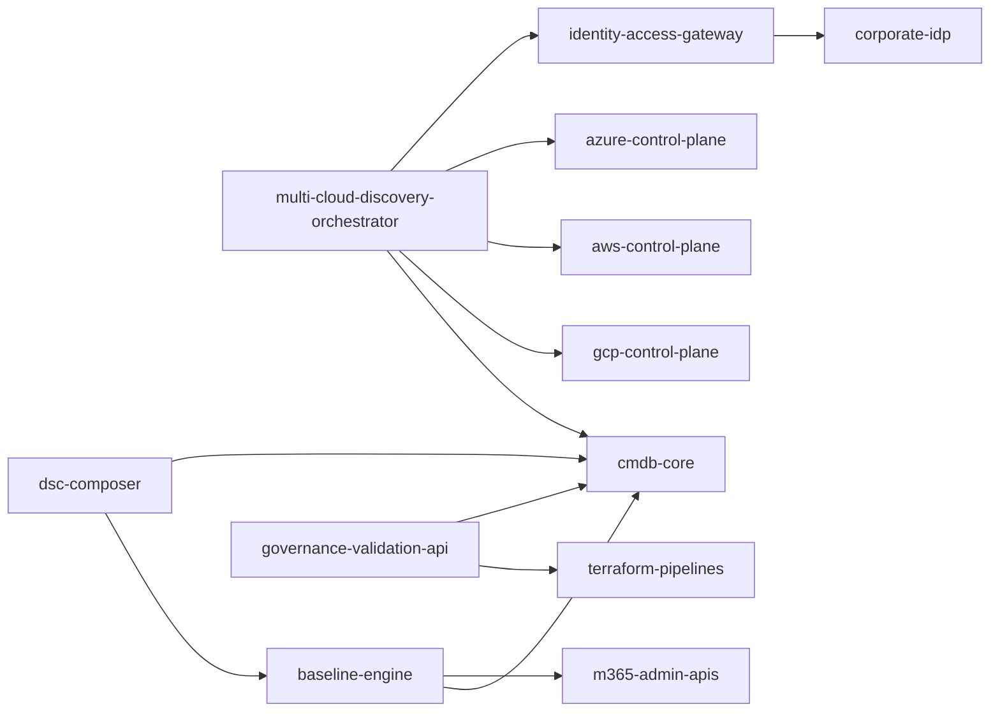
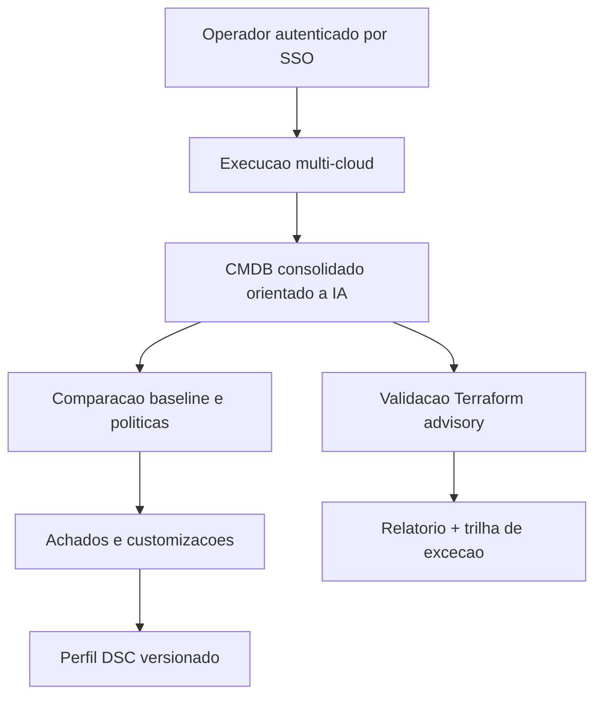
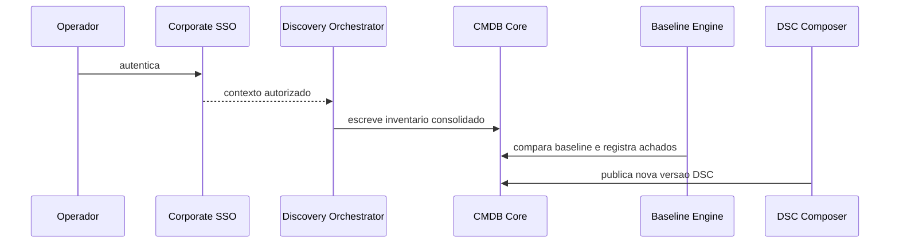

# Module Graph — Platform Preset CMDB + Baselines + DSC

## Code Dependency Graph

## Business Flow Graph

## Critical Path

## Implementation Trace

- scaffold self-contained under `platform-governance/`
- runtime factories back shared models, services, routes and CLI
