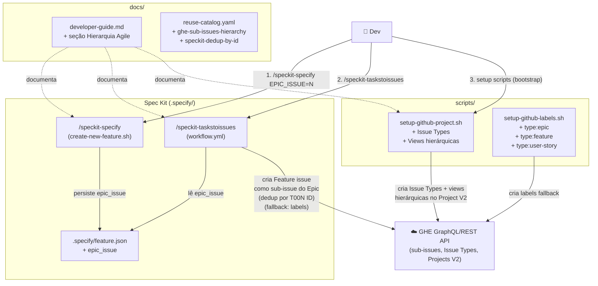
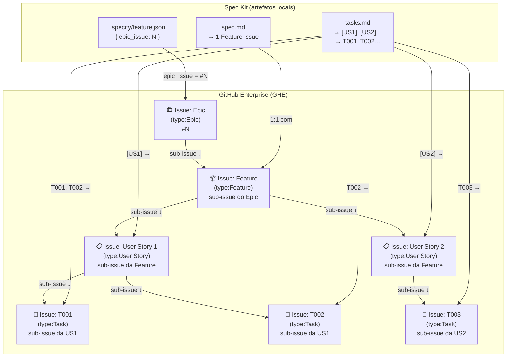

# graph.md — Feature 005: Epic/Feature/US Hierarchy no GHE com Spec Kit

> Gerado a partir de `graph.yaml` — manter os dois em sincronia após cada mudança de módulo.

---

## Diagrama por Código (fluxo de execução)

---

## Diagrama por Business (hierarquia de artefatos)

---

## Notas de Manutenção

- Atualizar `graph.yaml` e este arquivo se novos módulos forem adicionados
  durante a implementação (ex.: novo script de deduplicação separado)
- O campo `epic_issue` em `feature.json` é **opcional** — sem ele, o fluxo
  funciona normalmente sem criar vinculação hierárquica
- O fallback via labels é ativado automaticamente quando a consulta de Issue
  Types da org retorna lista vazia ou erro 404
