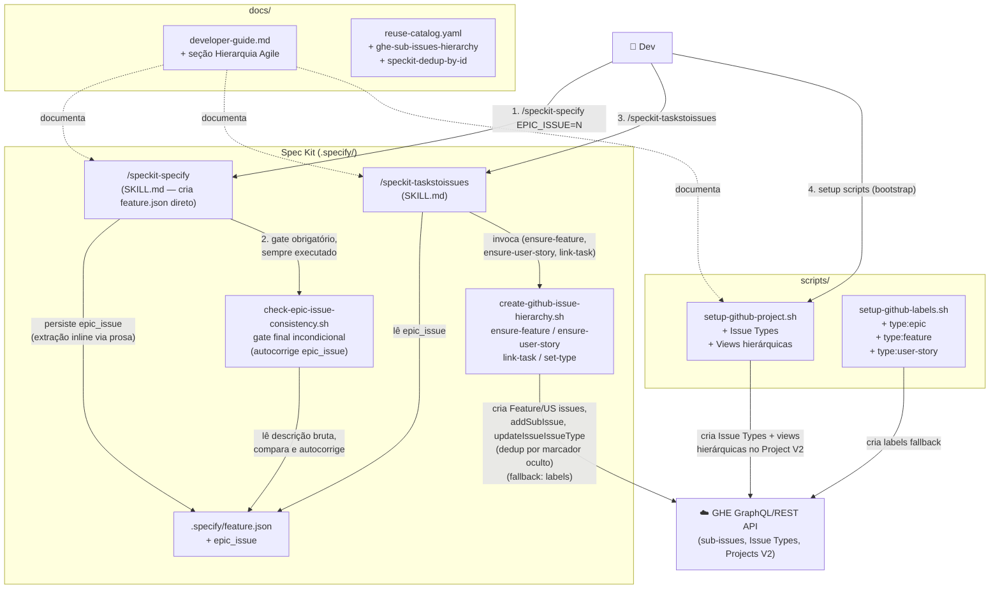
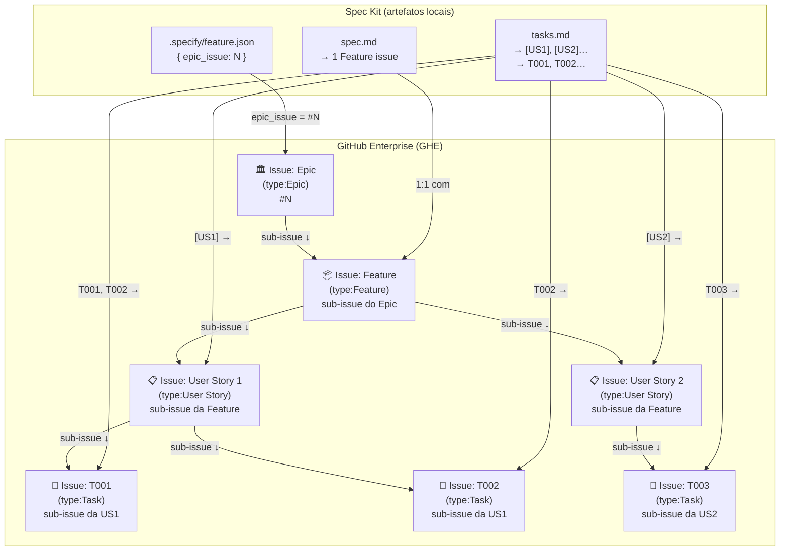

# graph.md — Feature 005: Epic/Feature/US Hierarchy no GHE com Spec Kit

> Gerado a partir de `graph.yaml` — manter os dois em sincronia após cada mudança de módulo.

---

## Diagrama por Código (fluxo de execução)

---

## Diagrama por Business (hierarquia de artefatos)

---

## Notas de Manutenção

- Atualizar `graph.yaml` e este arquivo se novos módulos forem adicionados
  durante a implementação
- `create-github-issue-hierarchy.sh` foi adicionado nesta sessão (2026-08-20)
  como o script de deduplicação/vinculação mencionado nesta nota — ver nó
  `create-github-issue-hierarchy` em `graph.yaml`
- **Confiabilidade da extração de `epic_issue`** (mesma sessão, follow-up): o
  `/speckit-specify` não invoca `create-new-feature.sh` no caminho principal
  (ele mesmo cria `feature.json` via prosa do SKILL.md) — então a extração de
  `EPIC_ISSUE=<N>` dependia de o agente LLM seguir uma instrução no meio de um
  fluxo longo, sem verificação. Corrigido com defesa em profundidade: (1)
  `create-new-feature.sh` também extrai o token para quem chama via CLI/hook;
  (2) novo `check-epic-issue-consistency.sh` faz a checagem determinística e
  se autocorrige; (3) o SKILL.md ganhou um gate "Mandatory Post-Execution
  Validation" **incondicional** que sempre roda esse script como último passo,
  em vez de confiar apenas na prosa do meio do fluxo.
- O campo `epic_issue` em `feature.json` é **opcional** — sem ele, o fluxo
  funciona normalmente sem criar vinculação hierárquica
- O fallback via labels é ativado automaticamente quando a consulta de Issue
  Types da org retorna lista vazia ou erro 404
