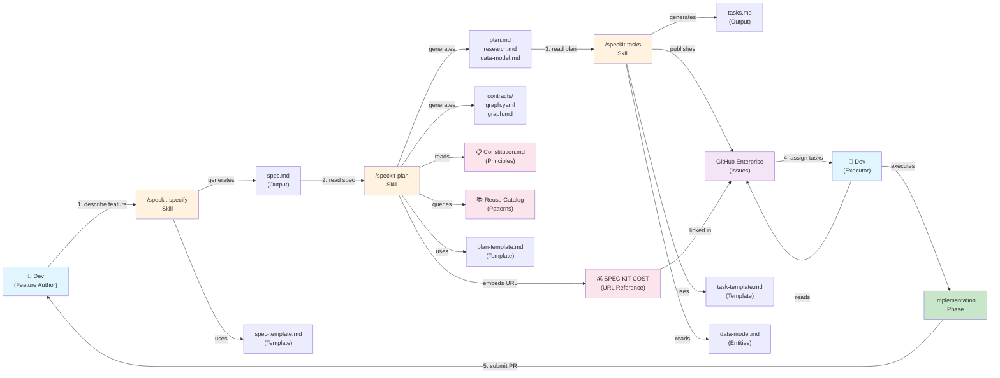
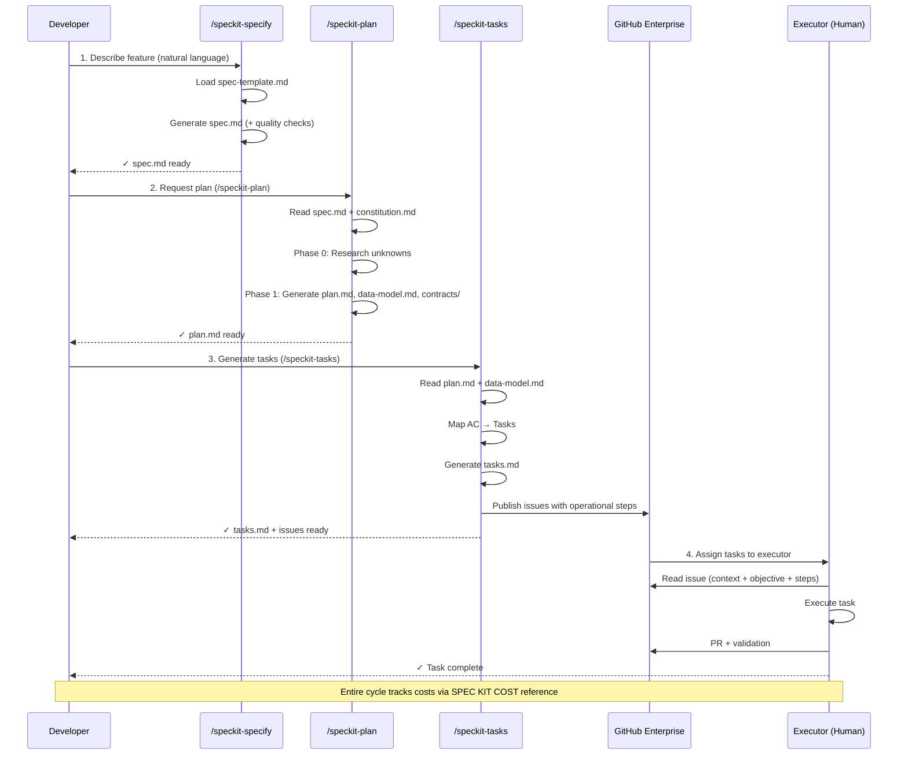
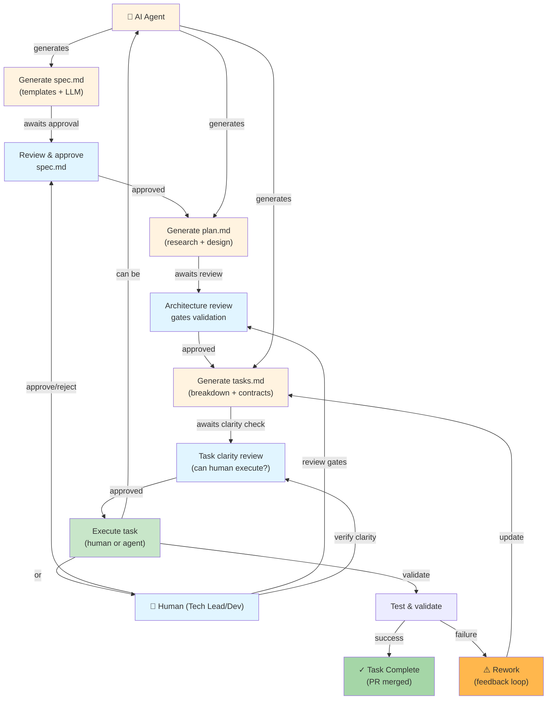
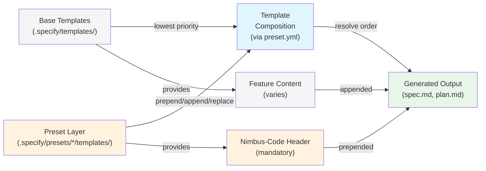

# Architecture Graphs: Hybrid Agent-Human Delivery Templates

---

## Technical Architecture



**Legend**:
- 🟦 **Blue**: Human actors (Dev/Author/Executor)
- 🟧 **Orange**: AI Skills (agent-driven)
- 🟪 **Purple**: Platform (GitHub Enterprise)
- 🟩 **Green**: Execution phase
- 🟥 **Red**: Governance/Reference documents

---

## Data Flow: Spec → Plan → Tasks → Execution



---

## Hybrid Collaboration Model Flow



---

## Module Composition Layers



---

## Gate & Validation Checkpoints

```mermaid
graph TD
    SPEC["spec.md<br/>Generated"]
    QC1["Quality Checklist<br/>(spec template)"]
    AC1["AC Validation<br/>(BDD format)"]
    
    SPEC -->|validate| QC1
    SPEC -->|check| AC1
    QC1 -->|✓ pass| PLAN_READY["Ready for<br>/speckit-plan"]
    QC1 -->|✗ fail| REWORK1["Rework spec"]
    
    REWORK1 -->|resubmit| SPEC
    AC1 -->|✗ fail| REWORK1
    
    PLAN["plan.md<br/>Generated"]
    QC2["Constitution Check"]
    GATES["Security & DevSecOps<br/>Quality Gate<br/>Complexity Classification"]
    
    PLAN_READY -->|next phase| PLAN
    PLAN -->|validate| QC2
    PLAN -->|evaluate| GATES
    
    QC2 -->|✓ pass| TASK_READY["Ready for<br/>/speckit-tasks"]
    GATES -->|✓ pass| TASK_READY
    
    QC2 -->|✗ fail| REWORK2["Rework plan"]
    GATES -->|❌ violation| REWORK2
    GATES -->|⚠️ deviation| ADL["Document in<br/>Architecture Decision Log"]
    
    REWORK2 -->|resubmit| PLAN
    ADL -->|justified| TASK_READY
    
    TASKS["tasks.md<br/>Generated"]
    GHE_PUBLISH["Publish to GHE<br/>(Issues)"]
    
    TASK_READY -->|next phase| TASKS
    TASKS -->|publish| GHE_PUBLISH
    GHE_PUBLISH -->|assign| EXECUTION["Execution Phase<br/>(human/agent)"]
    
    style SPEC fill:#e8f5e9
    style PLAN fill:#e8f5e9
    style TASKS fill:#e8f5e9
    style QC1 fill:#e1f5ff
    style QC2 fill:#e1f5ff
    style GATES fill:#ffccbc
    style ADL fill:#fff9c4
    style TASK_READY fill:#a5d6a7
    style PLAN_READY fill:#a5d6a7
    style EXECUTION fill:#c8e6c9
