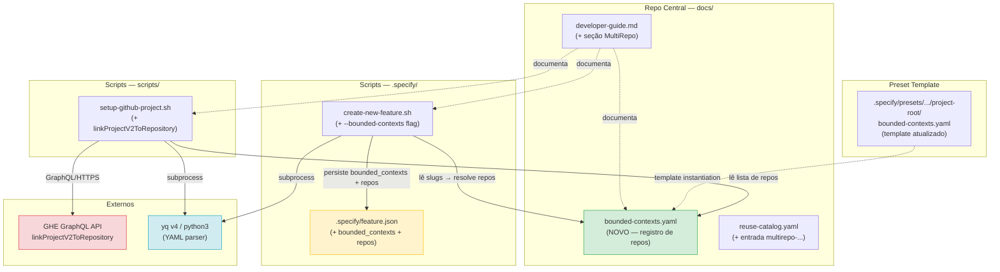
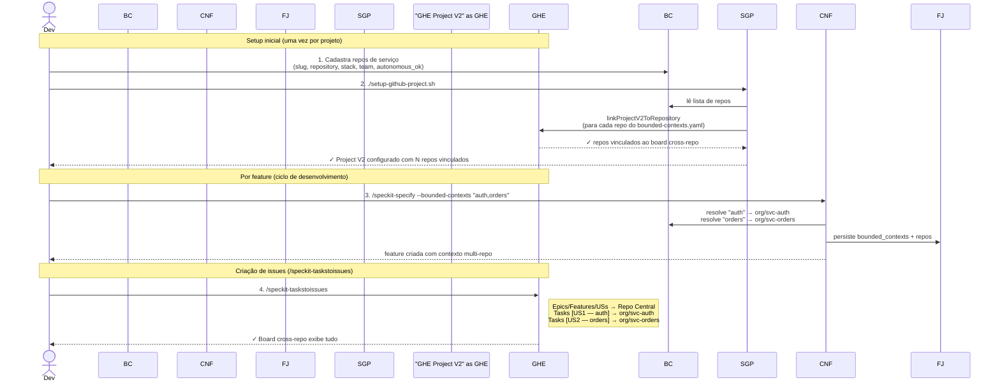

# graph.md — Feature 006: MultiRepo Support no Spec Kit Template

> Gerado a partir de `graph.yaml`. Atualizar ambos se a implementação divergir do plano.

---

## Diagrama por Código (módulos e dependências técnicas)

---

## Diagrama por Business (fluxo do ponto de vista do usuário)

---

## Legenda de riscos

| Cor | Significado |
|---|---|
| 🟢 Verde | Novo artefato — sem risco de regressão em código existente |
| 🟡 Amarelo | Artefato existente modificado — risco baixo (campo opcional) |
| 🔴 Vermelho | Dependência externa crítica — com fallback documentado |
| 🔵 Azul | Ferramenta utilitária — com fallback (python3/grep-awk) |
