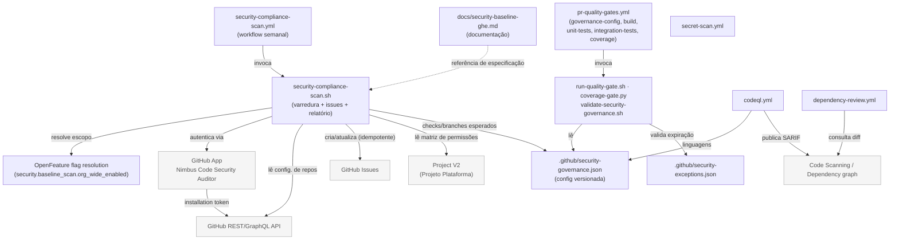
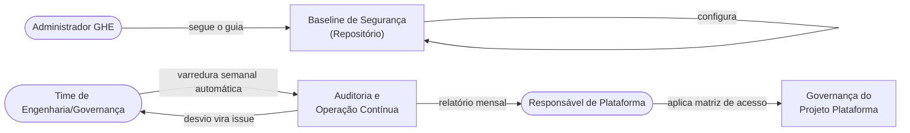

<!--
  graph.md — Grafo de módulos para leitura humana
  Gerado/atualizado junto com graph.yaml.
-->

# Grafo de Módulos — `007-controle-seguranca-ghe-projetos-plataforma`

> **Complexidade:** S4 — Arquitetura, segurança, dados sensíveis ou integração crítica
> **Última atualização:** 2026-09-22 (issue #450)
> **Spec:** [spec.md](./spec.md) · **Grafo estruturado:** [graph.yaml](./graph.yaml)

---

## Grafo por Código (dependências técnicas)

> **Legenda:** retângulos = internos · cinza = externos.
> Setas sólidas = **síncronas** (chamada em runtime) · seta tracejada = **referência documental** (não é chamada em runtime).

---

## Grafo por Business (fluxo de domínio / jornada)

---

## Tabela de Nós

| ID | Tipo | Path | Responsabilidade |
|---|---|---|---|
| `security-baseline-doc` | module | `docs/security-baseline-ghe.md` | Guia único de controles obrigatórios |
| `security-compliance-scan-workflow` | service | `.github/workflows/security-compliance-scan.yml` | Agendamento semanal da varredura |
| `security-compliance-scan-script` | module | `scripts/security-compliance-scan.sh` | Descoberta de repos, avaliação de repositórios + Project V2, issues e relatório mensal |
| `github-issues` | external | — | Rastreamento de não conformidades e relatório mensal |
| `platform-project-v2` | external | — | Alvo de avaliação da matriz de permissões |
| `openfeature-flag-provider` | module | `scripts/security-compliance-scan.sh` (trecho de resolução) | Rollout progressivo (piloto → org-wide) |
| `github-app-security-auditor` | external | — | Credencial somente-leitura para varredura org-wide |

---

## Tabela de Dependências

| De | Para | Tipo | Protocolo | Fallback |
|---|---|---|---|---|
| `security-compliance-scan-workflow` | `security-compliance-scan-script` | sync | shell invocation | Falha explícita (`::error::`) se secrets ausentes |
| `security-compliance-scan-script` | `github-app-security-auditor` | sync | HTTPS (GitHub App auth) | Falha explícita — sem varredura sem credencial válida |
| `security-compliance-scan-script` | `github-issues` | sync | GitHub REST API | Retry com backoff em rate limit |
| `security-compliance-scan-script` | `platform-project-v2` | sync | GitHub GraphQL API | Retry com backoff em rate limit |

---

## Notas de Risco / Pontos de Atenção

- `github-app-security-auditor` concentra acesso de leitura a **todos** os repositórios da organização — vazamento da chave privada é o principal risco desta feature (mitigação: rotação trimestral + GitHub Secrets, ver `plan.md`).
- `security-compliance-scan-script` é o único ponto que fala com a API do GitHub — qualquer mudança de contrato da API (REST/GraphQL) exige atualização centralizada neste módulo.
- Nenhum banco de dados próprio: todo estado observável vive em Issues do GitHub (comportamento intencional, evita nova infraestrutura).

> _Atualizar este grafo se, durante `/speckit-tasks`/`/speckit-implement`, um módulo novo for adicionado (ex.: script de agregação mensal separado)._
