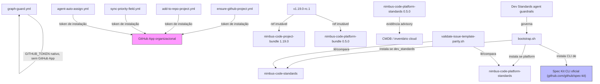
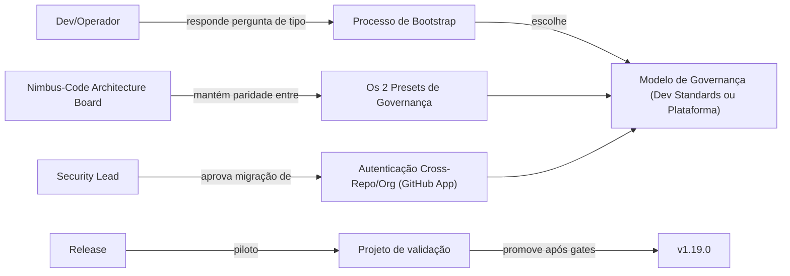

# Module Dependency Graph: Bootstrap Governance & Repo Provisioning Hardening

## Grafo por Código

## Grafo por Business

## Critical Paths

1. **Bootstrap → Preset**: se a pergunta de tipo de repositório falhar ou for
   pulada silenciosamente, todo o restante do bootstrap instala o preset errado
   — caminho crítico validado por AC-1.
2. **Workflow → GitHub App**: se o GitHub App não estiver instalado/configurado
   quando um workflow crítico (ex.: `ensure-github-project.yml`) rodar, o
   fallback para PAT preserva a operação, mas com aviso explícito — nunca falha
   silenciosamente (FR-009).
