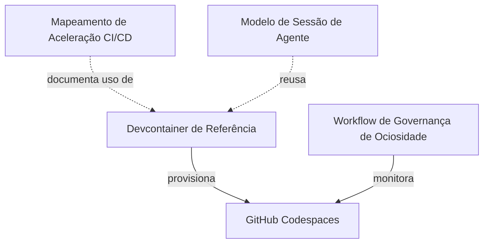
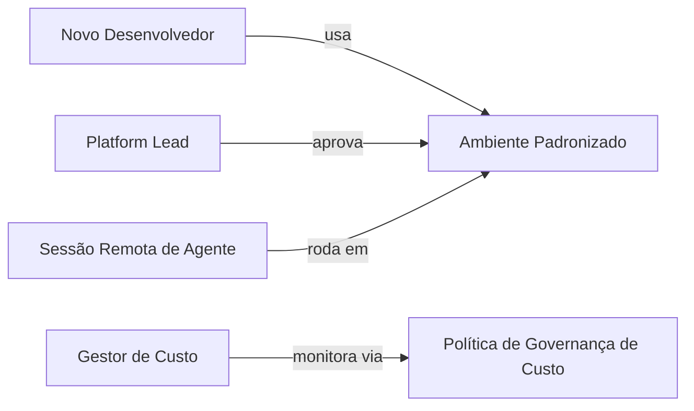

# Module Dependency Graph: Codespaces para DEV e CI/CD

## Grafo por Código

## Grafo por Business

## Critical Paths

1. **Devcontainer → Onboarding**: se o devcontainer de referência não cobrir
   toda a toolchain necessária, o objetivo de "zero-setup" (AC-1) falha.
2. **Governança de Custo → Sustentabilidade**: sem parada automática de
   Codespaces ociosos, a adoção pode gerar custo inesperado (AC-3), colocando
   em risco a continuidade da iniciativa.
