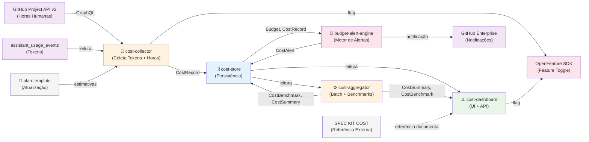
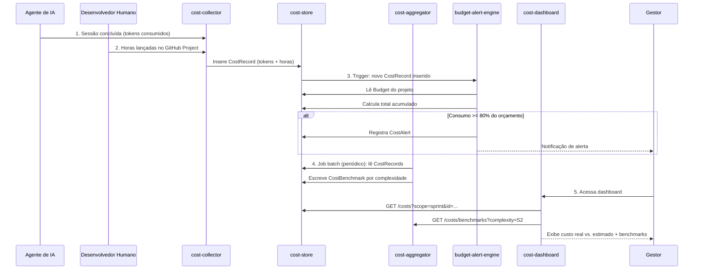
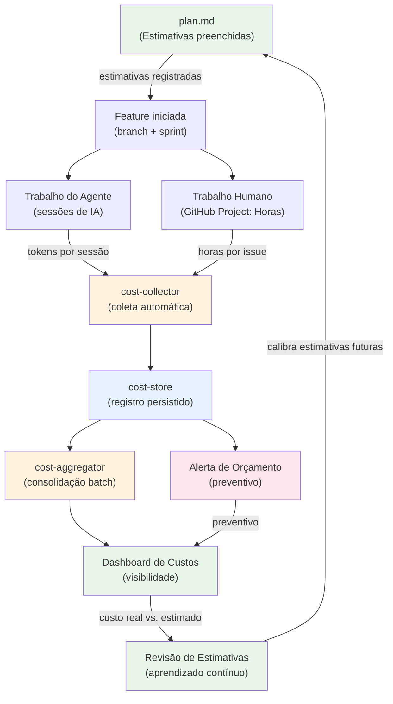
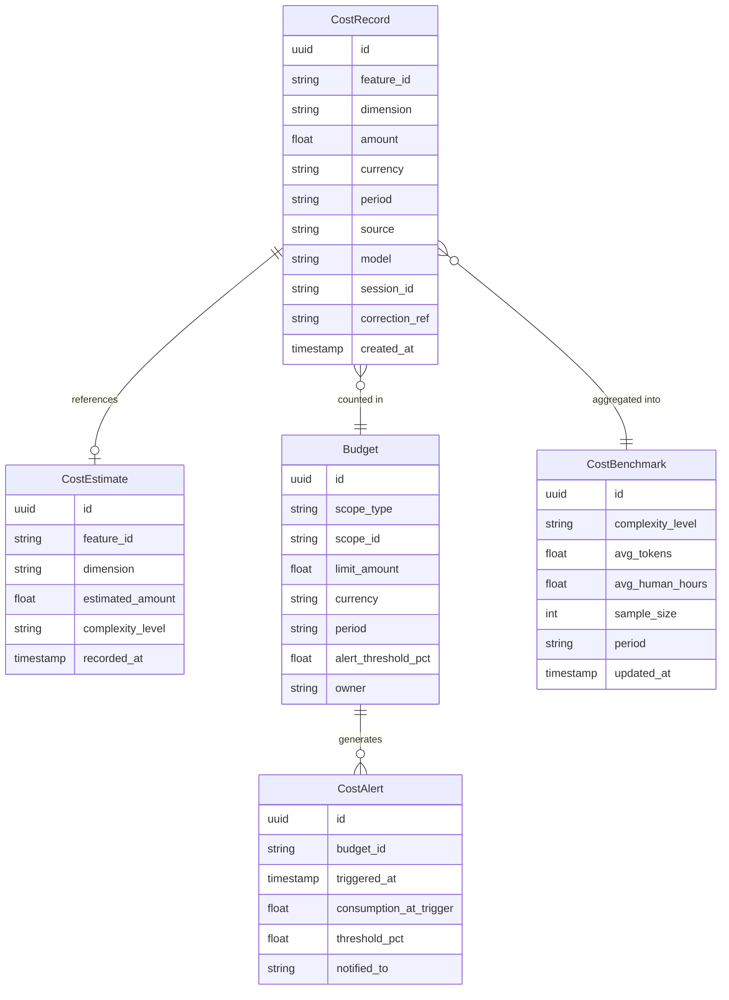
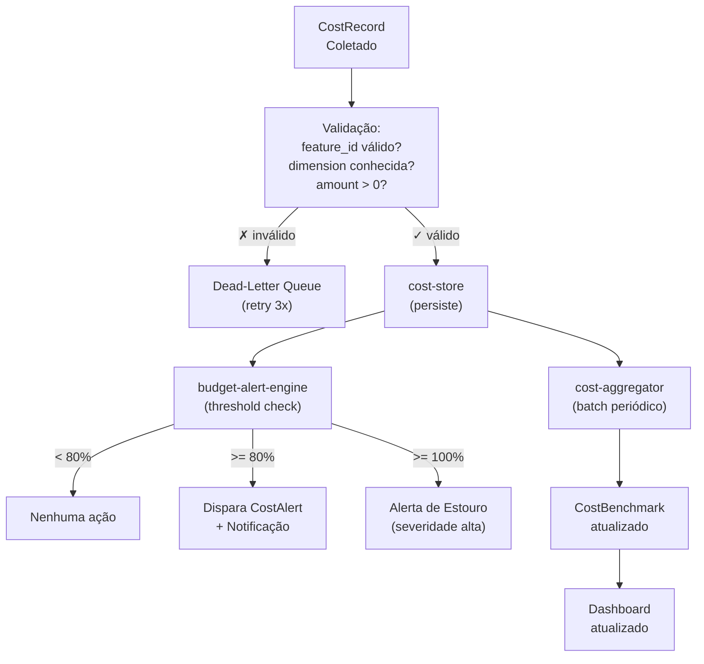
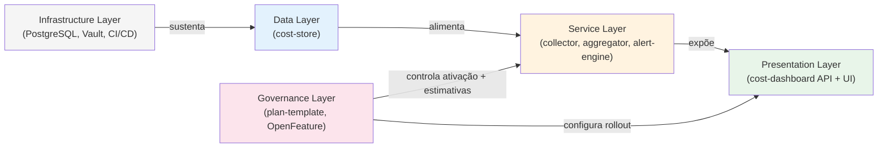

# Architecture Graphs: Controle de Custos (Feature 010)

---

## Technical Architecture

**Legend**:
- 🟧 **Orange**: Serviços de processamento (collector, aggregator)
- 🔵 **Blue**: Armazenamento (store)
- 🟥 **Pink/Red**: Motor de alertas, toggles
- 🟩 **Green**: Apresentação (dashboard)
- 🟪 **Purple**: Dependências externas (GitHub API, GHE)

---

## Data Flow: Coleta → Agregação → Dashboard → Alerta

---

## Fluxo de Negócio: Do Plan.md ao Dashboard

---

## Modelo de Entidades

---

## Gate & Validation Checkpoints

---

## Dependency Module Layers

