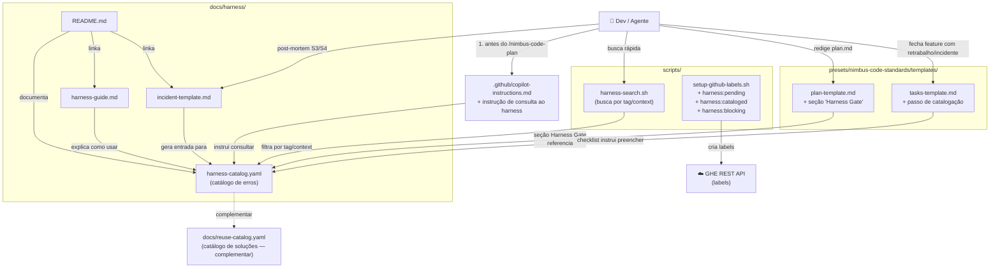
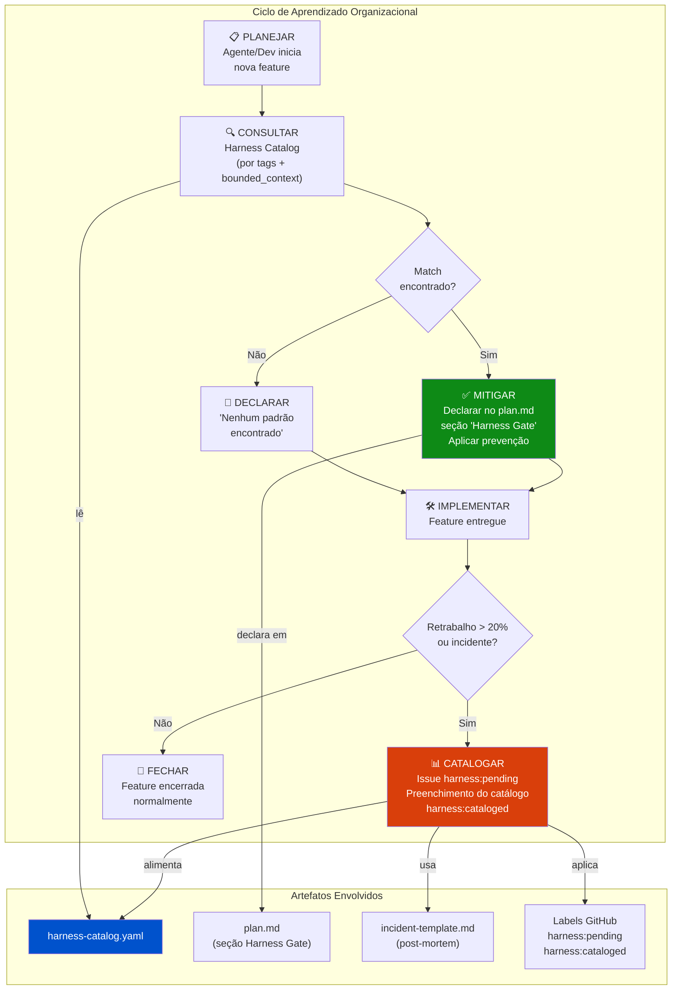

# graph.md — Feature 010: Harness Engineering — Aprendizado Organizacional com Erros

> Gerado a partir de `graph.yaml` — manter os dois em sincronia após cada mudança de módulo.

---

## Diagrama por Código (fluxo de execução)

---

## Diagrama por Business (fluxo de aprendizado organizacional)

---

## Módulos impactados por esta feature

| Módulo | Tipo de mudança | Descrição |
|---|---|---|
| `docs/harness/harness-catalog.yaml` | **Novo** | Catálogo central de lições aprendidas |
| `docs/harness/README.md` | **Novo** | Conceito, fluxo e navegação |
| `docs/harness/harness-guide.md` | **Novo** | Guia detalhado para devs e agentes |
| `docs/harness/incident-template.md` | **Novo** | Template de post-mortem |
| `scripts/harness-search.sh` | **Novo** | Script CLI de busca no catálogo |
| `presets/nimbus-code-standards/templates/plan-template.md` | **Estendido** | + seção "Harness Gate" |
| `.github/copilot-instructions.md` | **Estendido** | + instrução de consulta obrigatória |
| `scripts/setup-github-labels.sh` | **Estendido** | + labels `harness:*` |
| `presets/nimbus-code-standards/templates/tasks-template.md` | **Estendido** | + passo de catalogação no checklist de fechamento |
