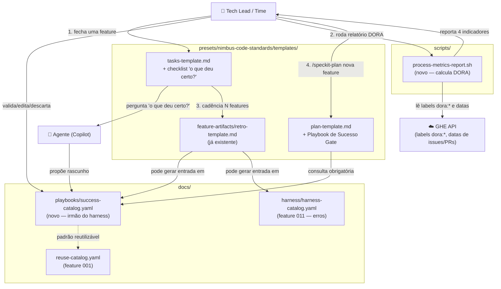
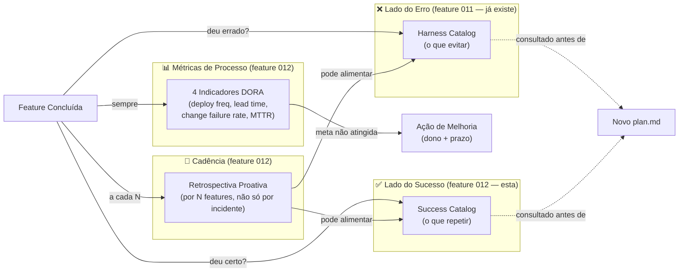

# graph.md — Feature 012: Loop de Melhoria Contínua Nimbus-Code

> Gerado a partir de `graph.yaml` — manter os dois em sincronia após cada mudança de módulo.

---

## Diagrama por Código (fluxo de execução)

---

## Diagrama por Business (ciclo de aprendizado)

---

## Notas de Manutenção

- Esta feature é **explicitamente complementar** à feature 011 (Harness
  Engineering), não uma duplicata — harness cobre erros, esta cobre sucessos
  + métricas + cadência de retrospectiva.
- Atualizar `graph.yaml` e este arquivo se novos módulos forem adicionados
  durante a implementação (ex.: mecanismo de armazenamento do Retro Cadence
  Counter, ainda em aberto no `data-model.md`).
- Toda entrada em `success-catalog.yaml` e toda meta/ação de melhoria de DORA
  passa por validação humana explícita antes de virar registro definitivo —
  reforço do princípio de Modelo Híbrido (FR-007).
