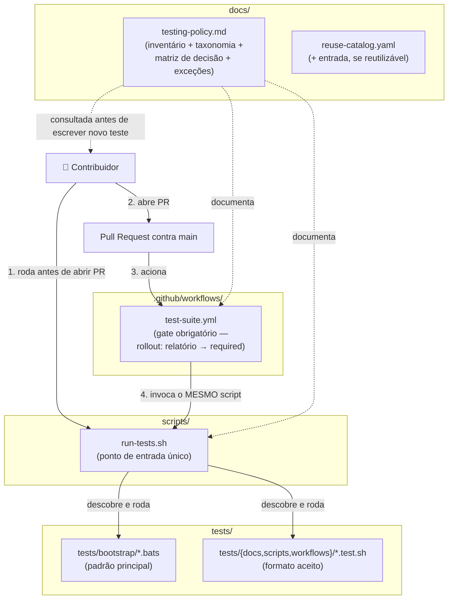
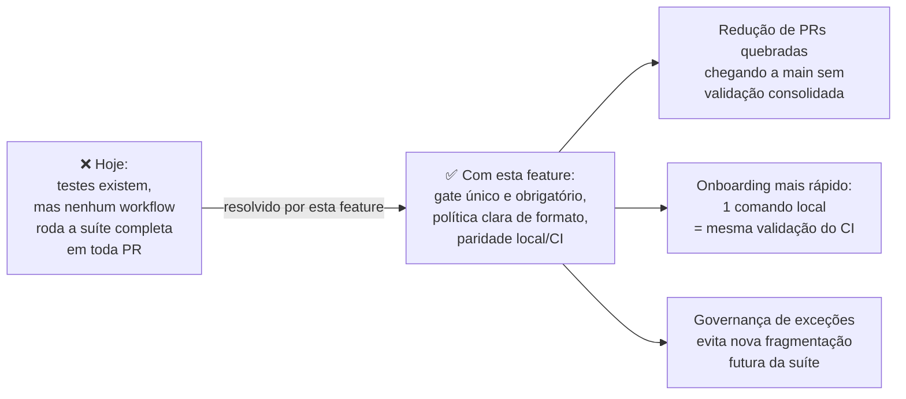

# graph.md — Feature 013: Governança de Testes em PR

> Gerado a partir de `graph.yaml` — manter os dois em sincronia após cada mudança de módulo.

---

## Diagrama por Código (fluxo de execução)

---

## Diagrama por Business (fecha o gap de governança)

---

## Notas de Manutenção

- Módulos novos desta feature (`docs/testing-policy.md`, `scripts/run-tests.sh`,
  `.github/workflows/test-suite.yml`) devem ser mantidos em paridade — qualquer
  mudança na lógica de descoberta de `run-tests.sh` deve ser refletida
  automaticamente no comportamento de `test-suite.yml` (mesma invocação), sem
  necessidade de duplicar a lógica.
- `tests/bootstrap/` e `tests/{docs,scripts,workflows}/` não são consumidos
  diretamente por nenhum outro módulo do bundle além de `run-tests.sh` — grafo
  local a esta feature, sem dependências externas ao repositório.
- Grafo será atualizado após `/nimbus-code-implement` se a implementação real
  divergir deste plano (ex.: se `run-tests.sh` for dividido em múltiplos
  scripts por categoria).
