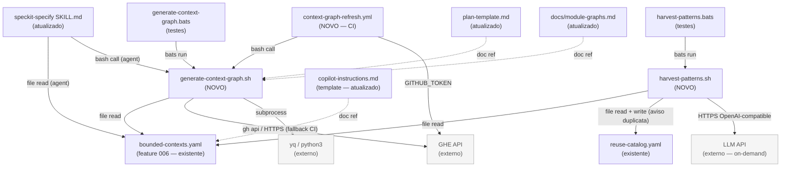
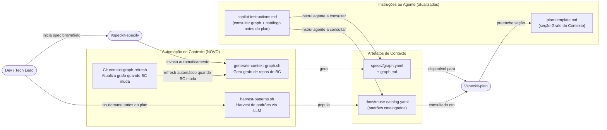

# graph.md — Feature 014: Brownfield MultiRepo Context Awareness

## Grafo por Código (Dependências Técnicas)

```mermaid
graph TD
  BC["bounded-contexts.yaml\n(feature 006 — existente)"]
  RC["reuse-catalog.yaml\n(existente)"]
  GCG["generate-context-graph.sh\n(NOVO)"]
  HP["harvest-patterns.sh\n(NOVO)"]
  CI["context-graph-refresh.yml\n(NOVO — CI)"]
  SS["speckit-specify SKILL.md\n(atualizado)"]
  GCG_T["generate-context-graph.bats\n(testes)"]
  HP_T["harvest-patterns.bats\n(testes)"]
  CPT["copilot-instructions.md\n(template — atualizado)"]
  PT["plan-template.md\n(atualizado)"]
  MGDOC["docs/module-graphs.md\n(atualizado)"]
  GHE["GHE API\n(externo)"]:::external
  LLM["LLM API\n(externo — on-demand)"]:::external
  YQ["yq / python3\n(externo)"]:::external

  GCG -->|"file read"| BC
  GCG -->|"gh api / HTTPS (fallback CI)"| GHE
  GCG -->|"subprocess"| YQ
  HP -->|"file read"| BC
  HP -->|"file read + write (aviso duplicata)"| RC
  HP -->|"HTTPS OpenAI-compatible"| LLM
  CI -->|"bash call"| GCG
  CI -->|"GITHUB_TOKEN"| GHE
  SS -->|"file read (agent)"| BC
  SS -->|"bash call (agent)"| GCG
  GCG_T -->|"bats run"| GCG
  HP_T -->|"bats run"| HP
  CPT -.->|"doc ref"| BC
  PT -.->|"doc ref"| GCG
  MGDOC -.->|"doc ref"| GCG

  classDef external fill:#f5f5f5,stroke:#aaa,color:#555
```

---

## Grafo por Business (Fluxo de Domínio)

```mermaid
graph LR
  DEV(["Dev / Tech Lead"])
  SPECKIT(["\/speckit-specify"])
  PLAN(["\/speckit-plan"])

  subgraph "Automação de Contexto (NOVO)"
    GCG2["generate-context-graph.sh\nGera grafo de repos do BC"]
    HP2["harvest-patterns.sh\nHarvest de padrões via LLM"]
    CI2["CI: context-graph-refresh\nAtualiza grafo quando BC muda"]
  end

  subgraph "Artefatos de Contexto"
    GYAML["specs/<feature>/graph.yaml\n+ graph.md"]
    RCAT["docs/reuse-catalog.yaml\n(padrões catalogados)"]
  end

  subgraph "Instruções ao Agente (atualizadas)"
    CPLINST["copilot-instructions.md\n(consultar graph + catálogo antes do plan)"]
    PLANTEMPL["plan-template.md\n(seção Grafo do Contexto)"]
  end

  DEV -->|"inicia spec brownfield"| SPECKIT
  SPECKIT -->|"invoca automaticamente"| GCG2
  GCG2 -->|"gera"| GYAML
  DEV -->|"on-demand antes do plan"| HP2
  HP2 -->|"popula"| RCAT
  CI2 -->|"refresh automático quando BC muda"| GCG2
  GYAML -->|"disponível para"| PLAN
  RCAT -->|"consultado em"| PLAN
  CPLINST -->|"instrui agente a consultar"| GYAML
  CPLINST -->|"instrui agente a consultar"| RCAT
  PLAN -->|"preenche seção"| PLANTEMPL
```
