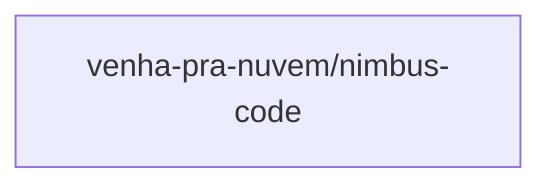

# Grafo do Bounded Context: spec-kit-workflow

> Gerado automaticamente por `scripts/generate-context-graph.sh` — não editar manualmente.

## Repositórios não analisados

Os seguintes repositórios não puderam ser acessados (nem localmente, nem via `gh api`):

- `venha-pra-nuvem/nimbus-code`

