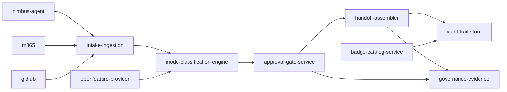
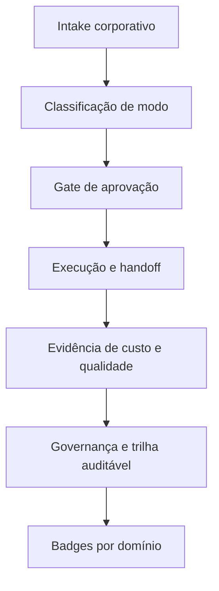

# Module Graph — 017-nimbus-digital-engineer-platform

## Grafo por Código

## Grafo por Business

## Notas
- `nimbus-agent` é o orquestrador principal multi-repo.
- OpenFeature é obrigatório como abstração para toggle de modos.
- Fluxos críticos persistem decisões em `audit-trail-store`.
