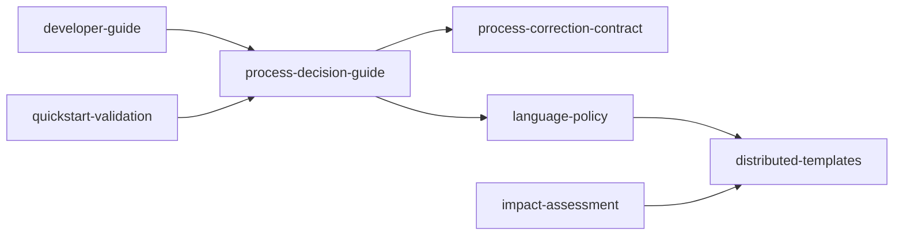
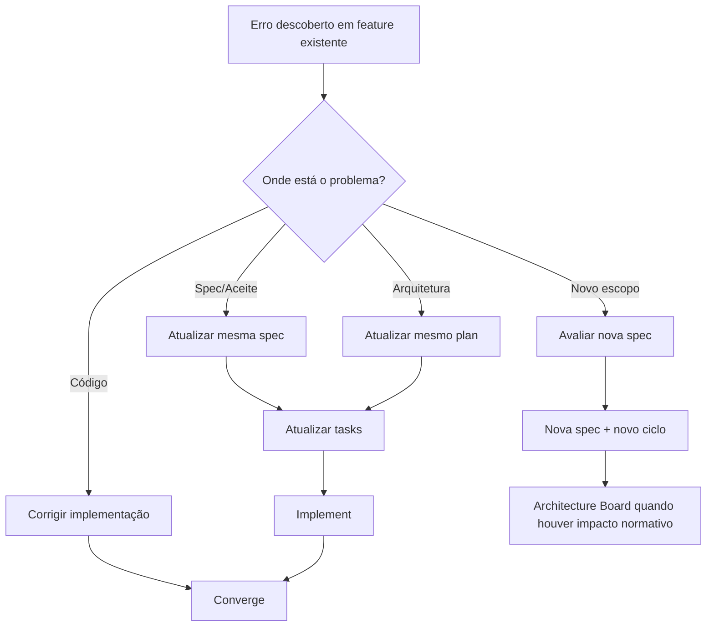

# Module Graph — 019-process-recovery-flow

## Grafo por Código

## Grafo por Business

## Notas

- `developer-guide` é o ponto operacional central da decisão.
- `process-correction-contract` reduz ambiguidade entre times e agentes.
- `language-policy` torna a regra de idioma normativa, não opcional.
- `distributed-templates` representa os presets e cópias espelho que distribuem
  a regra sem criar uma segunda fonte normativa.
- `impact-assessment` registra impacto, rollback, owners e critérios de Go/No-Go.
- `quickstart-validation` garante que edge cases e cenários principais possam ser validados de forma repetível.
