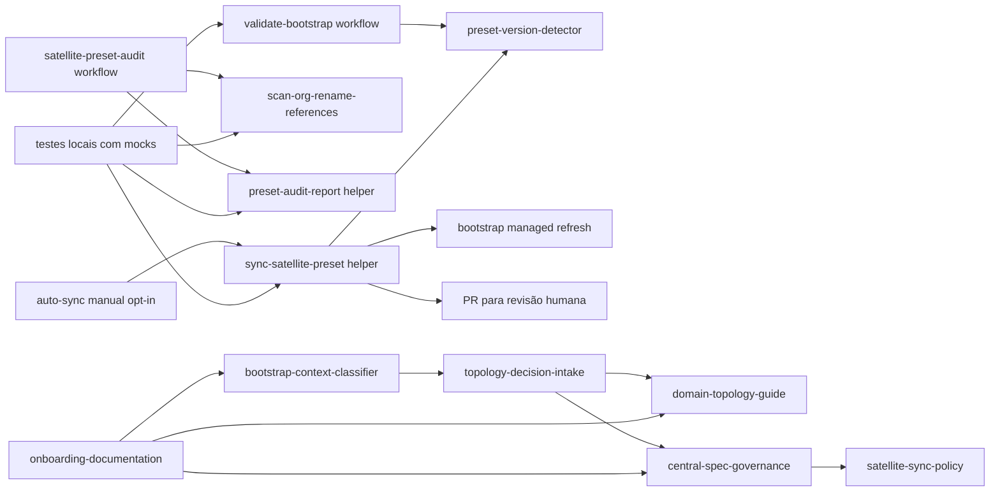
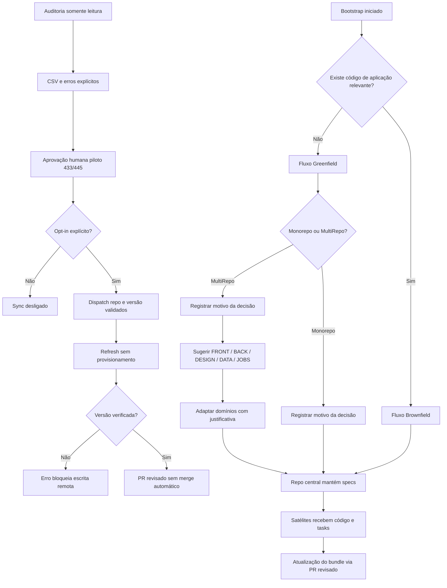

# Module Graph — 020-satellite-repo-governance

## Grafo por Código

## Grafo por Business

## Notas

- `preset-version-detector` infere `nimbus-code-standards` ou
  `nimbus-code-platform-standards` da registry nomeada; ambiguidade exige `--preset`.
  O wrapper instalado e `validate-bootstrap` usam a mesma interface `--repo-root`.
- `bootstrap-context-classifier` evita que repositórios quase vazios sejam tratados como brownfield real.
- `topology-decision-intake` transforma mono vs multirepo em decisão rastreável e persistida em `.specify/feature.json`.
- `domain-topology-guide` acelera a primeira decomposição sem engessar produtos diferentes.
- `central-spec-governance` reforça o repo central como fonte única de verdade para specs.
- `satellite-sync-policy` reaproveita o mecanismo oficial de alinhamento do bundle entre central e satélites.
