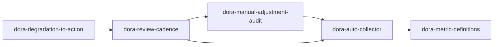
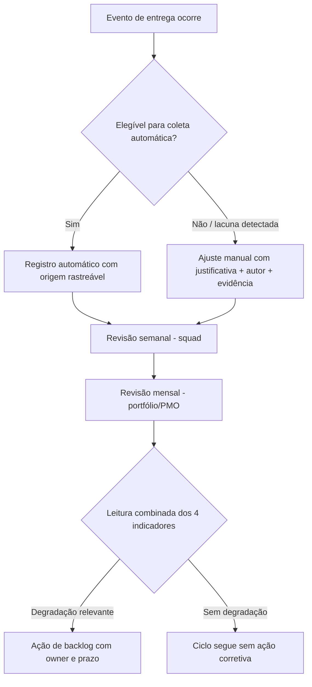

# Module Graph — 021-dora-metrics-governance

## Grafo por Código

## Grafo por Business

## Notas

- `dora-metric-definitions` é a fonte única de verdade consultada por todo o restante do grafo — evita leitura divergente entre squads.
- `dora-auto-collector` estende `scripts/process-metrics-report.sh` (feature 012); não é um script novo e paralelo.
- `dora-manual-adjustment-audit` é o módulo novo desta feature: garante que exceções manuais nunca fiquem sem trilha de auditoria.
- `dora-review-cadence` é o que transforma dado coletado em rotina operacional (semanal/mensal).
- `dora-degradation-to-action` fecha o loop de melhoria contínua, reaproveitando o backlog já existente (labels de prioridade do bundle).
