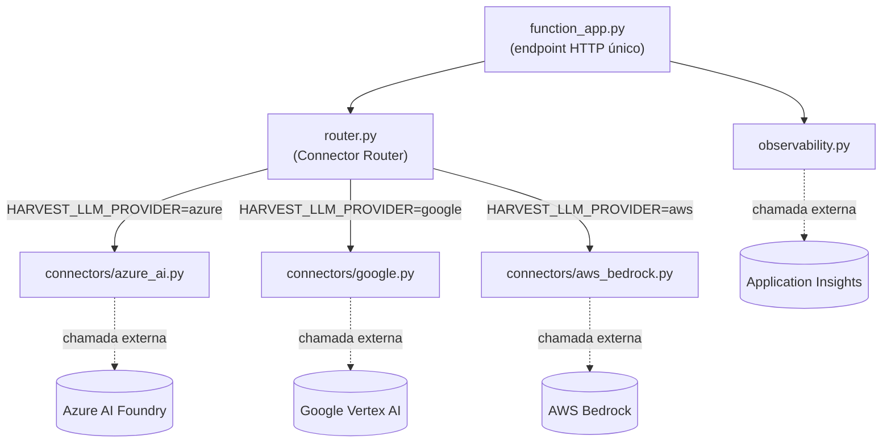
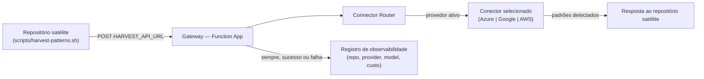
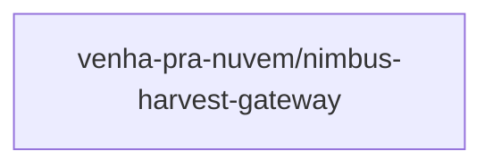

# Grafo de Módulos: Nimbus Harvest Gateway

Ver [graph.yaml](./graph.yaml) para a fonte estruturada (lida pelo Graph
Guard). Este arquivo traz os mesmos dados em diagramas Mermaid para leitura
humana.

## Grafo por código (módulos internos)

## Grafo por business (fluxo de valor)

## Grafo de Contexto Multi-Repo (SPEC-014)

**Repositórios não analisados**: o repositório `venha-pra-nuvem/nimbus-harvest-gateway`
ainda não existe — o grafo de contexto será reprocessado (`scripts/generate-context-graph.sh`)
assim que o repositório for criado, na fase de implementação.
