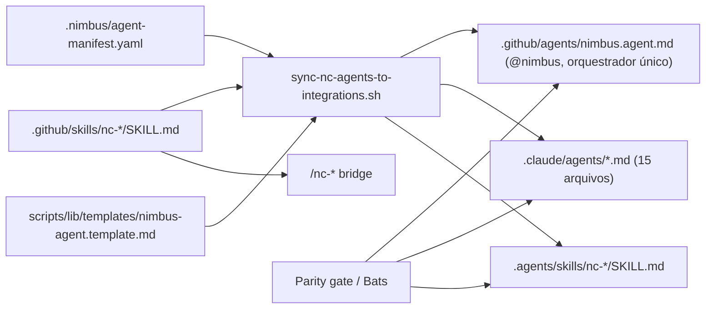
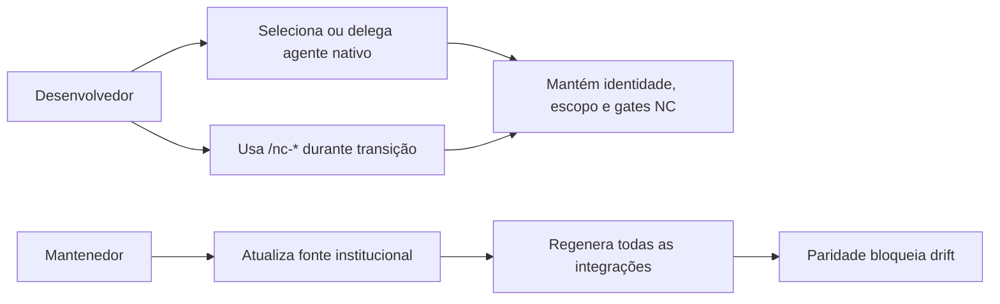

# Grafo da Feature 025 — Native NC Agents

## Grafo técnico

```mermaid
graph LR
  source[".github/skills/nc-*/SKILL.md"] --> generator["sync-nc-agents-to-integrations.sh"]
  manifest[".nimbus/agent-manifest.yaml"] --> generator
  template["scripts/lib/templates/nimbus-agent.template.md"] --> generator
  generator --> vscode[".github/agents/nimbus.agent.md (@nimbus, orquestrador único)"]
  generator --> claude[".claude/agents/*.md (15 arquivos)"]
  generator --> agy[".agents/skills/nc-*/SKILL.md"]
  source --> bridge["/nc-* bridge"]
  parity["Parity gate / Bats"] --> vscode
  parity --> claude
  parity --> agy
```

## Grafo de negócio

```mermaid
graph LR
  dev["Desenvolvedor"] --> native["Seleciona ou delega agente nativo"]
  dev --> bridge["Usa /nc-* durante transição"]
  native --> governance["Mantém identidade, escopo e gates NC"]
  bridge --> governance
  maintainer["Mantenedor"] --> source["Atualiza fonte institucional"]
  source --> all["Regenera todas as integrações"]
  all --> parity["Paridade bloqueia drift"]
```
