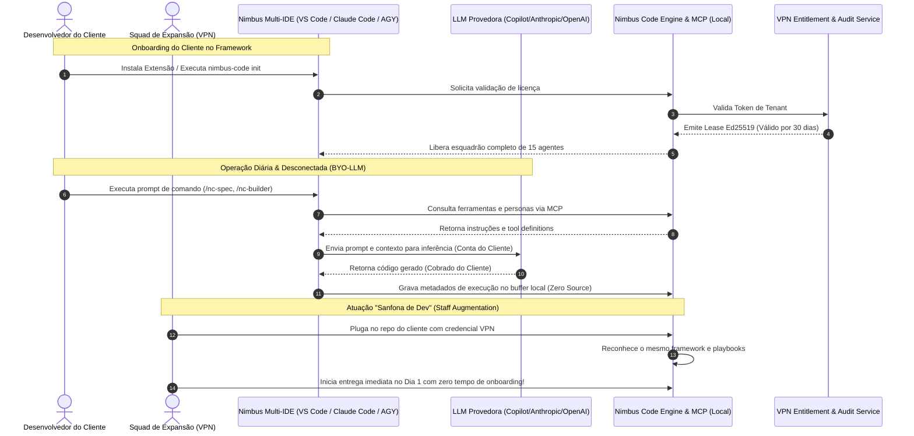

# Diagramas de Dependência e Fluxo de Arquitetura: `026-template-usage-governance`

## 1. Grafo de Módulos por Código (Técnico com BYO-LLM)

```mermaid
graph TD
    classDef client fill:#e1f5fe,stroke:#0288d1,stroke-width:2px;
    classDef core fill:#e8f5e9,stroke:#388e3c,stroke-width:2px;
    classDef cloud fill:#fff3e0,stroke:#f57c00,stroke-width:2px;
    classDef external fill:#f3e5f5,stroke:#8e24aa,stroke-width:2px;

    VSCodeExt["vscode-extension<br/>(extensions/vscode)"]:::client
    MCPServer["mcp-server<br/>(servers/mcp-nimbus)"]:::client
    CLICore["nimbus-cli-core<br/>(scripts/nimbus-code-cli)"]:::core
    LeaseVerifier["local-lease-verifier<br/>(scripts/lib/lease-verifier)"]:::core
    TelemetryBuffer["telemetry-buffer<br/>(scripts/lib/telemetry)"]:::core
    
    ClientLLM["LLM do Cliente (Copilot / OpenAI / Anthropic)<br/>[Zero Custo para VPN]"]:::external

    CloudAPI["cloud-entitlement-service<br/>(cloud/entitlement-service)"]:::cloud
    TenantDB[("tenant-database<br/>(cloud/db)")]:::cloud
    AuditLedger[("audit-ledger (WORM 5y)<br/>(cloud/storage)")]:::cloud
    KeyVault["Azure Key Vault (Master Ed25519)"]:::cloud

    VSCodeExt --> CLICore
    MCPServer --> CLICore
    CLICore --> LeaseVerifier
    CLICore --> TelemetryBuffer
    
    VSCodeExt <--> ClientLLM
    MCPServer <--> ClientLLM

    LeaseVerifier -.->|Check-in 30d (TLS 1.3)| CloudAPI
    TelemetryBuffer -.->|Telemetry Sync (Metadata)| CloudAPI
    CloudAPI --> TenantDB
    CloudAPI --> AuditLedger
    CloudAPI --> KeyVault
```

---

## 2. Grafo de Fluxo de Negócio & "Sanfona de Dev" (BYO-LLM)


