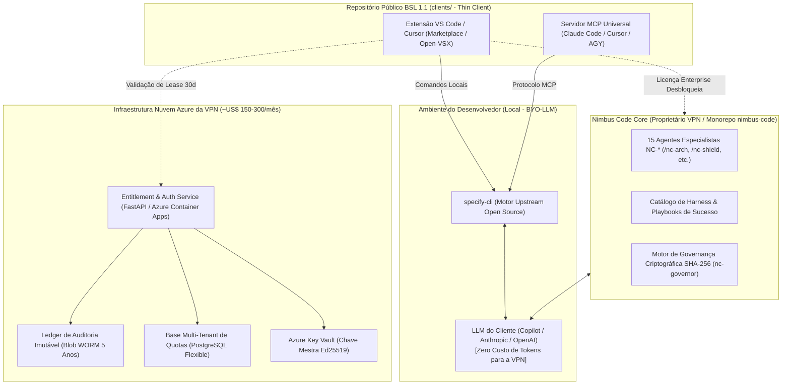
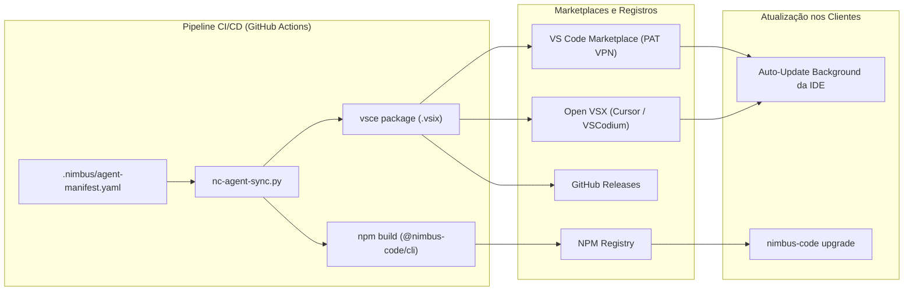

# Plano de Implementação Técnica: `026-template-usage-governance`

## Nimbus-Code — Classificação de Complexidade

| Dimensão | Valor | Justificativa |
|---|---|---|
| **Complexidade desta tarefa** | **S4** | Arquitetura de Criptografia Assimétrica, Validação de Licenciamento Multi-Tenant, Zero Source Leak, BYO-LLM e Governança de IP do Framework. |
| **Modelo selecionado** | `Claude Opus / GPT-5.5` (Reasoning Avançado) | Alta criticidade de segurança e controle de IP corporativo. |
| **Bounded Context** | `governance-entitlement`, `spec-kit-workflow`, `repository-provisioning` | Módulos de autorização, empacotamento multi-IDE e CLI. |
| **Padrão reutilizado encontrado?** | Sim (`ed25519-paseto-token`, `mcp-server-protocol`, `azure-container-apps-fastapi`) | Criptografia assimétrica padrão para leases locais, protocolo MCP para agentes e microserviço leve na nuvem VPN. |
| **Estimativa de tokens (in+out)** | ~40k – 65k tokens | Especificação, diagramas, contratos de API e modelos de dados. |

---

## 1. Arquitetura da Solução & Componentes

O repositório central privado (`venha-pra-nuvem/nimbus-code`) e seu espelho público de clientes (`venha-pra-nuvem/nimbus-code-extension`) são compostos por 4 camadas desacopladas sob o modelo **BYO-LLM (Bring Your Own LLM)**:

### Componentes e Divisão no Monorepo:
1. **`core/` (Proprietário VPN / IP Protegido)**:
   - Os 15 agentes especialistas `nc-*` com prompts de alta fidelidade e regras de automação.
   - Presets corporativos `nimbus-code-standards` e `platform-standards`.
   - Catálogo de Reuso (`docs/reuse-catalog.yaml`) e Catálogo de Harness (`docs/harness/`).
2. **`clients/` (Público sob BSL 1.1 no GitHub / npm / Marketplaces)**:
   - **Extensão VS Code / Cursor (`clients/vscode/`):** Interface visual, atalhos do `@nimbus`, menus de comandos.
   - **Servidor MCP Universal (`clients/mcp-server/`):** Adaptador universal para Claude Code, Cursor e Antigravity.
3. **`cloud/` (Enterprise / Gestão VPN)**:
   - **IaC Terraform (`cloud/iac/`):** Recursos Azure provisionados com isolamento de tenant e WORM 5 anos.
   - **Entitlement API (`cloud/services/`):** Emissão de leases Ed25519 e ingestão de telemetria agregada.
4. **`docs/` (Documentação Aberta & Governança)**:
   - Manuais de desenvolvimento, onboarding e termos de uso BSL 1.1.
   - Binário ou script de orquestração local que gerencia a árvore de arquivos, executa gates e valida os leases de autorização.
2. **Local Lease Verifier**:
   - Módulo criptográfico que valida localmente o token PASETO/Ed25519 sem latência de rede (< 50ms).
   - Gerencia o período de carência offline (até 30 dias).
3. **Multi-IDE Adapters (VS Code Extension + MCP Server)**:
   - Extensão VS Code/Cursor fornecendo interface visual do esquadrão `@nimbus`.
   - MCP Server expondo as ferramentas do Nimbus Code para agentes autônomos.
4. **VPN Cloud Entitlement & Audit Service**:
   - Serviço backend central da VPN para emissão de licenças, validação de tokens corporativos e recepção de telemetria estritamente anonimizada/estruturada com retenção de 5 anos.

---

## 2. Processo de Publicação e Atualização da Extensão

---

## 3. Infraestrutura Necessária do Lado da VPN

| Recurso Azure | SKU / Tier | Função | Custo Estimado |
|---|---|---|---|
| **Azure Container Apps** | Consumption (0.5 vCPU, 1GB RAM) | API de Entitlement e Ingestão de Telemetria (FastAPI). Escala a zero quando ocioso. | ~$30 - $80/mês |
| **Azure Database for PostgreSQL** | Flexible Server (B1ms ou B2s) | Armazenamento de tenants, clientes corporativos e quotas de licenças. | ~$60 - $150/mês |
| **Azure Blob Storage** | Standard Hot/Cool com WORM Policy | Ledger imutável de telemetria/auditoria por 5 anos (LGPD Art. 7º, IX e V). | ~$15 - $40/mês |
| **Azure Key Vault** | Standard | Guarda e rotação da chave privada mestra Ed25519 para emissão de leases. | ~$5/mês |
| **Azure Static Web Apps** | Free Tier | Painel administrativo web da VPN para gestão comercial de clientes e chaves. | Gratuito |

> **Custo Total de Infra VPN:** ~US$ 150 – 300 / mês (Margem bruta de software > 95%).

---

## 4. Architecture Decision Log (ADL)

### ADR-026-1: Licenciamento BSL 1.1 / Dual-License vs GPL
- **Decisão:** Adotar **BSL 1.1** (Business Source License) combinada com licença comercial Enterprise.
- **Justificativa:** GPL pura forçaria a abertura do código de quem modifica o framework ou criaria ambiguidades jurídicas; BSL permite acesso público ao código para testes e avaliação, mas veda produção comercial não autorizada, canalizando grandes contas para a VPN.
- **Aprovação:** Board Executivo & DPO.

### ADR-026-2: Empacotamento Multi-IDE via MCP + Extensão leve vs Fork de IDE
- **Decisão:** Não criar IDE proprietária. Focar em Extensão para VS Code/Cursor e Server MCP universal.
- **Justificativa:** Criar uma IDE própria demanda custo proibitivo de manutenção (upstream de Chromium/Electron/VSCode) e enfrenta enorme resistência de adoção por devs corporativos. Extensões e MCP integram-se aos editores que os devs já amam.

### ADR-026-3: Telemetria Estritamente Anonimizada e Sem Código-Fonte
- **Decisão:** Enviar apenas metadados técnicos (Tenant, Host ID, Contagem de Tokens, Status do Gate, Hashes).
- **Justificativa:** Mandatório para atender os requisitos de CISO corporativo e LGPD/GDPR. Qualquer envio de código geraria veto imediato de clientes Enterprise.

### ADR-026-4: Modelo BYO-LLM (Zero Custo de Tokens de Inferência para a VPN)
- **Decisão:** A VPN nunca paga os tokens de geração de código dos usuários. A IDE do cliente (VS Code Copilot, Claude Code, Cursor, AGY) consome as cotas do próprio cliente.
- **Justificativa:** Protege a margem financeira da VPN contra volatilidade de consumo de LLM, elimina responsabilidade sobre armazenamento/trânsito de código confidencial e respeita os contratos corporativos existentes entre o cliente e provedores como Microsoft, OpenAI e Anthropic.
- **Aprovação:** CFO, CTO e CISO.

---

## 5. Security & DevSecOps Gate (Não-Negociáveis)

| Controle | Status | Evidência / Implementação |
|---|---|---|
| **Criptografia & Assinatura** | Aprovado | Chaves assimétricas Ed25519 com certificados rotacionáveis. |
| **Segredos & Cofre** | Aprovado | Chave privada do Entitlement Service reside em Azure Key Vault; cliente local armazena apenas chave pública. |
| **Proteção contra Vazamento (DLP)** | Aprovado | Telemetria estritamente filtrada por schema JSON validado antes do envio. |
| **Isolamento de Tenant** | Aprovado | Particionamento lógico no banco de dados de Entitlement da VPN. |
| **Retenção & LGPD** | Aprovado | Logs de auditoria armazenados em bucket com política de imutabilidade e expiração em 5 anos. |
