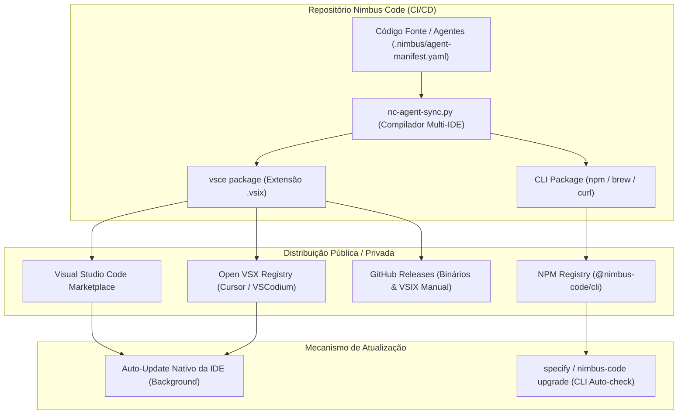

# Especificação Funcional e Estratégica: `026-template-usage-governance`

## Nimbus-Code — Cabeçalho Obrigatório da Spec

| Campo | Valor |
|---|---|
| **Feature slug** | `026-template-usage-governance` |
| **Complexidade estimada** | **S4** (Arquitetura de Segurança, Gestão de IP, Governança Criptográfica, Multi-Tenant, Zero Token Cost e Compliance LGPD) |
| **Bounded Context** | `spec-kit-workflow`, `repository-provisioning`, `governance-entitlement` |
| **PR de referência / Issue** | Ref: `#026` / Nova |
| **Data alvo de entrega** | 2026-10-30 |

---

## Nimbus-Code — SLO Alvo desta Feature

| Componente | Latência p99 (ms) | Taxa de erro máx. (%) | Disponibilidade alvo | RTO | RPO |
|---|---|---|---|---|---|
| Entitlement & Lease Verification Service | < 150ms | 0.01% | 99.95% | 15 min | 0 min (stateless/tokens) |
| Central Telemetry Ingestion API | < 300ms | 0.05% | 99.9% | 30 min | 5 min |
| Extension / Local Agent Runtime | < 50ms (local verify) | 0.0% | 100% (local offline até 30d) | N/A | N/A |

---

## Nimbus-Code — Objetivo e Contexto Estratégico

**Objetivo:**
Transformar o repositório **`nimbus-code`** (renomeado a partir de `nimbus-code-spec-kit-template`) em um framework corporativo distribuível com **Governança de Propriedade Intelectual (IP)**, suporte a **modelo de licenciamento BSL 1.1 / Source-Available no repositório público da extensão**, e entrega desacoplada em múltiplas camadas (**Core do Framework**, **Extensão VS Code / Multi-IDE**, **Servidor MCP Universal** e **Infraestrutura Cloud Azure**), viabilizando a estratégia de **Sanfona de Dev / Staff Augmentation de Alta Eficiência** da Venha Pra Nuvem (VPN), com **Zero Lock-in de Runtime**, **Segurança Absoluta de Código (No-Source-Leak)** e **Zero Custo de Inferência de Tokens para a VPN (Modelo BYO-LLM)**.

### Estrutura de Monorepo e Separação de Camadas

O repositório privado central da VPN (`venha-pra-nuvem/nimbus-code`) é estruturado em 4 camadas bem delimitadas:
1. **`core/` (Proprietário VPN / IP Fechado):** Presets institucionais (`nimbus-code-standards`), prompts dos 15 agentes `nc-*`, scripts de harness de erros/sucesso, catálogo de reuso e motor `bootstrap.sh`.
2. **`clients/` (Publicável sob BSL 1.1 / Repo Público):**
   - `clients/vscode/`: Extensão VS Code/Cursor (UI, comandos, atalhos do `@nimbus`).
   - `clients/mcp-server/`: Servidor MCP Universal para Claude Code, Cursor e AGY.
3. **`cloud/` (Enterprise / Gestão VPN):**
   - `cloud/iac/` (`infrastructure/nimbus-code-extension-iac/`): Terraform Azure (Container Apps, Storage WORM 5y, Key Vault, PostgreSQL Flexible).
   - `cloud/services/`: Entitlement & Telemetry API (FastAPI).
4. **`docs/` (Público & Governança):** Documentação técnica, manual de onboarding e FAQ da licença BSL 1.1.

### Modelo de Distribuição do Repositório Público ("Thin-Client / BYO-Engine")
- O repositório público (`venha-pra-nuvem/nimbus-code-extension`) contém **apenas o código de `clients/`** (Extensão VS Code e Servidor MCP) sob licença **BSL 1.1**.
- **Community / Self-Service:** Desenvolvedores externos clonam o repositório público ou instalam a extensão do Marketplace. No modo gratuito/community, utilizam seu próprio modelo de LLM (BYO-LLM) e executam o motor upstream do Spec-Driven Development (`specify-cli`), configurando seus próprios fluxos de forma autônoma.
- **Enterprise / VPN Squad:** Clientes que contratam a VPN desbloqueiam o acesso ao **Core do Nimbus Code** (os 15 agentes especialistas `nc-*`, gates DevSecOps `nc-shield`, governança criptográfica SHA-256 `nc-governor`, telemetria central e o modelo Sanfona de Dev).

**Motivação & Princípios Econômicos:**
1. **Modelo BYO-LLM (Zero Token Cost para a VPN):** A VPN **nunca arca com o custo de tokens** de geração de código dos desenvolvedores. O cliente utiliza suas próprias contas/provedores (GitHub Copilot corporativo, chaves Anthropic/OpenAI ou modelos do Cursor/AGY). A VPN licencia estritamente a **metodologia, personas de agentes, playbooks de erro/sucesso (Harness) e regras de engenharia**.
2. **Proteção e Monetização de IP:** O valor do Nimbus Code está na orquestração dos 15 agentes (`nc-*`), nas matrizes FinOps (S0–S4), nos playbooks e nos gates de conformidade. Impedir o uso comercial ou em produção não autorizado, permitindo testes livres para desenvolvedores (Developer-Led Growth).
3. **Modelo "Sanfona de Dev":** Reduzir a zero o atrito de onboarding quando a VPN atua em projetos de clientes. Clientes que adotam o framework Nimbus Code podem contratar squads da VPN que iniciam no primeiro dia com velocidade máxima e metodologia idêntica.
4. **Distribuição Unificada Multi-IDE:** Fornecer suporte nativo ao VS Code, Cursor, Claude Code e Antigravity através de uma extensão/plugin centralizada e CLI, consumindo leases criptográficos de autorização.
5. **Alinhamento com Stakeholders Críticos:** Atender às exigências de segurança do CISO (zero vazamento de código), custos do CFO (FinOps S0–S4 e margem bruta de quase 100% no SaaS), conformidade do Jurídico/DPO (BSL e LGPD) e produtividade da Engenharia.

**Critério de Done (Alto Nível):**
- Validação criptográfica de Entitlement/Licença no bootstrap, atualização e execução dos agentes.
- Suporte a Free Tier / Modo Avaliação (local, não-produção) e Enterprise Tier (produção / corporativo auditado).
- Telemetria de uso e auditoria centralizada retida por 5 anos (LGPD Art. 7º, IX e V), contendo estritamente metadados (zero envio de código-fonte).
- Garantia de Zero Lock-in de Runtime: código gerado roda de forma autônoma sem dependências proprietárias.
- Funcionamento offline resiliente por até 30 dias via lease assinado (Ed25519/PASETO).
- Empacotamento para Extensão VS Code + CLI + MCP Server compatível com múltiplos editores.
- Infraestrutura e pipelines de publicação da extensão (Visual Studio Marketplace, Open VSX, GitHub Releases) definidos e documentados.

---

## Nimbus-Code — Hybrid Collaboration Model

| Papel | Responsabilidades | Critério de Handoff | Escalação |
|---|---|---|---|
| **Agente (Nimbus Engine / NC-*)** | Geração e validação de código, checagem de lease local, despacho de telemetria, execução de testes BDD e gates. | Notifica o desenvolvedor quando o lease estiver prestes a expirar (< 5 dias) ou quando houver violação de escopo/licença. | Tech Lead / Architecture Board |
| **Humano (Dev / Tech Lead / DPO / CISO)** | Configuração de credenciais de tenant, revisão de código e aprovação de PRs, auditoria de conformidade e concessão de contratos comerciais. | Validação final de produção e assinatura de contratos de suporte/sanfona. | Diretoria Executiva / Jurídico (DPO) |

---

## Nimbus-Code — Critérios de Aceitação (formato BDD)

> **AC-1 — Verificação de Entitlement & Licença no Bootstrap e Atualização**
> **Given** que um desenvolvedor executa o comando de inicialização (`bootstrap.sh` ou extensão VS Code)
> **When** o framework consulta o serviço de Entitlement da VPN
> **Then** se a licença/tenant for válida, os artefatos proprietários e presets são instalados com sucesso; se inválida ou ausente, a instalação de componentes protegidos é abortada com instrução de como obter a chave de avaliação/enterprise.
> **Test ref:** `test_AC1_entitlement_bootstrap_verification`

> **AC-2 — Operação Offline Resiliente com Lease Criptográfico de até 30 Dias**
> **Given** que o desenvolvedor possui um lease de licença válido assinado criptograficamente
> **When** a máquina estiver sem conectividade com a internet por um período de até 30 dias
> **Then** os comandos do framework e agentes continuam executando localmente sem interrupção; após o 31º dia sem check-in, o runtime solicita renovação de conexão.
> **Test ref:** `test_AC2_offline_lease_30d_grace_period`

> **AC-3 — Auditoria Centralizada e Telemetria com Retenção de 5 Anos (No Source Leak)**
> **Given** que uma operação de inicialização, atualização de preset ou execução de gate é disparada
> **When** o runtime registra o evento de governança
> **Then** o payload contendo apenas metadados (identidade corporativa, machine ID, IP, repositório de destino, contagem de tokens consumidos na conta do cliente e timestamp) é enviado ao backend central com integridade assegurada e retenção de 5 anos, garantindo que nenhum código-fonte ou segredo seja transmitido.
> **Test ref:** `test_AC3_telemetry_audit_logging`

> **AC-4 — Modo Free/Community vs Enterprise (Dual-License / BSL 1.1)**
> **Given** um usuário utilizando a versão aberta para testes locais e desenvolvimento não-comercial
> **When** o framework detecta uso em ambiente produtivo ou pipeline corporativo sem licença Enterprise
> **Then** o sistema notifica a necessidade de licenciamento Enterprise e registra a inconformidade no painel de auditoria.
> **Test ref:** `test_AC4_license_tier_enforcement`

> **AC-5 — Interface Multi-IDE via Extensão VS Code, Claude Code e AGY (BYO-LLM)**
> **Given** um desenvolvedor trabalhando no VS Code, Cursor, Claude Code ou Antigravity
> **When** a extensão/plugin do Nimbus Code é carregada
> **Then** a interface executa utilizando o modelo de LLM configurado na IDE do cliente (sem repassar custos de inferência à VPN) e consome as ferramentas/prompts do MCP Server local.
> **Test ref:** `test_AC5_multi_ide_extension_integration`

> **AC-6 — Zero Lock-in de Runtime no Código Gerado**
> **Given** uma aplicação gerada ou mantida com o auxílio do Nimbus Code
> **When** ela é construída e implantada em ambiente de produção
> **Then** a aplicação executa utilizando apenas binários e bibliotecas nativas/padrão de mercado, sem exigir qualquer módulo ou serviço de runtime do Nimbus Code para funcionar.
> **Test ref:** `test_AC6_zero_runtime_lockin`

---

## Arquitetura de Distribuição, Publicação e Infraestrutura

### 1. Modelo de Execução: BYO-LLM (Bring Your Own LLM)

```
┌────────────────────────────────────────────────────────────────────────────────────────┐
│                              MÁQUINA / CONTA DO CLIENTE                                │
│                                                                                        │
│   1. A IDE DO CLIENTE FORNECE O MODELO (O CLIENTE PAGA A CONTA DE LLM):                 │
│      • No VS Code: Usa o GitHub Copilot (Claude 3.7 / GPT-4o / GPT-5) da empresa dele  │
│      • No Claude Code: Usa a API Key / Anthropic Console do próprio cliente            │
│      • No AGY / Cursor: Usa a chave configurada na IDE dele                            │
│                                                                                        │
│   2. O NIMBUS FORNECE AS REGRAS, O PROMPT E AS FERRAMENTAS (O NOSSO IP):                │
│      • Instruções de Engenharia, Persona do Agente, Regras S0–S4                       │
│      • Harness Catalog (aprendizado de erros) e Playbooks de Sucesso                   │
│      • Ferramentas de Grafo, Validação de Gates e Checagem de Licença                  │
│                                                                                        │
│   3. O SERVIDOR MCP LOCAL (localhost) APENAS:                                          │
│      • Valida o lease de licença Ed25519 offline (Zero Custo de IA)                    │
│      • Entrega os templates e executa scripts de apoio (Zero Custo de IA)              │
│      • Registra métricas de uso e conformidade para auditoria                          │
└────────────────────────────────────────────────────────────────────────────────────────┘
```

### 2. Processo de Publicação e Atualização da Extensão / CLI



1. **Compilação Unificada (`nc-agent-sync.py`):** A partir do manifesto central `.nimbus/agent-manifest.yaml`, o script gera em tempo de build os assets para VS Code, Claude Code (`.claude/agents/`) e Antigravity (`.agents/skills/`).
2. **Publicação Automatizada via GitHub Actions:**
   - **VS Code:** Publicação oficial no [Visual Studio Marketplace](https://marketplace.visualstudio.com) usando `vsce publish` com Personal Access Token (PAT) corporativo da VPN.
   - **Cursor / Open VSX:** Publicação no [Open VSX Registry](https://open-vsx.org) via `ovsx publish` para desenvolvedores que usam Cursor, VSCodium ou fork open source do VS Code.
   - **CLI / MCP Server:** Publicação no registro público NPM sob o escopo `@nimbus-code/cli` e via script curl de instalação direta.
3. **Ciclo de Atualização:**
   - As IDEs realizam o auto-update silencioso em background da extensão.
   - O CLI avisa ao desenvolvedor sobre novas versões a cada execução e suporta `nimbus-code upgrade` (ou atualização via `specify integration upgrade`).

---

### 3. Infraestrutura Necessária do Lado da VPN (Cloud Backend)

Como a inferência de LLM roda na conta do cliente, a infraestrutura da VPN é **extremamente enxuta, leve e de custo operacional quase zero**:

| Componente | Tecnologia | Papel & Função | Custo Estimado / Mês |
|---|---|---|---|
| **API de Entitlement & Licenciamento** | Azure Container Apps (FastAPI / Go) | Emissão e validação de leases PASETO/Ed25519 e verificação de quotas de tenants. Stateless e auto-escalável. | ~$30 – $80 / mês |
| **Banco de Dados de Tenants** | Azure Database for PostgreSQL (Flexible Server) | Cadastro de empresas clientes, chaves de API, planos Enterprise e histórico de contratos. | ~$60 – $150 / mês |
| **Armazenamento de Auditoria (WORM)** | Azure Blob Storage (com Imutabilidade Legal / 5 anos) | Armazena payloads de telemetria e logs de conformidade de 5 anos para atender auditorias e LGPD. | ~$15 – $40 / mês |
| **Cofre de Chaves Criptográficas** | Azure Key Vault | Armazena a chave privada Ed25519 mestra que assina os leases corporativos. Chave pública é embarcada no CLI/Extensão. | ~$5 / mês |
| **Painel Comercial / Admin** | Next.js / Azure Static Web Apps | Interface web para o time comercial da VPN gerar licenças, monitorar ativações e acompanhar métricas de adoção. | Gratuito / Base Tier |

> **Custo Total de Infraestrutura da VPN:** Menos de **$150 a $300/mês**, mesmo atendendo dezenas de clientes corporativos com centenas de desenvolvedores, garantindo margem bruta de SaaS superior a **95%**.

---

## User Scenarios & Testing

### User Story 1 — Onboarding Seguro de Novos Projetos de Clientes (Priority: P1)
Como Tech Lead de um cliente ou da VPN, quero rodar o bootstrap do Nimbus Code garantindo que apenas repositórios e desenvolvedores autorizados recebam o ecossistema completo de agentes e padrões proprietários.

**Why this priority:** Garante a proteção imediata do código e da propriedade intelectual da VPN, estabelecendo o canal de auditoria.

**Independent Test:** Executar o instalador com chave válida (sucesso) e com chave revogada/inexistente (bloqueio seguro).

**Acceptance Scenarios:**
1. **Given** chave de licença corporativa ativa, **When** executa `nimbus-code init`, **Then** o workspace é configurado com todos os 15 agentes e presets.
2. **Given** chave expirada ou ausente, **When** executa `nimbus-code init`, **Then** exibe mensagem informativa com link para registro de avaliação e interrompe a cópia de artefatos privados.

---

### User Story 2 — Atuação como "Sanfona de Dev" (Priority: P1)
Como Executivo da VPN, quero que qualquer squad da VPN possa plugar no repositório de um cliente que já utiliza o Nimbus Code e iniciar entregas imediatas com a mesma metodologia.

**Why this priority:** Viabiliza o modelo de negócio central de Staff Augmentation de Alta Produtividade e Venda de Projetos.

**Independent Test:** Um engenheiro da VPN autentica-se com credenciais VPN em um repositório cliente licenciado e obtém acesso instantâneo aos comandos e gates sem reconfiguração.

**Acceptance Scenarios:**
1. **Given** um repositório cliente padronizado com Nimbus Code, **When** o desenvolvedor da VPN executa `/nc-arch` ou `/nc-builder`, **Then** o ambiente reconhece o perfil e opera sem atrito de onboarding.

---

### User Story 3 — Uso Desconectado / Offshore / Viagens (Priority: P2)
Como Desenvolvedor trabalhando em trânsito ou ambiente restrito sem conexão direta, quero continuar codando e utilizando os agentes com o Nimbus Code por até 30 dias.

**Why this priority:** Desenvolvedores corporativos frequentemente trabalham em redes isoladas ou offline; o bloqueio em caso de queda de rede geraria insatisfação.

**Independent Test:** Desconectar a rede da máquina após login e validar a execução contínua durante o prazo do lease.

---

### User Story 4 — Homologação de Segurança e Auditoria pelo CISO (Priority: P2)
Como CISO de um cliente corporativo, quero auditar os pacotes de telemetria e o código gerado para comprovar que nenhum dado confidencial é enviado à VPN e que o código gerado não possui dependências proprietárias.

**Why this priority:** Elimina o maior risco de veto na contratação corporativa.

**Independent Test:** Inspecionar o tráfego de rede durante o uso do framework e auditar o build de produção sem o Nimbus Code instalado.

---

## Functional Requirements

- **FR-001**: O sistema DEVE validar a autenticidade e validade da licença/entitlement antes de liberar presets e scripts proprietários.
- **FR-002**: O sistema DEVE gerar um arquivo de lease local assinado criptograficamente (chave assimétrica Ed25519) com expiração máxima de 30 dias.
- **FR-003**: O cliente CLI/Extensão DEVE enviar evento de auditoria em cada bootstrap, upgrade de preset e fechamento de feature (usuário, hostname, IP, repo, timestamp UTC, contagem de tokens).
- **FR-004**: O backend de governança DEVE armazenar logs com imutabilidade e garantia de retenção por 5 anos.
- **FR-005**: O sistema DEVE fornecer extensão para VS Code, Open VSX (Cursor) e empacotamento compatível com editores de IA (Antigravity, Claude Code).
- **FR-006**: O sistema DEVE suportar termos de licenciamento BSL 1.1 (permitindo visualização de código e testes não-produtivos livres, com restrição de produção).
- **FR-007**: O sistema NUNCA DEVE incluir trechos de código-fonte, dados de negócio ou segredos no payload de telemetria e auditoria.
- **FR-008**: O código gerado pelos agentes NUNCA DEVE exigir dependências ou serviços do Nimbus Code para executar em ambiente de produção.
- **FR-009**: O framework DEVE operar sob arquitetura BYO-LLM, consumindo a chave/modelo do cliente localmente sem custos de inferência de IA para a VPN.

---

## Success Criteria

### Measurable Outcomes

- **SC-001**: 100% das inicializações do template fora de escopo autorizado bloqueadas antes da extração de artefatos proprietários.
- **SC-002**: Tempo de validação de licença local < 50ms para não impactar o fluxo do desenvolvedor.
- **SC-003**: 0% de interrupções de trabalho para desenvolvedores autorizados em regime offline dentro do período de 30 dias.
- **SC-004**: Redução do tempo de onboarding de squads da VPN em clientes padronizados para menos de 1 hora no primeiro dia de projeto.
- **SC-005**: Conformidade integral com LGPD atestada pelo relatório de DPO.
- **SC-006**: 100% de aprovação nos testes de não-vazamento de código (Zero Source Leak) em auditorias de segurança.
- **SC-007**: Custo de tokens de IA para a VPN rigorosamente zero no faturamento de infraestrutura.
