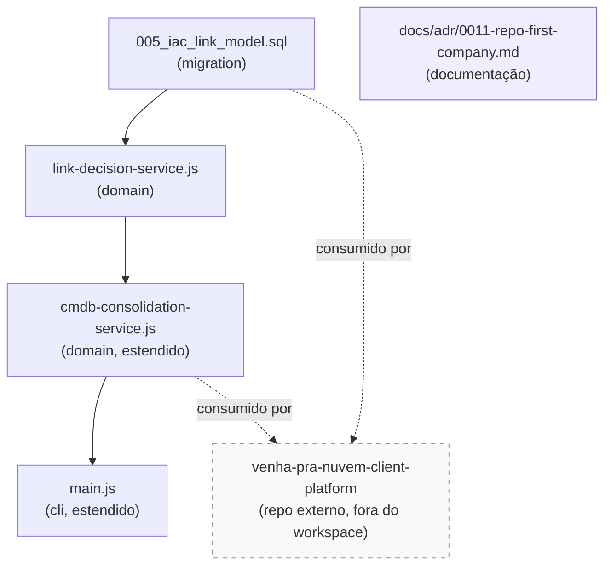
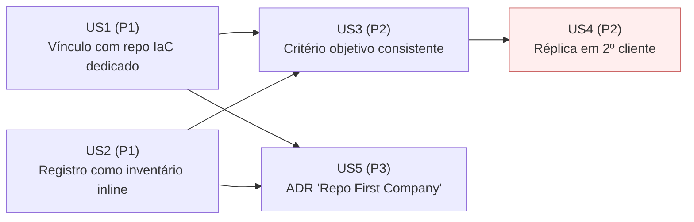

# Module Dependency Graph — 027-cliente-plataforma-cmdb-iac

Fonte estruturada: [graph.yaml](./graph.yaml)

## Diagrama por Código (módulos e dependências técnicas)

> A caixa `EXT` (repositório externo) é representada com borda tracejada para
> deixar explícito que está **fora do escopo de escrita** desta sessão — é um
> consumidor do modelo de referência, não um módulo implementado aqui.

## Diagrama por Negócio (User Stories e valor entregue)

> US4 é destacada (borda vermelha) porque sua execução completa depende do
> repositório externo `venha-pra-nuvem-client-platform` — nesta sessão, apenas
> o **processo documentado de instanciação** (parte da US4) pode ser preparado
> como artefato de referência; a execução real fica fora de alcance.

## Resumo de Dependências Externas

| Dependência | Tipo | Relação | Bloqueia o quê nesta sessão |
|---|---|---|---|
| `venha-pra-nuvem/venha-pra-nuvem-client-platform` | Repositório externo (fora do workspace) | Consumidor do modelo de referência (`cmdb-consolidation-service-ext`, `iac-link-model-migration`) | Aplicação real de US1, US2 e US4 em clientes de Managed Services; medição real de SC-001 a SC-005 |
