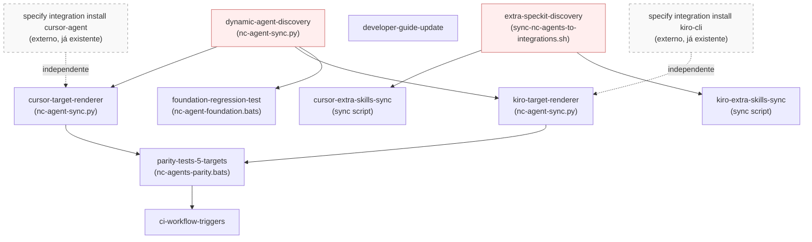
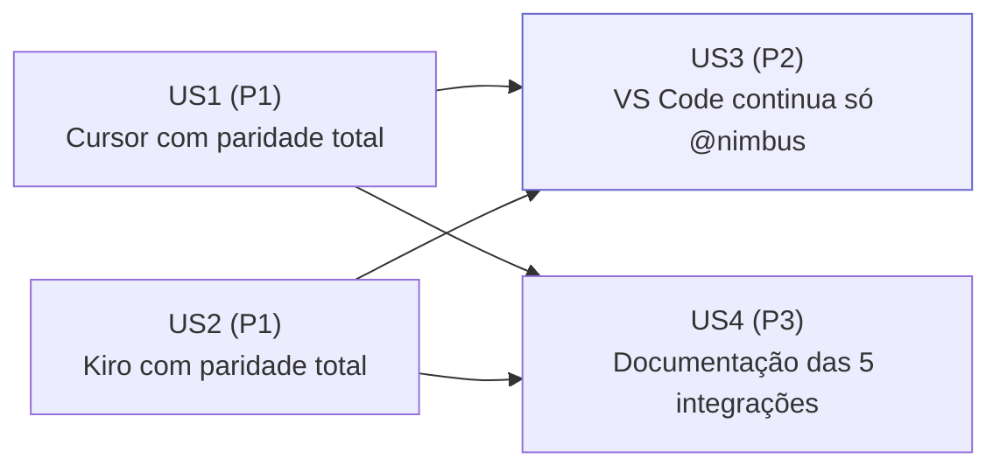

# Module Dependency Graph — 028-suporte-cursor-kiro

Fonte estruturada: [graph.yaml](./graph.yaml)

## Diagrama por Código (módulos e dependências técnicas)

> `dynamic-agent-discovery` e `extra-speckit-discovery` são destacados (borda
> vermelha) porque são mudanças arquiteturais **transversais aos 5 alvos**,
> não apenas aos 2 novos — mitigação do HRN-0006, aprovada explicitamente
> pelo usuário durante o `/nc-arch`.

## Diagrama por Negócio (User Stories e valor entregue)

> US3 é uma história de **regressão** — não introduz comportamento novo, mas
> garante que a extensão para 2 alvos não quebre a garantia já conquistada na
> spec 025.

## Resumo de Dependências Externas

| Dependência | Tipo | Relação | Observação |
|---|---|---|---|
| `specify` CLI (`cursor-agent`, `kiro-cli`) | Ferramenta externa, já instalada no catálogo | Fornece os 12 comandos `/speckit-*` de forma independente do gerador NC-* | Não reimplementado; apenas invocado |
| `kiro-cli` (binário) | Ferramenta externa, requer instalação local | Necessário para o dev usar Kiro na prática | Sem versão mínima exigida pelo `specify` CLI (confirmado nesta auditoria) |
