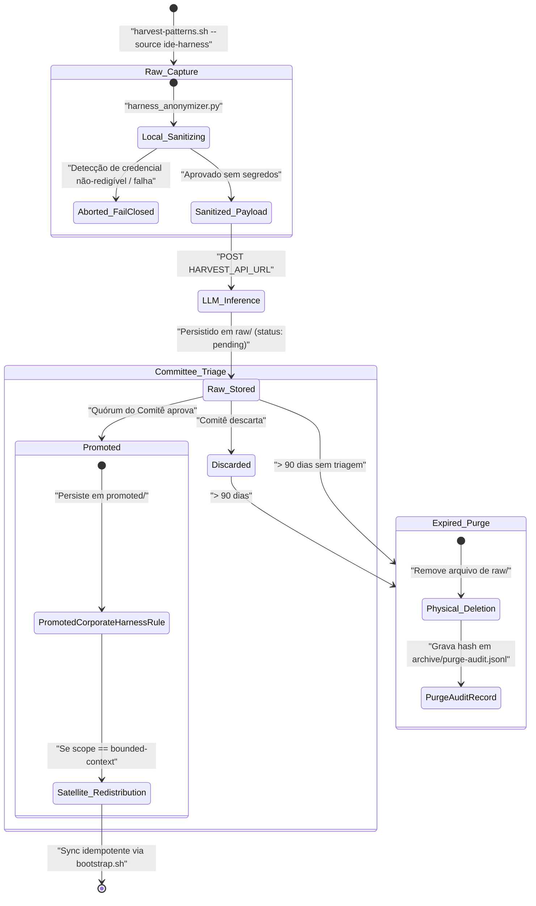

# Data Model: Harness Corporativo — Consolidação de Harness Agêntico IDE Pessoal

**Feature**: `029-harness-corporativo-ide`  
**Data**: 2026-09-22  
**Agente**: NC-Arch (Nimbus Solution Architect)  
**Status**: Concluído

---

## 1. Visão Geral das Entidades

O modelo de dados suporta o ciclo de vida completo do Harness Agêntico IDE:
1. **Captura e Anonimização Local**: Geração de `RawHarnessEntry`.
2. **Normalização via LLM**: Troca de mensagens estruturadas com `HarvestGateway` (`SanitizedHarvestPayload` → `CandidateHarnessPattern`).
3. **Triagem Humana do Comitê**: Registro de `CommitteeDecisionRecord` e criação de `PromotedCorporateHarnessRule`.
4. **Governança de Retenção (LGPD)**: Expurgo em 90 dias com registro em `PurgeAuditRecord`.
5. **Redistribuição Idempotente (Etapa 2)**: Rastreamento em `SatelliteDistributionRecord`.

---

## 2. Especificação das Entidades

### 2.1 RawHarnessEntry

Representa uma captura bruta de arquivos de configuração de IDE pessoal (`~/.claude/CLAUDE.md`, `.cursor/rules`) já submetida ao processo de anonimização local. Armazenada como arquivo YAML no repositório central dedicado em `raw/<author_hash>/<capture_timestamp>-<tool>.yaml`.

| Campo | Tipo | Obrigatório | Descrição |
|---|---|---|---|
| `id` | string | Sim | Identificador estável (formato `RAW-YYYYMMDD-<hash8>`) |
| `capture_timestamp` | datetime (ISO 8601 UTC) | Sim | Momento exato da execução da captura na máquina do dev |
| `author_id` | string | Sim | Hash consistente ou ID corporativo do colaborador autor |
| `tool_origin` | enum (`claude-code`, `cursor`, `hybrid`) | Sim | Ferramenta IDE de onde as regras foram extraídas |
| `source_files` | list[string] | Sim | Lista de caminhos locais relativos/originais lidos |
| `sanitization_status` | enum (`clean`, `redacted`, `failed`) | Sim | Resultado do motor de sanitização local |
| `redaction_summary` | object | Sim | Contagem de elementos sanitizados (`api_keys`, `emails`, `ips`, `credentials`) |
| `sanitized_content` | string | Sim | Texto livre das regras após substituição determinística por tokens |
| `content_sha256` | string | Sim | Hash SHA-256 do conteúdo sanitizado para validação de integridade |
| `status` | enum (`pending`, `promoted`, `discarded`, `purged`) | Sim | Estado atual do item no ciclo de governança |
| `expires_at` | datetime (ISO 8601 UTC) | Sim | Data limite para expurgo automático (`capture_timestamp` + 90 dias) |

**Regras de Validação**:
- Se `sanitization_status` for `failed`, o arquivo NUNCA é criado nem enviado (gate fail-closed).
- `sanitized_content` não pode conter nenhum padrão de secret correspondente à lista de regex de bloqueio.
- `status` inicial é sempre `pending`.

---

### 2.2 SanitizedHarvestPayload

Payload HTTP montado por `scripts/harvest-patterns.sh` para envio a `HARVEST_API_URL` (Harvest Gateway), requisitando ao LLM a extração e síntese de padrões reutilizáveis a partir do texto anonimizado.

| Campo | Tipo | Obrigatório | Descrição |
|---|---|---|---|
| `repo` | string | Sim | Identificador lógico (ex.: `harness-corporativo/raw/<author_id>`) |
| `stack` | string | Sim | Valor fixo `ide-agent-harness` |
| `prompt` | string | Sim | Prompt estruturado solicitando categorização de regras de agente |
| `content` | string | Sim | Conteúdo textual 100% sanitizado e redigido |
| `metadata` | list[object] | Sim | Lista de metadados das seções identificadas `{section, size_chars, hash}` |

**Regras de Validação**:
- `content` deve ter sido aprovado pelo `harness_anonymizer.py` sem violações.
- Se a chamada HTTP falhar ou retornar erro (não-200), o script reporta falha explícita (AC-3, FR-005).

---

### 2.3 CandidateHarnessPattern

Envelope retornado pela `HARVEST_API_URL` contendo as propostas de regras candidatas estruturadas pelo modelo de IA.

| Campo | Tipo | Obrigatório | Descrição |
|---|---|---|---|
| `tag` | string (kebab-case) | Sim | Identificador curto e único da regra proposta |
| `title` | string | Sim | Título descritivo em português claro |
| `category` | enum | Sim | `workflow-rule`, `persona-instruction`, `prompt-engineering`, `code-convention` |
| `description` | string | Sim | Explicação de 1-3 frases sobre a utilidade do padrão |
| `suggested_rule` | string | Sim | Bloco de texto/markdown formatado para inclusão em prompt/regras |
| `applicable_ide` | enum (`claude-code`, `cursor`, `agnostic`) | Sim | Escopo de compatibilidade da regra |
| `confidence_score` | float (0.0 a 1.0) | Sim | Grau de confiança de generalização avaliado pela IA |

---

### 2.4 PromotedCorporateHarnessRule

Entrada canônica no repositório centralizado `nimbus-code-harness-corporativo`, armazenada sob `promoted/generic/<category>/<tag>.yaml` ou `promoted/bounded-contexts/<slug>/<tag>.yaml`.

| Campo | Tipo | Obrigatório | Descrição |
|---|---|---|---|
| `id` | string | Sim | Identificador oficial (ex.: `CORP-HRN-0001`) |
| `tag` | string (kebab-case) | Sim | Tag canônica única para busca e referência |
| `title` | string | Sim | Nome oficial do padrão |
| `scope` | enum (`generic`, `bounded-context`) | Sim | Abrangência do padrão na organização |
| `target_bounded_context` | string | Não | Slug do bounded context (obrigatório se `scope=bounded-context`) |
| `category` | enum | Sim | Categoria da regra |
| `rule_content` | string | Sim | Texto oficial e polido da instrução/regra para o agente |
| `target_ide` | enum (`claude-code`, `cursor`, `agnostic`) | Sim | Ferramenta alvo |
| `raw_source_ref` | string | Sim | Ponteiro de rastreabilidade (ex.: `RAW-20260922-a1b2c3d4`) |
| `promotion_date` | datetime (ISO 8601 UTC) | Sim | Data e hora em que a aprovação do Comitê foi efetivada |
| `promoted_by` | string | Sim | Identificador do membro relator do Comitê |
| `approvals` | list[object] | Sim | Lista de aprovações `{role, member_id, approved_at, notes}` |
| `version` | integer | Sim | Versão da regra (inicia em 1) |
| `status` | enum (`active`, `deprecated`) | Sim | Ciclo de vida da regra corporativa |

---

### 2.5 CommitteeDecisionRecord

Registro de auditoria para cada deliberação do Comitê Nimbus Code sobre um item pendente em `raw/`.

| Campo | Tipo | Obrigatório | Descrição |
|---|---|---|---|
| `decision_id` | string | Sim | Identificador único (`DEC-YYYYMMDD-<hash>`) |
| `raw_entry_id` | string | Sim | Referência ao `RawHarnessEntry.id` avaliado |
| `decision` | enum (`promote`, `discard`, `quarantine`) | Sim | Veredito formal do Comitê |
| `review_date` | datetime (ISO 8601 UTC) | Sim | Timestamp da deliberação |
| `reviewers` | list[object] | Sim | Membros participantes `{role, member_id, vote}` |
| `quorum_valid` | boolean | Sim | Confirmação de que o quórum mínimo foi atingido |
| `rationale` | string | Sim | Justificativa técnica do aceite ou descarte |
| `resulting_corp_id` | string | Não | ID da regra gerada (obrigatório se `decision=promote`) |

---

### 2.6 PurgeAuditRecord

Entrada imutável gravada em `archive/purge-audit.jsonl` no repositório central a cada execução da rotina de expurgo automático de 90 dias.

| Campo | Tipo | Obrigatório | Descrição |
|---|---|---|---|
| `purge_timestamp` | datetime (ISO 8601 UTC) | Sim | Momento da exclusão física |
| `raw_entry_id` | string | Sim | ID do item excluído |
| `capture_timestamp` | datetime (ISO 8601 UTC) | Sim | Data de captura original |
| `retention_days` | integer | Sim | Idade do item em dias no momento do expurgo (≥ 90) |
| `content_sha256` | string | Sim | Hash criptográfico do conteúdo que foi deletado |
| `purged_by` | string | Sim | Identificador da automação (`github-actions/purge-expired`) |

---

### 2.7 SatelliteDistributionRecord

Registro de sincronização da Etapa 2 de redistribuição opcional para repositórios satélite.

| Campo | Tipo | Obrigatório | Descrição |
|---|---|---|---|
| `sync_id` | string | Sim | Identificador da execução de sincronização |
| `corp_rule_id` | string | Sim | Referência a `PromotedCorporateHarnessRule.id` |
| `target_repo` | string | Sim | Slug do repositório de destino |
| `target_file_path` | string | Sim | Caminho do arquivo alterado (ex.: `.claude/CLAUDE.md`) |
| `sync_status` | enum (`block_updated`, `clean_created`, `divergence_skipped`, `failed`) | Sim | Resultado da operação de escrita |
| `timestamp` | datetime (ISO 8601 UTC) | Sim | Timestamp da sincronização |

---

## 3. Diagrama Entidade-Relacionamento e Estados

