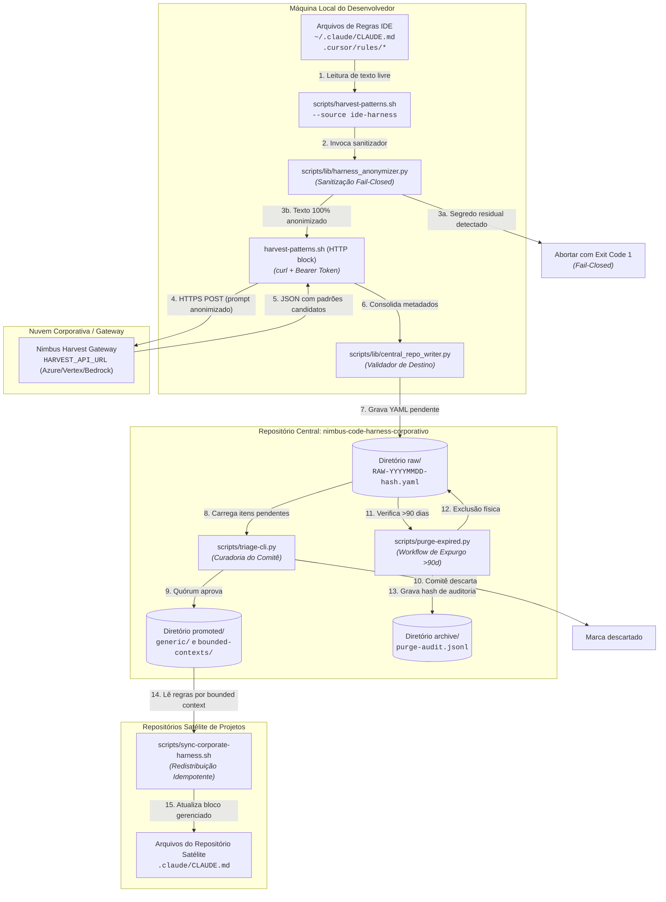
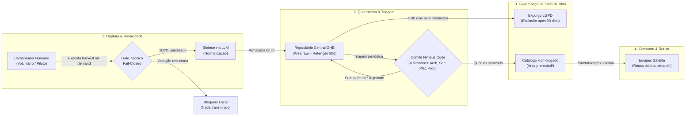
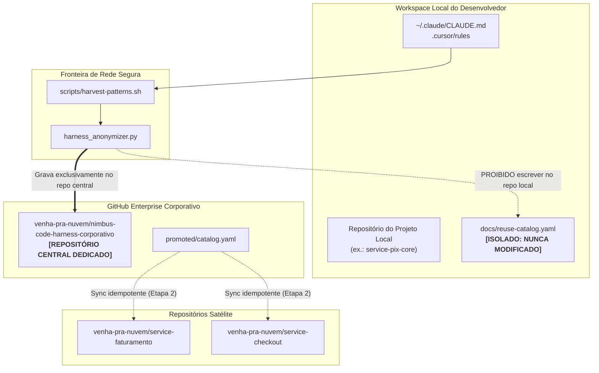

# Module Dependency Graph: Harness Corporativo — Consolidação de Harness Agêntico IDE Pessoal

**Feature**: `029-harness-corporativo-ide`  
**Data**: 2026-09-22  
**Agente**: NC-Arch (Nimbus Solution Architect)  
**Status**: Concluído — Versão 1.0.0

---

## 1. Diagrama por Código (Arquitetura de Módulos e Componentes)

Representa os componentes de código, scripts locais, módulos de sanitização e bibliotecas envolvidas no fluxo de execução.

---

## 2. Diagrama por Fluxo de Negócio e Governança

Ilustra os estágios de maturidade, gates de governança e papéis humanos envolvidos desde a captura inicial na IDE do colaborador até a propagação corporativa.

---

## 3. Diagrama Multi-Repo e Fronteiras de Segurança

Evidencia as fronteiras de isolamento estrito entre o repositório local de desenvolvimento, o repositório central institucional e os repositórios satélites (mitigando os riscos de vazamento e poluição cruzada mapeados em HRN-0005).

