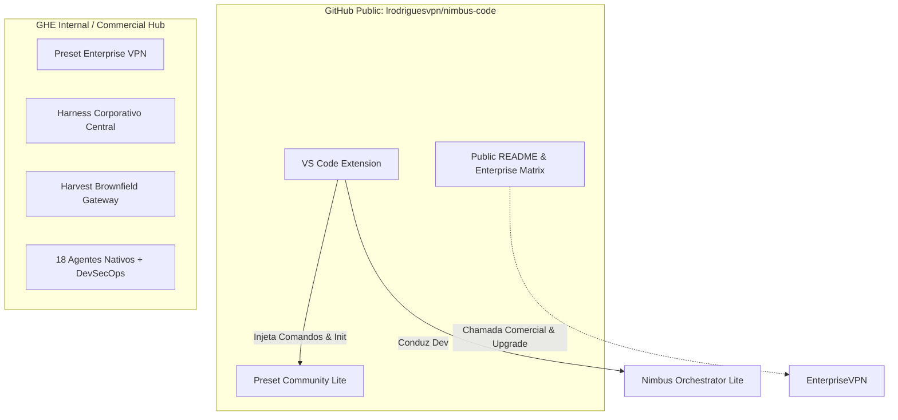

# Diagrama de Dependências: Nimbus Code Dual-Distribution

```mermaid
graph TD
    Ext[VS Code Extension] -->|Injeta Comandos & Init| PresetComm[Preset Community Lite]
    Ext -->|Conduz Dev| Orchestrator[Nimbus Orchestrator Lite]
    
    subgraph Public Distribution [GitHub Public: lrodriguesvpn/nimbus-code]
        Ext
        PresetComm
        PublicDoc[Public README & Enterprise Matrix]
    end

    subgraph Enterprise VPN [GHE Internal / Commercial Hub]
        EnterprisePreset[Preset Enterprise VPN]
        HarnessCentral[Harness Corporativo Central]
        HarvestEngine[Harvest Brownfield Gateway]
        FullSquad[18 Agentes Nativos + DevSecOps]
    end

    PublicDoc -.->|Chamada Comercial & Upgrade| EnterpriseVPN
```
